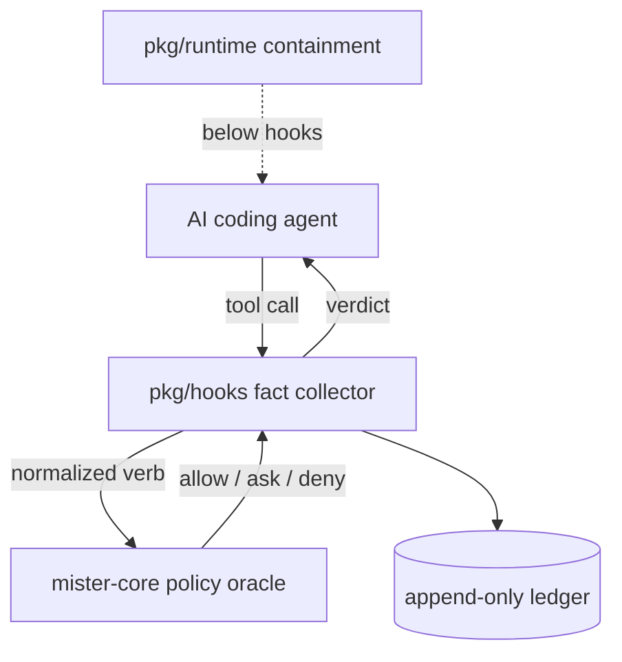

# sir Architecture

> [!NOTE]
> sir is experimental — test on your own machine, not shared infrastructure. `sir doctor` recovers any wedged state; [report bugs](https://github.com/somoore/sir/issues).

sir is experimental. This document describes the shipped v1 design and is deliberately transparent about where the trust boundary is heuristic rather than absolute.

> **Tip:** If you want the shortest path first, read [docs/contributor/core-mental-model.md](docs/contributor/core-mental-model.md).

## 1. Core thesis

sir is a "sandbox in reverse."

Traditional sandboxes constrain a process from below: syscalls, seccomp, filesystem jails. That model assumes the dangerous thing is a single process you can wrap. AI coding agents do not fit that model. They orchestrate tools, spawn subprocesses, call MCP servers, and chain intents across turns. The dangerous surface is not a syscall — it is an intent like "read `.env`, then curl an external host."

sir inverts the problem. Instead of wrapping the process, it constrains the *agent* from above: intercepting tool calls at the host's hook layer before they execute, normalizing them into verbs, and deciding allow / ask / deny through a pure policy oracle. **Information flow control** (IFC) tracks data sensitivity across operations, so if the agent reads a secret file, that taint propagates to anything it writes, commits, or pushes.

The agent does not inherit authority just because the host tool exposes a filesystem, shell, network, or delegation surface. It gets authority only when the current lease and runtime boundary explicitly grant it.

That shows up in three ways:

- **Lease policy** decides what the agent is allowed to do.
- **Hook mediation** classifies and enriches what the agent is trying to do.
- **Runtime containment** tries to keep the host agent inside a narrower OS/runtime boundary even when hooks are incomplete.

The design philosophy: quiet on normal coding, loud on dangerous transitions.

## 2. System shape

The system is split into a Rust policy oracle and a Go fact collector. That split is deliberate: policy is small, auditable, and pure; fact collection is messy, I/O-heavy, and host-specific. Keeping them separated means the policy surface can be reviewed independently of the hook glue.

### `mister-core` (Rust)

Pure policy oracle. Zero dependencies, zero unsafe, no I/O.

- No filesystem access.
- No network access.
- No external Rust dependencies.
- Evaluates normalized requests and returns `allow`, `deny`, or `ask`.

### `sir` (Go)

Operator CLI, hook handlers, state, telemetry, ledger, and runtime containment. Go is standard-library only unless there is a reviewed exception.

- Parses hook payloads from supported agents.
- Classifies tools into normalized intents.
- Assigns IFC labels and session-level facts.
- Persists ledger, session, lineage, and runtime state.
- Calls `mister-core` over the MSTR/1 subprocess boundary.

> **Note:** If `mister-core` is missing from `PATH`, Go falls back to a deliberately restrictive local evaluator. The fallback is held to parity with Rust by `TestLocalEvaluate_VerbParity` and `TestEnforcementGradientDocParity` — it is never more permissive than Rust, and a crashed or non-zero `mister-core` is a hard deny, not a silent pass.

## 3. Enforcement layers

### Lease and policy

`mister-core` owns verb semantics, IFC flow checks, risk tiers, and the final lease-boundary verdict.

Start here when changing:

- Verb rules.
- IFC joins and sink checks.
- The allow / deny / ask gradient.
- Policy receipts.

### Hook mediation

`pkg/hooks` owns fact collection around the host agent's hook surface.

Start here when changing:

- Shell and tool classification.
- MCP argument and response scanning.
- Evidence capture and redaction.
- Session-fatal posture behavior.

### Posture and managed restore

`pkg/posture` owns posture hashing, managed hook subtree drift detection, and hook restore logic.

Start here when changing:

- Hook tamper detection.
- Managed hook subtree hashing.
- Posture-file baseline comparison.
- Restore-only hook repair.

### Runtime containment

`pkg/runtime` sits below hooks.

Start here when changing:

- `sir run`.
- Runtime proxy allowlists.
- Runtime state descriptors.
- Host-agent containment claims.

On macOS the `sir run` proxy is **taint-aware**: it reads the contained agent's
live shadow posture and denies external egress under the hook layer's hard-deny
floors (live secret, untrusted ingestion, deny-all) even if the agent bypasses
the hook — the high-water-mark *ask* is deliberately not mirrored. See
[docs/research/runtime-taint-containment.md](docs/research/runtime-taint-containment.md)
for the design and the path to a taint-driven default.

#### Platform containment matrix

| Platform | Mode constant | OS mechanism | `sir run` |
|----------|---------------|--------------|-----------|
| macOS (arm64 / amd64) | `darwin_local_proxy` | `sandbox-exec` + local proxy | ✓ |
| Linux (amd64 / arm64) | `linux_network_namespace_offline` | User namespaces + iptables | ✓ |
| Windows (amd64 / arm64) | `windows_hook_gate_only` | None available | returns informative error |

Windows ships as a first-class platform for hook mediation, IFC taint tracking,
and policy enforcement. OS-level containment is unavailable on Windows because
no user-mode equivalent of `sandbox-exec` or Linux network namespaces exists.
`sir run` returns a clear error on Windows rather than launching uncontained.
`sir status` reports the `windows_hook_gate_only` mode honestly.

## 4. State objects that matter

- **Lease** — the authority contract.
- **Session** — mutable posture, secret session, lineage, and runtime state.
- **Ledger** — append-only decision history.
- **Runtime descriptor** — active containment metadata for `sir run`.

If a change mutates one of these, add or update tests first.

## 5. One non-negotiable boundary rule

Go may be stricter than Rust. It must never be looser. This is the single invariant that keeps the policy surface reviewable: if you want to understand the upper bound of what sir will allow, you only have to read Rust.

Examples of Go-only restrictions:

- Deny-all after posture tamper.
- MCP credential and injection detections.
- Managed-mode local command refusal.
- Runtime containment guardrails.

These may narrow a decision further. They must never widen a Rust `deny` into `ask` or `allow`.

## 6. Contributor reading order

1. [docs/contributor/core-mental-model.md](docs/contributor/core-mental-model.md)
2. [docs/contributor/security-engineering-core.md](docs/contributor/security-engineering-core.md)
3. [pkg/hooks/doc.go](pkg/hooks/doc.go)
4. [cmd/sir/doc.go](cmd/sir/doc.go)
5. [docs/research/security-verification-guide.md](docs/research/security-verification-guide.md) — the highest-signal verification flow.

## 7. Known limitations

sir is experimental, and its v1 tradeoffs are documented so contributors and users do not mistake heuristic detection for hard guarantees:

- The hook layer is advisory policy enforcement, not OS-level prevention. `sir run` adds below-hook containment on Linux and macOS, but is optional and not available on Windows (see the platform containment matrix in §3). The macOS `sir run` proxy is taint-aware (denies external egress under the hook's hard-deny floors even if the hook is bypassed); the equivalent Linux iptables enforcement and a taint-driven *default* are still on the roadmap ([runtime-taint-containment.md](docs/research/runtime-taint-containment.md)).
- MCP injection detection is heuristic (around 50 regex patterns across authority framing, exfil, credential harvest, and hidden-marker categories). The scanner normalizes responses first — zero-width/bidi (`unicode.Cf`) stripped and base64/hex/percent blobs decoded — so common encoding evasion is covered; semantic paraphrase and homoglyph substitution remain the residual, mitigated by server tainting and the integrity-flow egress wall rather than guaranteed blocking.
- Turn boundaries use a 30-second gap heuristic (backstop only; `UserPromptSubmit` advances turns instantly).
- Shell classification is lexical and prefix-based. It decomposes compound commands, command substitution (`$(…)` / backticks), process substitution, and `eval`, fails closed (ask) on opaque execution like `… | sh`, and flags interpreter one-liners that name a sensitive file by a literal path (`python -c "open('.env')"`, including `/usr/bin/python3` and `env python3` forms); the honest residual is dynamically-constructed or obfuscated paths and novel wrappers, which the downstream IFC floors still gate.
- The default lease is intentionally permissive to keep developer friction low; hardening is the operator's choice.
- IFC labels do not track model-internal reasoning, only observable tool I/O.

These are tradeoffs, not bugs. v2 plans are tracked in project memory.

## 8. v2 decision kernel (in development)

The v2 kernel (`pkg/kernel/`, `sir-core`) introduces a provider-based pipeline alongside the v1 hook path. Key differences:

**Taint and labels replace the v1 IFC lattice.** Rather than a formal trust/sensitivity lattice, v2 derives *action labels* from each signal (`credential_access`, `external_egress`, `shell_execution`, `file_mutation`, etc.) and propagates *taint* across turns via `prior_taint`/`new_taint` fields. A credential read in turn N emits `credential_access` taint; an egress attempt in turn N+1 sees that taint in `prior_taint` and triggers `deny-secret-to-egress`. The guarantee is the same as v1 IFC — secret reads gate downstream sinks — but the mechanism is label-matching rather than a lattice flow check.

**Provider capabilities gate enforceability.** `sir status` and `sir kernel replay --use-providers` derive `provider_capabilities` from live effect providers. `contained` mode only claims `enforces` when a capable provider (one that declares `contain: true`) is present; without one it honestly reports `detects`. This is the detect-vs-enforce boundary v1 did not expose.

**Parity:** `sir harness run --engine both` verifies Go and Rust agree on verdict, enforceability, attribution, policy rules, effects, and new_taint for every fixture.

## 9. Proof surface

The architecture is only real if the repo keeps proving it:

- Unit and integration tests.
- Fixture replay in `testdata/`.
- Benchmark budgets.
- Security invariants.
- Public-contract checks.

If a claimed behavior cannot be expressed in one of those surfaces, it is not stable enough to trust.
