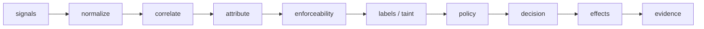
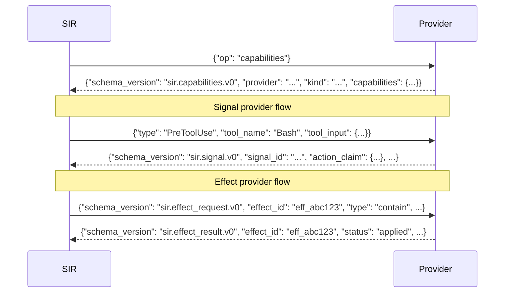

# API Reference

Public interfaces for SIR v2: kernel evaluation types, wire schemas, the stdio-JSON provider protocol, and CLI commands. Schema files are in the `schemas/` directory at the repo root.

---

## How SIR makes decisions

Before diving into types, it helps to know what moves through the system. Every request follows the same pipeline:



**Rust decides. Go orchestrates.** The `sir-core` crate holds `evaluate()` -- a pure function with no IO, no global state, and no external dependencies. Go threads in all the stateful context (`prior_taint`, `provider_capabilities`, timestamps, friction counters, ledger writes) and calls Rust for the deterministic parity fields.

---

## Kernel evaluation interface

These types are the boundary between Go orchestration and the Rust decision kernel. Both implementations must agree on them.

### EvaluationInput

Complete, explicit input to `evaluate()`. The kernel reads nothing from global state -- everything is passed in.

```json
{
  "case_id": "cross-action-cred-egress-same-session",
  "mode": "hook_gate",
  "signals": [
    {
      "schema_version": "sir.signal.v0",
      "signal_id": "cross-egress-001",
      "signal_time": "2026-05-31T00:00:00Z",
      "source": {
        "kind": "claude_hook",
        "reliability": "declared_intent",
        "timing": "pre_exec",
        "provider": "sir-claude-code-hook",
        "provider_version": "0.1.0"
      },
      "session": {
        "session_id": "sess_cross_001",
        "span_id": "span_egress_001"
      },
      "actor_claim": {
        "kind": "ai_coding_agent",
        "name": "claude-code",
        "pid": 1234
      },
      "action_claim": {
        "type": "network_connect",
        "target": {
          "display": "https://unknown.example/upload",
          "sensitivity": "external_network"
        }
      }
    }
  ],
  "evasion_flags": {
    "span_stripped": false,
    "span_forged": false,
    "detached_child": false,
    "hook_missing": false,
    "required_effect_unavailable": false,
    "fail_closed": false
  },
  "prior_taint": ["credential_access"],
  "provider_capabilities": ["contain", "record"],
  "provider_enforcement": "real",
  "resolved_actor_kind": "ai_coding_agent",
  "policy_verdicts": [
    {
      "schema_version": "sir.policy_verdict.v0",
      "provider": "opa-bridge",
      "verdict": "ask",
      "rules_matched": ["agent-push-review"],
      "is_advisory": true
    }
  ]
}
```

**Fields:**

| Field | Type | Description |
|---|---|---|
| `case_id` | string | Identifier for this evaluation (harness case name or runtime action ID) |
| `mode` | string | Current protection mode; see [protection modes](#protection-modes) |
| `signals` | array | One or more `sir.signal.v0` objects collected from providers |
| `evasion_flags` | object | Facts about the environment that affect enforceability analysis |
| `prior_taint` | string array | Taint labels accumulated from previous `evaluate()` calls in the same session |
| `provider_capabilities` | string array | Effect types the active providers can apply (e.g. `"contain"`, `"record"`) |
| `provider_enforcement` | string | `"real"` when the active effect provider demonstrably contains, `"simulated"`/absent otherwise. A declared `block`/`contain` capability only yields `enforces` when this is `"real"`. |
| `resolved_actor_kind` | string | Actor identity resolved by the orchestrator (e.g. `ai_coding_agent`); empty falls back to the signal's `actor_claim`. |
| `policy_verdicts` | array | Advisory `sir.policy_verdict.v0` verdicts from registered policy providers. The kernel composes them under the native floors and the developer-workflow floor (escalate `allow → ask` only; never widens a deny). Empty reproduces the no-provider baseline. |

**`prior_taint` and cross-action taint**

`prior_taint` is how the kernel catches credential-read-then-egress attacks that span multiple agent turns. When an action produces a credential read, the kernel returns `"credential_access"` in `new_taint`. The Go orchestrator merges that into the session taint store. On the next `evaluate()` call, Go passes the accumulated taint as `prior_taint`. If the new action is an external network call, the kernel sees `credential_access` in `prior_taint` plus `external_egress` in the current labels, and fires `deny-secret-to-egress` -- even though neither action alone would trigger a deny.

**`evasion_flags` fields:**

| Flag | What it signals |
|---|---|
| `span_stripped` | The agent session span was removed, breaking traceability |
| `span_forged` | The span ID was injected rather than created by SIR |
| `detached_child` | The process forked and dropped the session span |
| `hook_missing` | The expected pre-exec hook was not present |
| `required_effect_unavailable` | A `required: true` effect provider reported `unavailable` |
| `fail_closed` | If a required effect is unavailable, deny rather than degrade |

---

### EvaluationOutput

The deterministic output of `evaluate()`. Go adds `decision_id` and `timestamp` after evaluation -- those are not parity fields.

```json
{
  "verdict": "deny",
  "decision_class": "deny_now",
  "enforceability": "enforces",
  "attribution": "medium",
  "policy_rules": ["deny-secret-to-egress"],
  "effects": [
    {"type": "block", "required": true, "fail_closed": true},
    {"type": "record", "required": true, "fail_closed": false}
  ],
  "action_type": "network_connect",
  "sensitivity": "external_network",
  "new_taint": []
}
```

**Fields:**

| Field | Values | Description |
|---|---|---|
| `verdict` | `allow`, `ask`, `deny` | The kernel's policy decision |
| `decision_class` | see below | Enforcement timing semantics |
| `enforceability` | `enforces`, `detects`, `blind` | What SIR can actually do in the current mode |
| `attribution` | `high`, `medium`, `low`, `unknown` | Confidence that this action came from the claimed actor |
| `policy_rules` | string array | Rule IDs that matched and drove the verdict |
| `effects` | array of PlannedEffect | Effects the orchestrator should apply |
| `action_type` | string | Canonical action type extracted from signals |
| `sensitivity` | string | Highest sensitivity level found across signals |
| `new_taint` | string array | Taint labels this action adds to the session; Go merges into taint store |

**Decision classes:**

| Class | When it applies |
|---|---|
| `proceed_and_reconcile` | Verdict is `allow`; action may proceed; recorded post-hoc |
| `block_and_wait` | Verdict is `ask` and SIR can enforce; pre-exec gate holds until user responds |
| `deny_now` | Verdict is `deny`; immediate block |
| `record_post_hoc` | Verdict is `ask` but SIR cannot enforce; records for evidence only |

**Attribution confidence is derived from signal reliability:**

| Attribution | Reliability signals present |
|---|---|
| `high` | Any `enforced_boundary` signal |
| `medium` | `mediated_action` or `declared_intent` (no `enforced_boundary`) |
| `low` | `observed_runtime` only |
| `unknown` | No signals or only advisory signals |

Low-confidence escalation: if `attribution` is `low` or `unknown` and `sensitivity` is `credential`, `high`, or `critical`, an `allow` verdict is escalated to `ask`, and the rule `low-confidence-escalation` is added to `policy_rules`.

---

### PlannedEffect

An effect the kernel intends to apply, returned as part of `EvaluationOutput.effects`.

```json
{"type": "block", "required": true, "fail_closed": true}
```

| Field | Type | Description |
|---|---|---|
| `type` | string | Effect type (matches `sir.effect_request.v0` type enum) |
| `required` | bool | If true, the effect is mandatory for the decision to hold |
| `fail_closed` | bool | If `required` is true and the provider is `unavailable`, upgrade to `deny` |

---

### The subprocess binary: sir-core-eval

`sir-core-eval` wraps the same `evaluate()` function as a JSON-in / JSON-out subprocess. Go calls it when running `sir harness run --engine rust` or `--engine both`.

**Input** (one JSON object per stdin line): the `EvaluationInput` wire format above.

**Output** (one JSON line per input): the `EvaluationOutput` wire format above.

```bash
# Build the binary
cargo build -p sir-core

# Send a case manually
echo '{"case_id":"test","mode":"hook_gate","signals":[...],"evasion_flags":{},"prior_taint":[],"provider_capabilities":[]}' \
  | ./target/debug/sir-core-eval
```

Exit code 0 on success, 1 on parse or IO error.

---

## Protection modes

The mode tells the kernel what enforcement guarantees are available. Each mode carries a different bare-laptop honesty level.

| Mode | Guarantee |
|---|---|
| `observe` | Records only; no enforcement |
| `advise` | Explains only; no enforcement |
| `hook_gate` | Enforces via cooperative pre-exec hooks; blind to detached children, stripped spans, and missing hooks |
| `os_observed` | Detects post-hoc via OS sensor; cannot prevent; attribution may be weak |
| `mediated` | Enforces when SIR launches or proxies the process; detects on residue when span is severed |
| `contained` | Enforces via sandbox or effect provider; requires an active provider to be meaningful |
| `managed` | Enforces via signed policy and provider health checks; enterprise-grade; requires infrastructure |

---

## Wire schemas

SIR uses JSON Schema (draft 2020-12) for all wire types. Schema files live in `schemas/`. Every string constant in `pkg/sdk/types.go` and `sdk/python/sir_sdk.py` matches the schema definitions exactly -- changing a constant is a breaking protocol change.

### sir.signal.v0

The canonical unit emitted by a `signal_provider`. Every action that reaches the kernel is described by one or more of these.

```json
{
  "schema_version": "sir.signal.v0",
  "signal_id": "shell-a3f2b1c4e5d6",
  "signal_time": "2026-05-31T00:00:00Z",
  "source": {
    "kind": "shell_wrapper",
    "reliability": "declared_intent",
    "timing": "pre_exec",
    "provider": "sir-shell-wrapper",
    "provider_version": "0.1.0"
  },
  "session": {
    "session_id": "sess_abc123",
    "trace_id": "trace_abc123",
    "turn_id": "turn_001",
    "span_id": "span_xyz789"
  },
  "actor_claim": {
    "kind": "ai_coding_agent",
    "name": "claude-code",
    "pid": 1234,
    "process_tree": ["bash", "claude"]
  },
  "action_claim": {
    "type": "shell_exec",
    "target": {
      "display": "curl https://example.com",
      "sensitivity": "external_network"
    }
  }
}
```

**`action_claim.type`** is required. Signals without it fail `sir provider test` conformance.

**`source.reliability` enum** -- how trustworthy the source is:

| Value | Meaning |
|---|---|
| `declared_intent` | Agent declared this action before executing (hook intercept) |
| `mediated_action` | SIR launched or proxied the process |
| `observed_runtime` | OS or sensor observed this post-hoc |
| `enforced_boundary` | A sandbox boundary confirmed this |
| `advisory_signal` | Heuristic or model advisory; never authoritative |
| `user_decision` | A human explicitly approved or denied |
| `admin_policy` | Organizational policy override |

**`source.timing` enum:**

| Value | Meaning |
|---|---|
| `pre_exec` | Signal arrived before execution; gating is possible |
| `during_exec` | Signal arrived during execution |
| `post_exec` | Signal arrived after execution; detection only |
| `unknown` | Timing is not known |

**`action_claim.target.sensitivity` enum:**

| Value | Meaning |
|---|---|
| `credential` | Credentials, keys, or secrets |
| `external_network` | Outbound network access |
| `high` | High-sensitivity target (not credential or network) |
| `medium` | Medium-sensitivity target |
| `low` | Low-sensitivity target |

---

### sir.provider.v0

The provider manifest. Every provider declares itself here. SIR reads this file during `sir provider validate` and `sir provider test`.

```yaml
schema_version: sir.provider.v0
name: sir-shell-wrapper
kind: signal_provider
version: 0.1.0
protocol: stdio-json
entrypoint: ./provider.py
platforms: [macos, linux, windows]
capabilities:
  signal_reliability: [declared_intent]
  timing: [pre_exec]
fixtures:
  - fixtures/example.json
```

**`kind` enum:**

| Value | What it does |
|---|---|
| `signal_provider` | Emits `sir.signal.v0` objects |
| `effect_provider` | Applies effects (`block`, `contain`, `record`, etc.) |
| `policy_provider` | Emits advisory policy verdicts |
| `advisory_provider` | Emits advisory risk signals |
| `export_provider` | Exports evidence to external systems |

A provider's declared `capabilities` must match what it actually does. `sir provider test` validates that every signal emitted during fixture round-trips uses only the `reliability` and `timing` values declared in the manifest.

**`enforcement` field (effect providers).** Optional top-level field, enum `simulated | real`. An effect provider declaring `contain`/`block` should state whether its enforcement is real OS-level containment (`real`) or capability plumbing (`simulated`). A `simulated` provider never scores `enforces`; a `real` claim requires capture proof (`sir provider verify-containment`) or it fails the enforcement-honesty CI gate.

---

### sir.effect_request.v0

SIR sends this to an effect provider when the kernel plans an effect.

```json
{
  "schema_version": "sir.effect_request.v0",
  "effect_id": "eff_abc123",
  "type": "contain",
  "required": true,
  "fail_closed": true,
  "target": {
    "kind": "process",
    "pid": 1234
  }
}
```

**`type` enum:**

| Value | What happens |
|---|---|
| `record` | Write evidence to the ledger |
| `nudge` | Show the developer an advisory message |
| `redact` | Remove sensitive data from output |
| `prompt` | Ask the developer for approval |
| `block` | Prevent the action from completing |
| `contain` | Run the action inside a sandbox boundary |
| `export` | Send evidence to an external system |
| `kill_process` | Terminate the offending process |
| `request_exception` | Ask for a policy exception |

When `required: true` and `fail_closed: true`, and the effect provider reports `unavailable`, SIR upgrades the decision to `deny`. This is the fail-closed contract: providers that cannot enforce must say so, and SIR responds by denying rather than silently degrading.

---

### sir.effect_result.v0

The effect provider's response to an `sir.effect_request.v0`.

```json
{
  "schema_version": "sir.effect_result.v0",
  "effect_id": "eff_abc123",
  "status": "applied",
  "reason": "process contained via sandbox-exec"
}
```

**`status` enum:**

| Value | Meaning |
|---|---|
| `applied` | Effect was applied successfully |
| `unavailable` | Provider cannot apply this effect on this platform |
| `failed` | Provider tried and failed |
| `not_supported` | This effect type is not supported by this provider |

`unavailable` is a valid, conformant response. Providers should never claim to enforce things they cannot. If a sandbox provider cannot sandbox on a given platform, it returns `unavailable` -- SIR handles the escalation.

---

### sir.capabilities.v0

The response to a `{"op": "capabilities"}` query from SIR.

```json
{
  "schema_version": "sir.capabilities.v0",
  "provider": "sir-macos-seatbelt",
  "kind": "effect_provider",
  "capabilities": {
    "contain": true,
    "block": false,
    "record": true,
    "platform": "darwin"
  }
}
```

SIR queries capabilities when a provider first starts and during `sir provider health` checks. The capabilities map is free-form JSON, but the keys should correspond to the effect types or signal features the provider supports.

---

### sir.case.v0

A harness test case. Each case is a directory under `harness/fixtures/cases/` with a `case.json` file.

```json
{
  "case_id": "cross-action-cred-egress-same-session",
  "title": "Cross-Action: Credential Read Then Egress (Same Session)",
  "description": "A credential file was read in a prior evaluate() call. The prior_taint field carries 'credential_access'. This egress attempt should trigger deny-secret-to-egress.",
  "mode": "hook_gate",
  "sensitive_source": true,
  "irreversible_sink": true,
  "prior_taint": ["credential_access"],
  "signals": [...]
}
```

**Fields:**

| Field | Type | Description |
|---|---|---|
| `case_id` | string | Unique identifier; must match the directory name |
| `title` | string | Human-readable name |
| `description` | string | What this case is testing |
| `mode` | string | Protection mode to use for evaluation |
| `signals` | array | Signal objects the kernel receives |
| `prior_taint` | string array | Taint from prior turns; enables cross-action taint tests |
| `sensitive_source` | bool | Hints that the action involves a sensitive data source |
| `irreversible_sink` | bool | Hints that the action cannot be undone |
| `required_effect_unavailable` | bool | Simulates a required effect being unavailable |
| `fail_closed` | bool | Paired with `required_effect_unavailable` |
| `span_stripped` | bool | Simulates a stripped session span |
| `span_forged` | bool | Simulates a forged span ID |
| `detached_child` | bool | Simulates a process that forked and dropped the span |
| `hook_missing` | bool | Simulates a missing pre-exec hook |
| `shared_shell` | bool | Simulates a shared shell session (weak attribution) |
| `provider_capabilities` | string array | Effect capabilities the active providers declare |
| `provider_enforcement` | string | `real` or `simulated` — gates whether a declared `contain`/`block` scores `enforces` |
| `policy_verdicts` | array | Advisory `sir.policy_verdict.v0` verdicts injected so the harness exercises policy composition through both kernels |
| `resolved_actor_kind` | string | Actor identity resolved by the orchestrator |
| `note` | string | Free-form note for reviewers |

A case may also carry a sibling `capture.json` (same shape) produced from a real run; the [capture tier](observability.md#capture-tier-reality-vs-the-model) scores it against the fixture.

---

### sir.policy_request.v0

Sent by the SIR kernel **to** a `policy_provider`. Every field is populated by the orchestrator, so providers never handle empty strings.

```json
{
  "op": "evaluate",
  "schema_version": "sir.policy_request.v0",
  "action": "push_origin",
  "target": "origin",
  "resolved_actor": "ai_coding_agent",
  "attribution_confidence": "medium",
  "taint": ["credential_access"],
  "enforceability": "enforces",
  "mode": "guard"
}
```

| Field | Type | Description |
|---|---|---|
| `op` | const `"evaluate"` | Distinguishes from the `capabilities` probe |
| `action` | string | The verb being evaluated (`push_origin`, `read_ref`, `net_external`, …) |
| `target` | string | File path, remote, URL, or command |
| `resolved_actor` | `ai_coding_agent`, `human_developer`, `unknown` | Attribution |
| `attribution_confidence` | `high`, `medium`, `low`, `unknown` | Confidence in the attribution |
| `taint` | string array | Prior-session taint labels |
| `enforceability` | `enforces`, `detects`, `blind` | What SIR can do with the verdict |
| `mode` | string | Active operating mode |

The advisory request (`sir.advisory_request.v0`) has the same fields with `op: "assess"`.

### sir.policy_verdict.v0

Emitted by `policy_provider` instances. Policy verdicts are **always advisory**. They can raise the risk level, but the kernel's own rule engine owns final decisions.

```json
{
  "schema_version": "sir.policy_verdict.v0",
  "provider": "sir-policy-pack",
  "verdict": "ask",
  "rules_matched": ["was-secret-push-origin"],
  "reason": "session previously held credentials; re-approve push",
  "is_advisory": true
}
```

| Field | Type | Description |
|---|---|---|
| `schema_version` | const `"sir.policy_verdict.v0"` | Schema version |
| `provider` | string | Provider name (auto-filled from the registry entry if omitted) |
| `verdict` | `allow`, `ask`, `deny` | Advisory verdict |
| `rules_matched` | string array | Rule IDs that matched |
| `reason` | string | Human-readable explanation |
| `is_advisory` | const `true` | Always `true`; a verdict with `is_advisory: false` is rejected |

---

### sir.advisory_signal.v0

Emitted by `advisory_provider` instances. Advisory signals can raise risk but can never lower a deterministic risk assessment.

```json
{
  "schema_version": "sir.advisory_signal.v0",
  "provider": "sir-advisory-baseline",
  "risk_level": "high",
  "reason": "unusual egress pattern for this agent session",
  "advisory_signal_type": "advisory_signal",
  "is_advisory": true,
  "metadata": {
    "baseline_deviation": 3.4
  }
}
```

| Field | Type | Description |
|---|---|---|
| `schema_version` | const `"sir.advisory_signal.v0"` | Schema version |
| `provider` | string | Provider name |
| `risk_level` | `low`, `medium`, `high`, `critical` | Assessed risk |
| `reason` | string | Human-readable explanation |
| `advisory_signal_type` | string | Reliability type of the underlying signal |
| `is_advisory` | const `true` | Always `true` |
| `metadata` | object | Provider-specific context |

---

## Provider protocol

All providers use JSON-over-stdio. Each line is a complete JSON object. SIR writes one line, reads one line. No framing, no headers.



**Signal provider protocol:** SIR sends a raw native event (any JSON object that is not a capabilities query). The provider converts it into a `sir.signal.v0` and writes it to stdout. If the event is not relevant, the provider writes nothing and SIR moves on.

**Effect provider protocol:** SIR sends a `sir.effect_request.v0`. The provider applies the effect and responds with `sir.effect_result.v0`. Every request must produce exactly one response.

**Policy provider protocol:** SIR sends `{"op": "evaluate", ...sir.policy_request.v0}`. The provider returns `sir.policy_verdict.v0`, or writes nothing to mean allow.

**Advisory provider protocol:** SIR sends `{"op": "assess", ...sir.advisory_request.v0}`. The provider returns `sir.advisory_signal.v0`, or writes nothing to mean low risk.

**Export providers:** SIR sends a `sir.effect_request.v0` with `type: export` whose target carries the decision, verdict, enforceability, and attribution; the provider ships it to an external system and responds with `sir.effect_result.v0`.

Each kind has a one-line SDK runner: `run_signal_provider`, `run_effect_provider`, `run_policy_provider`, `run_advisory_provider`.

**Conformance rule:** A provider must never emit a `reliability` or `timing` value in a signal that is not in its manifest's declared `capabilities`. `sir provider test` validates this during fixture round-trips.

---

## Provider SDK

SIR ships SDKs for building providers without manually handling the stdio loop.

### Go SDK (`pkg/sdk`)

```go
import "github.com/somoore/sir/pkg/sdk"

// Signal provider
sdk.RunSignalProvider(
    func() sdk.CapabilitiesResponse {
        return sdk.NewCapabilitiesResponse("my-provider", sdk.KindSignalProvider, map[string]any{
            "signal_reliability": []string{sdk.ReliabilityDeclaredIntent},
            "timing":             []string{sdk.TimingPreExec},
        })
    },
    func(event map[string]any) *sdk.Signal {
        // convert native event to sir.signal.v0
        // return nil to drop the event
    },
)

// Effect provider
sdk.RunEffectProvider(
    func() sdk.CapabilitiesResponse { ... },
    func(req sdk.EffectRequest) sdk.EffectResult {
        if req.Type == sdk.EffectContain {
            return sdk.NewEffectResult(req.EffectID, sdk.EffectApplied, "contained")
        }
        return sdk.NewEffectResult(req.EffectID, sdk.EffectUnavailable, "not supported")
    },
)
```

### Python SDK (`sdk/python/sir_sdk.py`)

Single file, zero dependencies. Drop it alongside your `provider.py` or install via PYTHONPATH (set automatically by `sir provider test`).

```python
import sir_sdk

# Signal provider
def caps():
    return sir_sdk.capabilities("my-provider", sir_sdk.KIND_SIGNAL, {
        "signal_reliability": [sir_sdk.RELIABILITY_DECLARED_INTENT],
        "timing": [sir_sdk.TIMING_PRE_EXEC],
    })

def emit(event):
    if event.get("tool_name") != "Bash":
        return None
    return sir_sdk.make_signal(
        signal_id="bash-001",
        signal_time="2026-05-31T00:00:00Z",
        source_kind="claude_hook",
        reliability=sir_sdk.RELIABILITY_DECLARED_INTENT,
        timing=sir_sdk.TIMING_PRE_EXEC,
        action_claim={"type": "shell_exec", "target": {"display": event.get("command",""), "sensitivity": "low"}},
    )

sir_sdk.run_signal_provider(caps, emit)
```

```python
# Effect provider
def caps():
    return sir_sdk.capabilities("my-effect", sir_sdk.KIND_EFFECT, {"contain": True})

def handle(req):
    if req["type"] == sir_sdk.EFFECT_CONTAIN:
        return sir_sdk.effect_applied(req["effect_id"], "contained via devcontainer")
    return sir_sdk.effect_unavailable(req["effect_id"], "unsupported effect type")

sir_sdk.run_effect_provider(caps, handle)
```

---

## CLI reference

### `sir on` / `sir off`

Activate or deactivate SIR protection. `sir on` installs hooks into the active agent configuration. `sir off` removes them.

```bash
# Activate with the default mode (hook_gate)
sir on

# Activate with a specific mode
sir on --mode contained

# Deactivate
sir off
```

---

### `sir status`

Show current mode, last decision, and provider health.

```bash
sir status
```

---

### `sir why`

Explain a decision from the ledger in human-readable form. Shows verdict, policy rules triggered, effects planned, enforceability, and attribution. When policy providers contributed, it shows their verdicts **separately** from native rules, and surfaces any fail-open provider failures (e.g. an OPA timeout) as a non-blocking note.

```bash
# Explain the most recent decision
sir why --last

# Explain a specific decision by case ID, entry ID, or decision ID
sir why --id cross-action-cred-egress-same-session
```

---

### `sir allow`

Grant a one-time exception for a specific target. Maximum TTL is one hour.

```bash
sir allow target-path --ttl 10m
```

---

### `sir replay`

Process harness cases through the stateful kernel pipeline (`Process`, which adds timestamps, friction, and ledger writes). Results are written to the ledger.

```bash
# Process all cases in the default fixtures directory
sir replay harness/fixtures/cases

# Override the mode for cases that don't declare one
sir replay --mode contained harness/fixtures/cases

# Process a custom case directory
sir replay path/to/my/cases
```

Output columns: `case_id`, `verdict`, `enforceability`, `attribution`, `policy rules`.

---

### `sir doctor`

Check system health: hook installation, provider connectivity, ledger integrity, and recovery guidance if something is wrong.

```bash
sir doctor
```

---

### `sir export`

Export the decision ledger as redacted JSONL. Raw secrets are never written to the ledger; the export is safe to share.

```bash
# Export everything
sir export

# Export the last N decisions
sir export --last 10

# Export to a file
sir export --out /tmp/sir-evidence.jsonl
```

---

### `sir kernel`

Direct access to the v2 kernel pipeline. These commands are namespaced under `sir kernel` to stay additive alongside v1 commands.

```bash
# Replay harness cases through the v2 kernel (with ledger writes)
sir kernel replay harness/fixtures/cases
sir kernel replay --mode contained harness/fixtures/cases

# Replay with active registered providers selected by `sir provider use`
sir kernel replay --use-providers harness/fixtures/cases

# Development only: also scan an unregistered provider directory
sir kernel replay --use-providers --providers-dir examples/providers --include-unregistered harness/fixtures/cases

# Explain the last kernel decision
sir kernel why --last
sir kernel why --id <case-id or decision-id>

# Show current mode, last decision, and provider health
sir kernel status
```

---

### `sir harness`

Score fixture cases against the decision kernel. The harness measures enforceability (`enforces`, `detects`, `blind`) per case and produces a mode-boundary summary.

```bash
# Score all cases with the Go engine (default)
sir harness run harness/fixtures/cases

# Score with the Rust engine (calls sir-core-eval)
sir harness run --engine rust harness/fixtures/cases

# Run a parity check: both engines, compare the six deterministic fields
sir harness run --engine both harness/fixtures/cases

# Capture tier: score each case's real-run capture.json against its fixture
sir harness run --tier capture harness/fixtures/cases

# Regenerate capture.json files from real process reproductions
sir harness capture-generate --write harness/fixtures/cases

# Score a custom case directory
sir harness run path/to/my/cases
```

`sir kernel replay --use-providers` invokes active providers from `~/.sir/providers.json`. For policy providers, `sir provider use`, `sir provider disable`, and `sir provider swap` control which advisory policy verdicts reach replay. Unregistered manifests under `examples/providers` are not scanned unless `--include-unregistered` is set with `--providers-dir`.

**`--engine both` parity check** compares `verdict`, `decision_class`, `enforceability`, `attribution`, and `policy_rules` between Go and Rust for every case. A mismatch exits with code 1 and lists the diverging fields. The built-in cases include policy-composition and real-containment cases.

**`--tier capture`** scores each case's sibling `capture.json` — produced from a real run — and fails if the captured result is weaker than the fixture claim. **`sir harness capture-generate`** reproduces each evasion with real processes (harmless commands) and derives the evasion flags from genuine observation. See [Observability › Capture tier](observability.md#capture-tier-reality-vs-the-model).

Harness output is also written to `harness/fixtures/report.json` after each run.

---

### `sir provider`

Manage providers (lifecycle) and build/validate them (development).

```bash
# Lifecycle: register, list, and switch the active provider
sir provider install examples/providers/opa-bridge/provider.yaml
sir provider list
sir provider use opa-bridge            # make active (exclusive kinds: policy, effect)
sir provider swap sir-macos-seatbelt sir-devcontainer
sir provider enable|disable <name>
sir provider configure <name> --set key=value
sir provider status [<name>]
sir provider uninstall <name>

# Development: validate, test, and prove providers
sir provider validate examples/providers/my-provider/provider.yaml
sir provider test examples/providers/my-provider/provider.yaml
sir provider health examples/providers
sir provider scaffold --name my-provider --kind signal_provider --lang python

# Prove an effect provider that claims enforcement:real actually contains
sir provider verify-containment examples/providers/devcontainer/provider.yaml
```

`sir provider test` sets `PYTHONPATH` to include `sdk/python` automatically, so Python providers can `import sir_sdk` without manual setup. `verify-containment` runs a real contained action and confirms the boundary held; `--write-capture <dir>` writes a capture proof from that real run. See [Provider Guide › Provider lifecycle](providers.md#provider-lifecycle-install-enable-swap).

---

### `sir policy`

Inspect and debug policy decisions (in addition to the lease subcommands `show`/`diff`/`init`/`suggest`).

```bash
# Send one request to a policy provider and print its verdict
sir policy test examples/providers/policy-pack/provider.yaml \
  --action push_origin --taint credential_access --actor ai_coding_agent
sir policy test opa-bridge --fixture examples/providers/opa-bridge/fixtures/was-secret-push.json

# Show how a verdict composes: native floor, developer-workflow floor, advisory, final
sir policy explain --action vcs_commit --verdict opa=deny
sir policy explain --action vcs_push --taint credential_access --verdict opa=ask
sir policy explain --action vcs_commit --actor human_developer --provider opa-bridge
```

`sir policy test` shows the policy request, provider recommendation, and composed final decision. `sir policy explain` runs the real kernel composition, so the layers it prints are exactly what production would decide. See [Policy Reference › Debugging policy](policy.md#debugging-policy).

---

## Policy rules

The kernel ships with the following built-in rules. Rules are evaluated in priority order; the first `deny` wins.

| Rule ID | Verdict | When it fires |
|---|---|---|
| `deny-agent-credential-read` | `deny` | Actor is `ai_coding_agent` and action reads a credential |
| `deny-secret-to-egress` | `deny` | Credential access in `prior_taint` and current action is external egress (cross-action taint); or both in the same action |
| `deny-sir-config-tamper` | `deny` | Action targets SIR config files (`.claude/settings`, `sir.yaml`, `.sir/`, etc.) |
| `ask-external-egress` | `ask` | Action is an external network call |
| `ask-dangerous-shell` | `ask` | Shell execution with dangerous patterns (`rm -rf`, `chmod 777`, fork bomb, etc.) |
| `ask-new-mcp-server` | `ask` | A new MCP server is being registered |
| `ask-cicd-edit` | `ask` | Action targets CI/CD pipeline files (`.github/workflows`, `Jenkinsfile`, etc.) |
| `low-confidence-escalation` | escalates `allow` to `ask` | Attribution is `low` or `unknown` and sensitivity is `credential`, `high`, or `critical` |

---

## Example providers

The `examples/providers/` directory contains 12 reference implementations across all five provider kinds.

| Provider | Kind | Platform | What it does |
|---|---|---|---|
| `shell-wrapper` | signal | macos, linux | Intercepts shell commands via pre-exec hooks |
| `claude-code-hook` | signal | all | Converts Claude Code hook payloads to signals |
| `toy-signal` | signal | all | Minimal reference for signal provider authors |
| `macos-seatbelt` | effect | macos | Applies macOS `sandbox-exec` containment |
| `devcontainer` | effect | all | Routes processes into a dev container |
| `noop-effect` | effect | all | Records and nudges; no containment |
| `sandbox-provider-stub` | effect | linux, macos | Stub for testing contain/block/record |
| `test-block-effect` | effect | all | Handles `block` and `record`; used in harness parity tests |
| `policy-pack` | policy | all | Advisory policy verdicts with allow/ask/deny |
| `advisory-baseline` | advisory | all | Baseline risk signals from heuristic analysis |
| `jsonl-exporter` | export | all | Writes evidence to a JSONL file |
| `otlp-exporter` | export | all | Ships evidence as OTLP-JSON |
