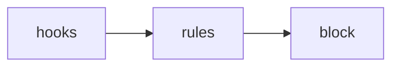
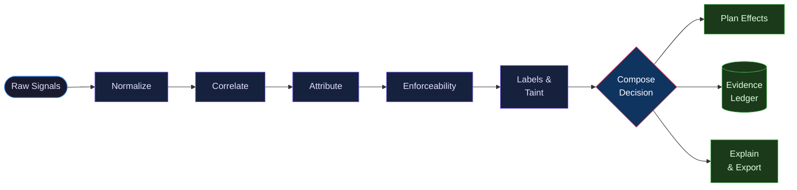
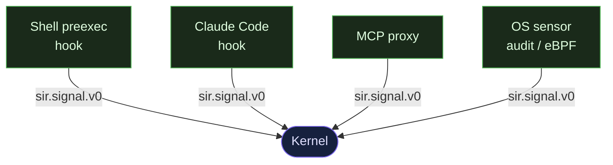
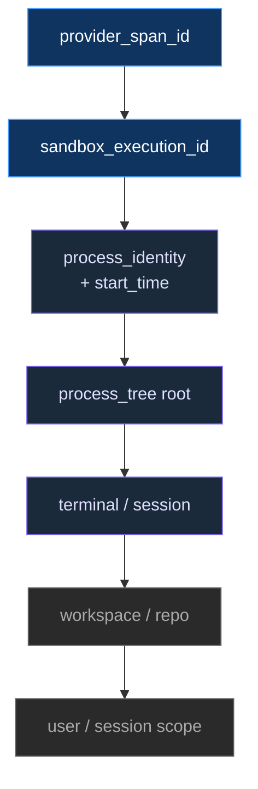
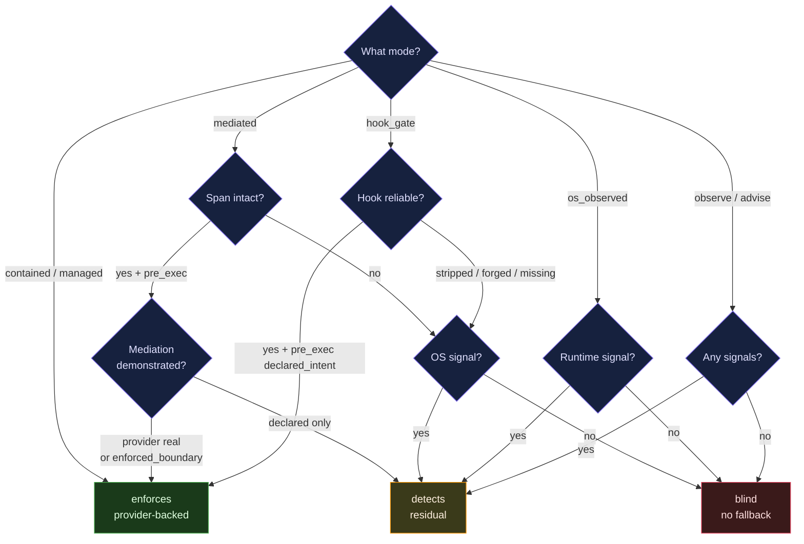
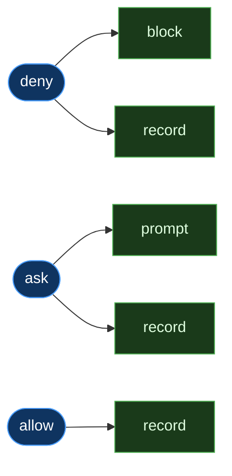
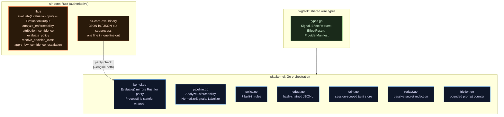
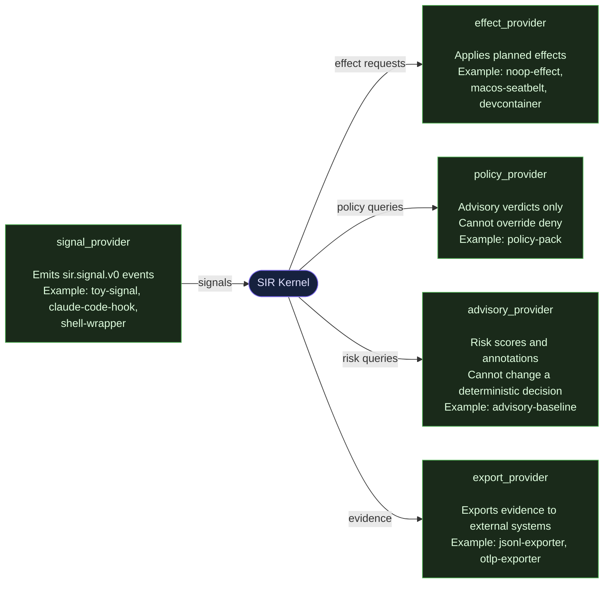

# Architecture

SIR is a runtime decision kernel for AI coding agents. The pipeline is the trust boundary, not the hook: every signal is normalized, attributed, and evaluated through an explicit, auditable sequence before Rust delivers a final verdict. This page traces that sequence stage by stage.

---

## Core thesis

The old model for AI agent security looked like this:



The problem: hooks are cooperative signals. An agent that strips or forges its hook span evades the entire system. Hooks are useful evidence, but they are not the trust boundary.

The new model treats the pipeline as the authority, not the hook:



Every stage is explicit. Nothing is implicit. The decision composer sees all evidence and owns the final call. Rust owns that final call.

---

## Design principles

**Rust decides. Go orchestrates. Providers integrate. Harness proves.**

The pure decision function lives in Rust (`sir-core`). Stateful operations (taint, friction, ledger, timestamps) live in Go. Providers are language-neutral processes. The harness proves both engines agree on the 37 fixture cases.

---

## Pipeline stages

### 1. Raw signals

Signals arrive from multiple sources simultaneously. A single agent action might produce a hook signal, an MCP proxy signal, and an OS audit event at the same time.



Each signal carries:

| Field | Meaning |
|---|---|
| `source.reliability` | How trustworthy the source is (`declared_intent`, `observed_runtime`, `enforced_boundary`, etc.) |
| `source.timing` | When the signal arrived relative to execution (`pre_exec`, `post_exec`) |
| `actor_claim` | Who the signal claims is acting |
| `action_claim` | What the signal claims is happening |
| `session` | Correlation context (trace ID, session ID, turn ID, span ID) |

### 2. Normalize

Normalization is a strict gate. Signals with missing required fields or wrong schema versions are dropped before they enter the pipeline. Corrupt or malformed signals never reach attribution.

Go's `NormalizeSignals` in `pkg/kernel/pipeline.go` enforces this. A signal must carry `schema_version: sir.signal.v0`, a non-empty `signal_id`, and a non-empty `source.kind`.

### 3. Correlate

A single agent action can produce many signals. Correlation groups signals from the same session or span into one attributed action. The priority list for matching, from strongest to weakest:



If a span ID is present, it wins. Session-level correlation is a fallback, not a default.

### 4. Attribute

Attribution determines how confident SIR is about who caused the action. The function `AttributionConfidence` (Go) and `attribution_confidence` (Rust) both implement the same logic:

| Reliability | Confidence |
|---|---|
| `enforced_boundary` | high |
| `mediated_action` or `declared_intent` | medium |
| `observed_runtime` | low |
| no signals | unknown |

Low or unknown confidence on high-sensitivity targets triggers the escalation rule: `allow` becomes `ask`. This is the `low-confidence-escalation` rule that appears in `policy_rules` when it fires.

### 5. Enforceability analysis

This is the most important stage. It answers: can SIR actually block this action, or can it only detect it?



The result is one of three classes:

| Class | Meaning |
|---|---|
| `enforces` | SIR can block the action before it executes |
| `detects` | SIR can observe and record, but cannot block |
| `blind` | SIR has no signal and cannot enforce or detect |

Mode honesty is a hard requirement. SIR never claims `enforces` when it cannot enforce. The enforceability class flows into the final decision, the explanation, and the ledger.

### 6. Labels and taint (information flow control)

This stage implements information flow control (IFC): tracking data sensitivity across actions so that a credential read in one turn gates an egress attempt in a later turn. Labels classify the current action; taint propagates dangerous state forward across turns.

Labels classify the action:

| Label | Trigger |
|---|---|
| `credential_access` | Target sensitivity is `credential` |
| `external_egress` | Target sensitivity is `external_network` |
| `shell_execution` | Action type contains `shell_exec` |
| `file_mutation` | Action type contains `file_write` |
| `ai_agent_actor` | Actor kind is `ai_coding_agent` |
| `dangerous_shell` | Display target matches patterns like `rm -rf`, `chmod 777`, `mkfs`, etc. |
| `cicd_edit` | Target path matches `.github/workflows`, `Jenkinsfile`, `.circleci`, etc. |
| `sir_config_tamper` | Target path matches `.claude/settings`, `sir.yaml`, `.sir/`, `sir-posture` |

Taint is separate from labels. It is session-scoped and additive. Once a session reads a credential file, the session carries the `credential_access` taint label for the rest of its lifetime. That taint is passed into every subsequent `evaluate()` call via `prior_taint` in `EvaluationInput`. Taint is never erased within a session.

### 7. Policy evaluation

Policy rules are deterministic pattern matches against labels and `prior_taint`. Hard deny wins. Advisory engines can raise risk but cannot lower a verdict that policy has already determined.

Built-in policies:

| Rule | Trigger | Verdict |
|---|---|---|
| `deny-agent-credential-read` | AI agent + credential access | deny |
| `deny-secret-to-egress` | `credential_access` in prior_taint + external egress | deny |
| `ask-external-egress` | Any external network connection | ask |
| `ask-dangerous-shell` | Shell execution + dangerous shell patterns | ask |
| `ask-new-mcp-server` | New MCP server trust requested | ask |
| `ask-cicd-edit` | CI/CD config file modified | ask |
| `deny-sir-config-tamper` | Attempt to modify SIR config | deny |

`deny-secret-to-egress` handles two cases. Same-action: both `credential_access` and `external_egress` labels appear in the same evaluation. Cross-action: `credential_access` appears in `prior_taint` from an earlier turn, and the current action has `external_egress`. The `prior_taint` check runs first, before the rule loop, so it is always evaluated.

### 8. Decision composition

The composer applies additional rules on top of policy evaluation:

1. Hard deny always wins over ask or allow
2. Required effect unavailable with `fail_closed=true` upgrades to deny
3. Managed policy, when configured and verified, can impose stricter local ceilings
4. Low-confidence attribution on high-sensitivity targets escalates allow to ask
5. Advisory engines can raise risk but cannot lower a deterministic decision
6. Friction bounding: repeated ask prompts escalate to deny after three in ten minutes

The decision class refines the verdict with enforcement timing semantics:

| Verdict | Enforceability | Decision class |
|---|---|---|
| `deny` | any | `deny_now` |
| `ask` | `enforces` | `block_and_wait` |
| `ask` | `detects` or `blind` | `record_post_hoc` |
| `allow` | any | `proceed_and_reconcile` |

### 9. Effect planning

The decision maps to planned effects:



Effects can be `required` or `best-effort`. If a required effect is unavailable and `fail_closed=true`, the decision upgrades to deny. The `evasion_flags.required_effect_unavailable` field in `EvaluationInput` signals this condition.

### 10. Evidence ledger

Every decision is written to a hash-chained JSONL ledger. Each entry includes:

- Decision ID, timestamp, mode
- Verdict, decision class, enforceability, attribution confidence
- Policy rules that matched
- Planned effects
- SHA-256 hash of this entry
- SHA-256 hash of the previous entry

No raw secret values are written. The ledger stores display paths, sensitivity labels, and decision metadata. Passive redaction runs in Go before anything reaches disk.

---

## Kernel internals: Rust decides, Go orchestrates

The decision logic lives in Rust. Go orchestrates providers, manages stateful context, stamps timestamps, and writes to the ledger. This split is intentional: the pure decision function is small, auditable, and testable in isolation.



**What Rust owns (pure, no side effects):**

- `evaluate(EvaluationInput) -> EvaluationOutput` in `sir-core/src/lib.rs`
- All enforceability logic, attribution confidence, policy evaluation, label derivation, and decision composition
- Zero filesystem access, zero network access, zero global state, zero unsafe, zero external crate dependencies

**What Go owns (stateful, orchestration):**

- Decision ID generation and timestamps (via `Process()` in `kernel.go`)
- Taint store: accumulates `new_taint` from each evaluation, threads it back as `prior_taint`
- Friction counter: tracks repeated ask prompts within a session
- Ledger writes: hash-chained JSONL entries after every decision
- Provider supervision: starts, health-checks, and routes to effect providers

**Why subprocess before FFI:** The `sir-core-eval` binary reads JSON from stdin and writes JSON to stdout, one line per call. This lets Go call Rust without FFI, gives a safe migration path, and makes `--engine both` parity checking straightforward without any shared memory.

**Parity status:** `sir harness run --engine both` shows 37/37 cases matching between Go and Rust. The six parity fields are: `verdict`, `decision_class`, `enforceability`, `attribution`, `policy_rules`, `effects`. `make kernel-parity` verifies this on every build.

---

## EvaluationInput

`EvaluationInput` is the complete, explicit input to `evaluate()`. The kernel reads nothing from global state. All stateful context is passed in as fields.

```
EvaluationInput {
    case_id              string           // correlation ID for this evaluation
    mode                 string           // protection mode (see modes below)
    signals              []Signal         // normalized signals from providers
    evasion_flags        EvasionFlags     // evasion conditions detected by orchestrator
    prior_taint          []string         // taint labels from previous actions in session
    provider_capabilities []string        // what effect providers are available to apply
}
```

The `evasion_flags` field carries conditions the orchestrator has detected about the environment, not about the signals themselves:

| Flag | Meaning |
|---|---|
| `span_stripped` | The hook span correlation ID was removed |
| `span_forged` | The span ID is present but not trustworthy |
| `detached_child` | The process detached from the monitored process tree |
| `hook_missing` | The expected hook was not present |
| `required_effect_unavail` | An effect provider could not apply a required effect |
| `fail_closed` | Config says to deny when required effects are unavailable |

`EvaluationOutput` carries the six parity fields plus `action_type`, `sensitivity`, and `new_taint`. The Go orchestrator merges `new_taint` into the session taint store after each call. Decision ID and timestamp are added by Go after the pure evaluation returns.

---

## Cross-action taint

Taint tracks dangerous state across separate agent turns. Consider this sequence:

1. Agent reads `~/.aws/credentials`. The action is evaluated. `evaluate()` returns `new_taint: ["credential_access"]`. Go merges this into the session taint store.
2. Later, a different agent turn attempts to `curl` an external host. Go reads the taint store and passes `prior_taint: ["credential_access"]` into the next `evaluate()` call.
3. Inside `evaluate()`, the policy check sees `credential_access` in `prior_taint` and `external_egress` in the current labels. The `deny-secret-to-egress` rule fires. The verdict is `deny`.

This works even if the two turns have no shared span ID. The taint store is session-scoped and managed by the Go orchestrator. Rust never reads global state; it only sees what Go threads in.

If a new session starts, it starts with no prior taint. The same egress action in a clean session fires `ask-external-egress` instead of `deny`.

---

## Protection modes

SIR operates in one of seven modes. The mode determines the enforceability ceiling.

| Mode | Enforceability ceiling | Description |
|---|---|---|
| `observe` | detects | Records signals, makes no decisions |
| `advise` | detects | Explains decisions, does not block |
| `hook_gate` | enforces (when hook reliable) | Cooperative pre-exec hook gates execution |
| `os_observed` | detects | Post-hoc OS audit observation |
| `mediated` | enforces (when span intact **and** mediation demonstrated) | SIR launches/proxies the process under a real runner — e.g. the macOS `sandbox-exec` provider — a second real-enforcing mode independent of Docker |
| `contained` | enforces | Provider-backed containment (e.g. the Docker devcontainer) |
| `managed` | enforces | Signed policy plus provider health checks |

Mode honesty is enforced by `analyze_enforceability`. If a hook is stripped or forged, `hook_gate` mode drops from `enforces` to `detects` or `blind` depending on whether an OS fallback signal is available. Symmetrically, `mediated` claims `enforces` only when the mediation is **demonstrated** — `provider_enforcement: real` (an active runner like the `sir-macos-sandbox` Seatbelt provider, backed by capture proof) or an `enforced_boundary` signal. A bare declared pre-exec signal degrades to `detects`: the same false-`enforces` gate that `contained` applies to a declared-only containment capability. This makes `mediated` a genuine second real-enforcing mode rather than one that claims enforcement it cannot prove.

---

## Provider model

Providers are external processes that integrate with SIR. They communicate over stdio using the `sir.signal.v0` and `sir.effect_request.v0` / `sir.effect_result.v0` JSON schemas. There are five kinds:



SIR ships 11 example providers covering all five kinds:

| Provider | Kind |
|---|---|
| `toy-signal` | signal |
| `claude-code-hook` | signal |
| `shell-wrapper` | signal |
| `noop-effect` | effect |
| `macos-seatbelt` | effect |
| `sandbox-provider-stub` | effect |
| `devcontainer` | effect |
| `policy-pack` | policy |
| `advisory-baseline` | advisory |
| `jsonl-exporter` | export |
| `otlp-exporter` | export |

Providers declare themselves via `provider.yaml` using `schema_version: sir.provider.v0`. The manifest includes `kind`, `protocol`, `entrypoint`, `platforms`, and `capabilities`. The capabilities map is what the orchestrator uses to populate `provider_capabilities` in `EvaluationInput`.

Provider commands: `sir provider validate`, `sir provider test`, `sir provider health`, `sir provider scaffold`.

---

## Package layout

```text
sir-core/                    Rust decision kernel (AUTHORITATIVE for policy decisions)
  src/lib.rs                 evaluate() pure function, all types and policies
  src/bin/sir_core_eval.rs   JSON-in/JSON-out subprocess binary

pkg/kernel/                  Go orchestration layer
  kernel.go                  Evaluate() mirrors Rust for parity; Process() is stateful wrapper
  pipeline.go                AnalyzeEnforceability, NormalizeSignals, Labelize (shared with harness)
  policy.go                  EvaluatePolicy, 7 built-in rules
  ledger.go                  Hash-chained JSONL evidence ledger
  taint.go                   Session-scoped taint store
  redact.go                  Passive secret redaction before ledger writes
  friction.go                Bounded prompt counter

pkg/sdk/                     Go wire types and provider runner
  types.go                   Signal, EffectRequest, EffectResult, ProviderManifest

sdk/python/                  Python SDK
  sir_sdk.py                 Single file, zero dependencies

cmd/sir/                     CLI commands (on, off, status, why, replay, allow, doctor, export,
                             provider, kernel, harness)

schemas/                     JSON Schema definitions (v0)
  sir.signal.v0.schema.json
  sir.capabilities.v0.schema.json
  sir.provider.v0.schema.json
  sir.effect_request.v0.schema.json
  sir.effect_result.v0.schema.json

examples/providers/          11 example providers across all 5 kinds

harness/                     Evasion fixture cases and runner
  fixtures/cases/            37 fixture cases (hook-missing, span-strip, cred-read-then-egress, etc.)
  runner.py                  Harness runner (--engine go|rust|both)

docs/                        This documentation

mister-core/                 Legacy v1 oracle (preserved during migration)
mister-shared/               Legacy v1 shared types (JSON parser reused by sir-core)
```

---

## Command reference

```
sir on / sir off          Enable or disable SIR for the current session
sir status                Show current mode and provider health
sir why [decision-id]     Explain a specific decision
sir replay [case-id]      Replay a case through the kernel
sir allow [pattern]       Add a pattern to the session allowlist
sir doctor                Diagnose and recover wedged state
sir export                Export the evidence ledger

sir provider validate     Validate a provider.yaml manifest
sir provider test         Run provider fixtures through the kernel
sir provider health       Check live provider health
sir provider scaffold     Generate a new provider scaffold

sir kernel replay         Replay a case through the kernel directly
sir kernel why            Explain a kernel decision
sir kernel status         Show kernel and parity status

sir harness run           Run harness fixture cases
  --engine go|rust|both   Choose which engine(s) to evaluate against
```

---

## Design principles

**Rust decides. Go orchestrates.** The pure decision function lives in Rust. Stateful operations (taint, friction, ledger, timestamps) live in Go. Providers are language-neutral. This is the architectural invariant.

**Mode honesty.** SIR never claims to enforce what it cannot enforce. Every mode has a documented enforceability ceiling. `enforces` is only returned when a pre-exec gate or provider-backed boundary exists.

**Single source of truth, proven by parity.** Go's `Evaluate()` and Rust's `evaluate()` must produce identical output on the six parity fields for all harness cases. `make kernel-parity` verifies this. If they diverge, it is a bug.

**Pure inputs, explicit state.** Prior taint and provider capabilities are fields in `EvaluationInput`. The kernel reads nothing from global state. This is what makes the Rust function truly pure, the Go reference truly equivalent, and the harness comparison possible.

**Determinism at the boundary.** Advisory signals and model scores can raise risk. They cannot change a deterministic policy decision. Hard deny is hard.

**Fail closed on corruption.** Any state corruption that is not `os.IsNotExist` triggers a fail-closed path. SIR does not guess at defaults and does not silently pass on a corrupted oracle.

**No raw secrets in evidence.** The ledger stores display paths, sensitivity labels, and decision metadata. Passive redaction runs before anything reaches disk. No raw credential values, no raw environment variables.

**Stdlib only in Go and Rust.** No third-party crates in `sir-core` or `mister-shared`. No third-party Go packages in core packages. OTLP export uses a Python subprocess so Go and Rust stay clean.
