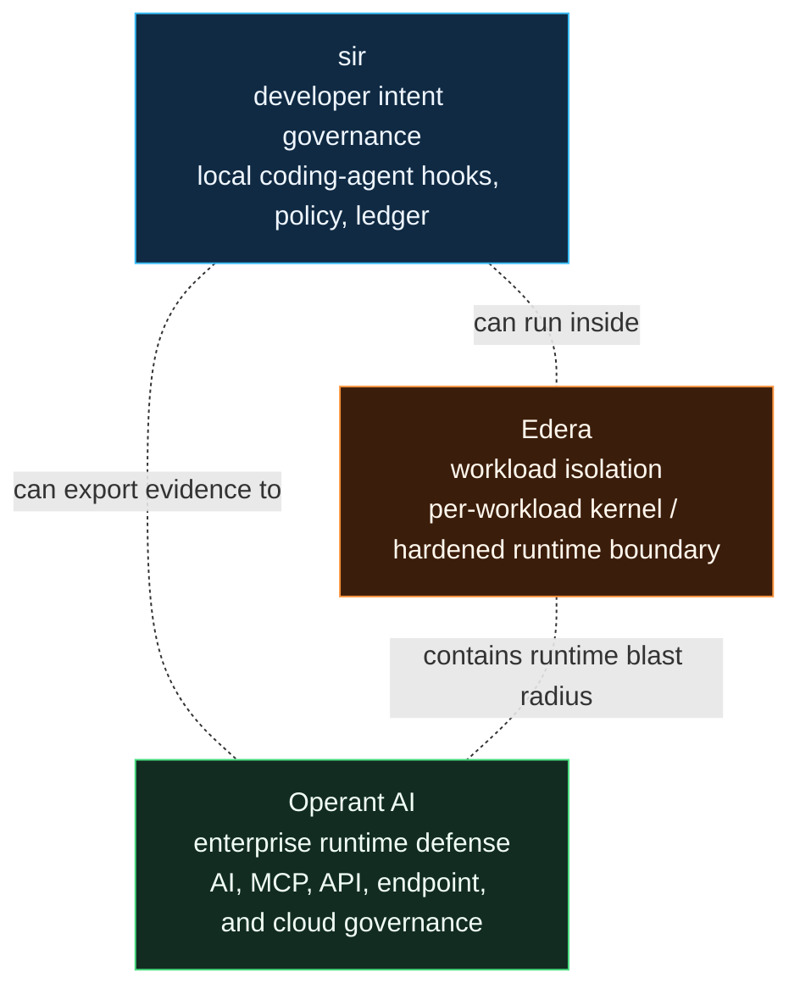

# Competitive Analysis

As of June 1, 2026, sir, Edera, and Operant AI are best understood as different layers of AI security, not direct substitutes.

## Short version

- **Use sir** when you want transparent local control over what Claude Code, Cursor, Gemini CLI, or Codex is trying to do on a developer machine.
- **Use Edera** when you need hard workload isolation for untrusted code or agents running in infrastructure.
- **Use Operant AI** when you need enterprise-wide discovery, detection, blocking, and governance across AI apps, MCP, APIs, endpoints, and cloud systems.

sir is better for developer-loop intent governance. Edera is better for infrastructure isolation. Operant is better for fleet-scale enterprise runtime defense. The strongest posture can layer them.

## Comparison

| Question | sir | Edera | Operant AI |
|---|---|---|---|
| Primary boundary | Agent intent and tool calls | Workload/container isolation | Enterprise AI/API/MCP runtime activity |
| Primary user | Individual developers and security-minded engineering teams | Platform and infrastructure teams | Security organizations and platform teams |
| Main strength | Local, open, auditable policy around coding-agent actions | Hard isolation and blast-radius reduction | Centralized discovery, policy, visibility, and blocking |
| Best signal | Hook intent: read, write, shell, MCP, prompt, session | Runtime containment boundary | Network, API, model, MCP, endpoint, cloud telemetry |
| Evidence | Local hash-chained ledger | Platform/runtime posture | Enterprise telemetry and dashboards |
| Tradeoff | Hook-scoped unless paired with stronger containment | Less semantic visibility into why an agent acted | Heavier enterprise platform footprint |

## Why sir still matters

Infrastructure isolation can contain a process, but it does not explain whether a coding agent just tried to read `.env`, rewrite hooks, call an MCP server, or push a tainted change. Enterprise platforms can centralize policy, but they often sit above or beside the developer loop. sir sits directly in that loop, where the agent's intent is still legible.

That makes sir useful even when you already have a sandbox or enterprise AI security platform:

- It catches risky developer actions before they become shell, file, MCP, or network side effects.
- It produces local, reviewable evidence instead of only centralized telemetry.
- It keeps normal coding fast while making dangerous transitions explicit.
- It is open and provider-driven, so teams can bring their own sandbox, policy engine, signal source, and export path.

## Source positioning

Edera's public AI-agent sandboxing materials describe production sandboxing for agents, with each agent running in an isolated environment with a dedicated Linux kernel. Its overview emphasizes VM-grade isolation, no shared kernel, and Kubernetes/workload runtime positioning.

Operant AI's public AI Gatekeeper materials emphasize coverage across AI applications, APIs, services, MCP, agents, and real-time detection/blocking of unauthorized AI behavior. Its 3D Runtime Defense materials emphasize discovery, detection, and data-flow protection across cloud and AI workloads. Its MCP Gateway announcement describes discovery, detection, and defense for MCP-connected AI workflows across local development tools and cloud deployments.

Sources: [Edera AI Agent Sandboxing](https://edera.dev/use-case/ai-agent-sandboxing), [Edera overview](https://edera.dev/), [Operant AI Gatekeeper](https://www.operant.ai/platform/ai-gatekeeper), [Operant 3D Runtime Defense](https://www.operant.ai/platform/3d-runtime-defense), [Operant MCP Gateway announcement](https://www.globenewswire.com/news-release/2025/06/16/3099877/0/en/Operant-AI-Launches-MCP-Gateway-Enterprise-Grade-Runtime-Defense-for-MCP-Connected-AI-Applications.html).
