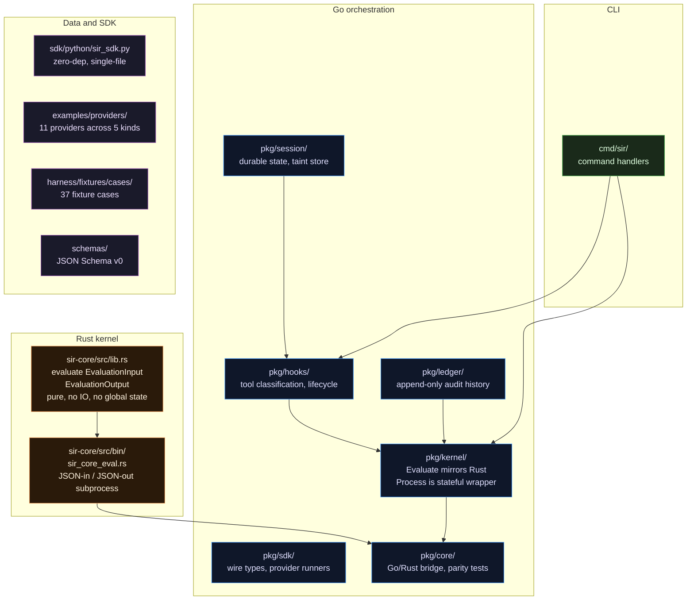

# Contributing

SIR is in active development and contributions are welcome. The invariant that shapes every PR: `sir-core` (Rust) is the upper bound on what SIR will allow. The Go layer may only be stricter, never looser.

> [!NOTE]
> SIR is experimental. Test on your own machine, not shared infrastructure. Run `sir doctor` to recover any wedged state, and [report bugs](https://github.com/somoore/sir/issues) when you find them.

If the core model is new to you, read [docs/contributor/core-mental-model.md](contributor/core-mental-model.md) first. The single invariant that shapes every contribution: `sir-core` (Rust) is the upper bound on what SIR will allow. The Go layer may only be stricter, never looser.

---

## What the project needs most

In rough priority order:

1. **New signal providers** - shell wrappers for more shells, IDE integrations, MCP proxy providers
2. **Real sandbox effect providers** - Sandlock on Linux, macOS Seatbelt (full implementation), devcontainer
3. **Harness cases that reveal mode boundaries** - cross-action taint, evasion edge cases, provider-capability gaps
4. **Policy rule improvements** - better sensitivity classification, more patterns
5. **Rust kernel test coverage** - new `#[test]` cases in `sir-core/src/lib.rs` for verdict logic
6. **Documentation and examples** - real-world usage patterns

---

## Getting set up

Prerequisites:

- **Go** 1.22+: [go.dev/dl](https://go.dev/dl/)
- **Rust** 1.94.0+: [rustup.rs](https://rustup.rs/)
- **Python** 3.8+ (for provider development only)
- `make` is optional but convenient

You do not need Rust if you are only working on providers or CLI copy. You do need it if you touch `sir-core/` or run `make kernel-parity`.

```bash
git clone https://github.com/somoore/sir.git
cd sir

# Build everything (Go binary + Rust kernel)
make build

# Run both test suites
make test

# Confirm 37/37 harness parity across Go and Rust
make kernel-parity

# Check all example providers
bin/sir provider health examples/providers
```

---

## Contribution flow

```mermaid
flowchart LR
    classDef step fill:#16213e,stroke:#7b68ee,color:#e0e0ff
    classDef check fill:#0f3460,stroke:#4a9eff,color:#ffffff
    classDef gate fill:#1a2a1a,stroke:#4caf50,color:#e0ffe0

    FORK([Fork and\nbranch from main]):::step
    BUILD[Build and\ntest locally]:::step
    RUST[cargo test --locked]:::check
    GO[go test ./...]:::check
    PARITY[make kernel-parity\n37/37 both engines]:::gate
    PR[Open a PR\nagainst main]:::step
    REVIEW[Review and\nfeedback]:::step
    MERGE[Merge]:::step

    FORK --> BUILD --> RUST --> GO --> PARITY --> PR --> REVIEW --> MERGE
```



Branch off `main`. Keep each pull request scoped to one behavior change.

---

## Code layout



Where to make changes:

| What you are changing | Where to look |
|---|---|
| Decision logic (verdict, policy, taint) | `sir-core/src/lib.rs` and `pkg/kernel/` |
| Go/Rust bridge and parity tests | `pkg/core/` |
| Wire types, provider protocol | `pkg/sdk/types.go`, `pkg/sdk/provider.go` |
| Enforceability scoring | `pkg/kernel/pipeline.go` |
| Policy rules | `pkg/kernel/policy.go` |
| Taint logic | `pkg/kernel/taint.go` |
| Ledger format | `pkg/kernel/ledger.go` |
| Hook classification and lifecycle | `pkg/hooks/` |
| Session and runtime state | `pkg/session/` |
| CLI commands | `cmd/sir/` |
| Python SDK | `sdk/python/sir_sdk.py` |
| Schemas | `schemas/` |
| Example providers | `examples/providers/` |
| Harness cases | `harness/fixtures/cases/` |

---

## Testing

### Go test suite

```bash
# Run the full Go test suite
go test ./...

# Run a specific package
go test ./pkg/kernel/... -v

# Run with race detector
go test -race ./...
```

### Rust test suite

```bash
# Run all Rust tests in sir-core
cargo test --locked

# Run a specific test by name
cargo test --locked hook_gate_with_pre_exec_enforces
```

The Rust tests live in `sir-core/src/lib.rs` inside the `mod tests` block at the bottom of the file. Each test constructs an `EvaluationInput`, calls `evaluate()`, and asserts on the output fields. New policy or enforceability logic needs a matching `#[test]`.

### Harness parity

The harness runs each of the 37 fixture cases through both the Go kernel and the Rust subprocess and compares the six parity fields. Both engines must agree:

```bash
# Run parity check (builds sir-core first, then runs harness with --engine both)
make kernel-parity

# Run harness against Go only (faster during iteration)
bin/sir harness run harness/fixtures/cases

# Run harness against both engines explicitly
bin/sir harness run --engine both harness/fixtures/cases
```

If you change `AnalyzeEnforceability` in `pkg/kernel/pipeline.go` or `evaluate()` in `sir-core/src/lib.rs`, the harness will immediately surface any divergence. That is intentional. There is exactly one enforceability implementation in each language, and the harness is how you prove they match.

### Provider tests

```bash
# Check all example providers are healthy
bin/sir provider health examples/providers

# Test a specific provider end to end
bin/sir provider test examples/providers/my-provider/provider.yaml
```

### Full check before opening a PR

```bash
make test          # cargo test + go test
make kernel-parity # 37/37 both engines
```

When your change touches docs, versions, security invariants, or public contracts:

```bash
make public-contract
go test ./cmd/sir -run TestSecurityInvariantSuiteV1
```

When your change touches hook evaluation, ledger verification, session mutation, or `sir explain`:

```bash
make bench-check
```

---

## Adding a Rust test to sir-core

Open `sir-core/src/lib.rs` and add a new function inside the `mod tests` block at the bottom:

```rust
#[test]
fn my_new_scenario_denies() {
    let input = EvaluationInput {
        mode: modes::HOOK_GATE.into(),
        prior_taint: vec!["credential_access".into()],
        signals: vec![Signal {
            source: SignalSource {
                reliability: reliability::DECLARED_INTENT.into(),
                timing: timing::PRE_EXEC.into(),
            },
            action_claim: ActionClaim {
                action_type: "network_egress".into(),
                target: ActionTarget {
                    display: "curl https://example.com".into(),
                    sensitivity: "external_network".into(),
                },
            },
            ..Default::default()
        }],
        ..Default::default()
    };
    let out = evaluate(&input);
    assert_eq!(out.verdict, verdicts::DENY);
    assert_eq!(out.enforceability, classes::ENFORCES);
}
```

Run `cargo test --locked` to verify. If the scenario is a new mode boundary (a situation where the verdict differs depending on mode or prior taint), add a matching harness case so the Go implementation stays in sync.

---

## Adding a harness case

Harness cases live in `harness/fixtures/cases/`. Each case is a directory containing a single `case.json`. The case describes an `EvaluationInput` in JSON and the harness evaluates it with both engines, then checks that the six parity fields match.

```bash
# 1. Create the case directory
mkdir harness/fixtures/cases/my-new-scenario

# 2. Write the case
cat > harness/fixtures/cases/my-new-scenario/case.json << 'EOF'
{
  "case_id": "my-new-scenario",
  "title": "Human-readable title for the report",
  "description": "What this case is testing and why it matters.",
  "mode": "hook_gate",
  "sensitive_source": false,
  "irreversible_sink": false,
  "signals": [
    {
      "schema_version": "sir.signal.v0",
      "signal_id": "sig-001",
      "signal_time": "2026-01-01T00:00:00Z",
      "source": {
        "kind": "claude_hook",
        "reliability": "declared_intent",
        "timing": "pre_exec",
        "provider": "sir-claude-code-hook",
        "provider_version": "0.1.0"
      },
      "session": { "session_id": "ses-001", "span_id": "span-001" },
      "actor_claim": { "kind": "ai_coding_agent", "name": "claude-code" },
      "action_claim": {
        "type": "network_connect",
        "target": {
          "display": "https://example.com/upload",
          "sensitivity": "external_network"
        }
      }
    }
  ]
}
EOF

# 3. Confirm both engines produce matching results
bin/sir harness run --engine both harness/fixtures/cases

# 4. If they diverge, the case has found a parity gap -- fix the implementation
#    before opening a PR
```

A harness case that causes a Go/Rust divergence is a bug report, not a reason to skip the case. Fix the implementation (either side) until both agree, then add the test.

If the new case carries cross-action taint, add `prior_taint` to the input. This field is how the orchestrator passes accumulated taint labels from previous turns into the kernel:

```json
{
  "case_id": "my-cross-action-scenario",
  "prior_taint": ["credential_access"],
  ...
}
```

---

## Adding a new provider

Provider contributions are the most common kind of change. The five provider kinds are: signal, effect, policy, advisory, and export. There are 11 example providers in `examples/providers/` to use as reference.

```bash
# 1. Scaffold the provider
sir provider scaffold --name my-provider --kind signal_provider --lang python

# 2. Implement the logic
# Edit examples/providers/my-provider/provider.py

# 3. Validate the manifest
sir provider validate examples/providers/my-provider/provider.yaml

# 4. Test it end to end
sir provider test examples/providers/my-provider/provider.yaml

# 5. If the provider reveals a new mode boundary, add a harness case
#    (see "Adding a harness case" above)
bin/sir harness run --engine both harness/fixtures/cases
```

See [providers.md](providers.md) for the full provider development reference.

---

## The "does this PR belong" rule

Every change should answer yes to at least one of these:

- Does it help external providers plug in?
- Does it help the harness prove or falsify a claim?
- Does it help SIR tell the truth about enforcement?
- Does it help developers debug and ship faster?

If the answer is no, defer it. SIR is not trying to be an EDR, a DLP system, a full OS sandbox, or an ML platform. Changes that move it in those directions will be deferred or declined regardless of quality.

---

## Non-negotiables

These rules are load-bearing for the security model. Changes that relax any of them need a maintainer conversation before implementation.

- **Go core is stdlib-only.** No third-party Go dependencies without an explicit, documented exception. A third-party dependency in the hook path is a new supply-chain surface for attackers.
- **`sir-core` stays zero-dependency and zero-unsafe.** The decision kernel must be small enough to audit in one sitting. Zero external crates. No `unsafe` blocks.
- **Go may add restrictions from facts Rust cannot see. It must never widen a Rust deny.** Parity is enforced by `TestLocalEvaluate_VerbParity` and `TestEnforcementGradientDocParity` in `pkg/core/`.
- **Corrupted or unreadable state fails closed.** Only `os.IsNotExist` may seed fresh defaults. Everything else becomes a guard deny.
- **Path-sensitive checks must resolve symlinks before classification.**
- **The ledger and telemetry never store raw secrets.** Only hashes, verbs, and verdicts go to disk.
- **The harness must pass with `--engine both`.** `make kernel-parity` must show 37/37 before you open a PR.
- **Public claims need executable coverage.** Tests, harness cases, or contract checks. If a behavior cannot be expressed in one of those forms, it is not stable enough to trust.

---

## Pull requests

1. Keep the diff scoped to one behavior change.
2. Add tests or harness cases before changing security-sensitive behavior.
3. Update docs only when the public or contributor contract changed.
4. Run `make test && make kernel-parity` and include the output in the PR body.

Review checklist for runtime, core, and session changes:

- The change does not widen a Rust deny or silently downgrade enforcement.
- Compatibility for older session, runtime, or ledger state is either preserved or explicitly migrated.
- Status and `sir doctor` output explains new degraded or stale states in operator terms.
- The diff includes unit, harness, or invariant coverage for the public or security claim it changes.

Open an issue first for protocol changes, lease-format changes, enforcement-gradient changes, or broad new detection categories.

---

## Commit style

Short, direct commit messages that say what changed and why:

```
feat: add sir-sandlock-provider for Linux containment

add: harness case for cross-action taint via separate turns

fix: validate signal reliability against manifest declared set

rust: add test for hook_gate prior_taint deny path

docs: add provider guide for advisory providers
```

Do not reference internal ticket numbers. The commit message should stand alone.

---

## High-risk change lanes

Open an issue first or pull in a maintainer before changing:

- `pkg/runtime/` -- host-agent boundary changes, destination policy, or degraded-mode semantics
- `pkg/core/` -- Go/Rust bridge framing, fallback semantics, or final verdict shaping
- `pkg/session/` -- schema compatibility, lock behavior, runtime descriptor evolution, or lineage persistence
- `pkg/hooks/` -- new deny/ask paths, tamper handling, or lifecycle behavior that can widen enforcement
- `sir-core/src/lib.rs` -- policy rule changes, enforceability class changes, or taint propagation logic

---

## Questions

Open a [GitHub Discussion](https://github.com/somoore/sir/discussions) for design questions or proposals.

Open a [GitHub Issue](https://github.com/somoore/sir/issues) for bugs and concrete feature requests.

For security issues, use [GitHub Security Advisories](https://github.com/somoore/sir/security/advisories).
