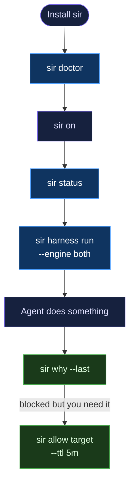

# Getting Started

Install SIR, turn on protection, and understand exactly what it can enforce — in one session.

**Rust decides. Go orchestrates. Providers integrate. Harness proves.**

---

## What you need

- **macOS** (Apple Silicon arm64 or Intel amd64)
- **Linux** x86_64 or arm64 — Ubuntu, Debian, RHEL/CentOS, SUSE/openSUSE, Fedora, Alpine, and derivatives
- **Windows** x64 or ARM64 — hook_gate mode only (see [Windows support](#windows-support))
- At least one AI coding agent: Claude Code, Codex, or Gemini CLI
- Go 1.22+ and Rust (stable) if you want to build from source

---

## Flow overview



---

## Install

**macOS / Linux:**
```bash
curl -fsSL https://raw.githubusercontent.com/somoore/sir/main/scripts/download.sh | bash
```

**Windows (PowerShell):**
```powershell
irm https://raw.githubusercontent.com/somoore/sir/main/scripts/download.ps1 | iex
```

Or build from source:

```bash
git clone https://github.com/somoore/sir.git
cd sir
git checkout sir-v2
make build
# sir binary lands at bin/sir
# Rust oracle binary lands at target/release/sir-core-eval
```

Verify the install:

```bash
sir version
sir doctor
```

`sir doctor` checks that hooks are installed, providers are reachable, and the Rust oracle binary is present. Run it any time something seems off.

---

## Windows support

sir ships native binaries for Windows x64 and ARM64. Hook mediation, IFC taint tracking, the policy oracle (`mister-core`), and the tamper-evident ledger all operate normally. The one capability absent on Windows is OS-level containment:

| Feature | macOS | Linux | Windows |
|---------|-------|-------|---------|
| Hook mediation (IFC, taint, ledger) | ✓ | ✓ | ✓ |
| Policy oracle (Rust) | ✓ | ✓ | ✓ |
| `sir status` / `sir why` | ✓ | ✓ | ✓ |
| OS-level containment (`sir run`) | ✓ sandbox-exec | ✓ namespaces | — not available |

**Why no containment on Windows?** `sir run` wraps agents in an OS-enforced sandbox (macOS `sandbox-exec`, Linux network namespaces). Windows has no user-mode equivalent of these mechanisms. Rather than ship a weak substitute, sir honestly degrades: `hook_gate` mode is active, and `sir status` tells you exactly what is and isn't enforced.

Run `sir status` after install to see the full picture for your platform.

---

## The decision kernel: two engines, one answer

SIR's policy decisions come from a pure Rust function called `evaluate`. It takes explicit input -- signals, mode, prior taint, provider capabilities -- and returns a deterministic verdict with no IO and no global state. Go mirrors this function exactly.

The subprocess binary `sir-core-eval` exposes the Rust engine as JSON-in / JSON-out over stdin:

```
input  (stdin):  {"case_id":"...", "mode":"hook_gate", "signals":[...], "prior_taint":[], ...}
output (stdout): {"verdict":"deny", "decision_class":"deny_now", "enforceability":"enforces", ...}
```

Go and Rust must agree on six fields for every case: `verdict`, `decision_class`, `enforceability`, `attribution`, `policy_rules`, and `effects`. If they diverge, the harness fails loudly. This is what "harness proves" means.

To build the Rust oracle:

```bash
cargo build -p sir-core
# binary at target/release/sir-core-eval
```

---

## Turn on protection

```bash
sir on
```

SIR detects all available providers, writes a mode state file, and tells you what is actually enforceable:

```text
sir on -- mode: hook_gate
  11 provider(s) detected and healthy
  Guarantee: enforces via cooperative pre-exec hooks; blind to detached children
```

You can choose a different mode if you have a sandbox provider available:

```bash
sir on --mode contained
```

Available modes, from least to most invasive:

| Mode | Guarantee |
|---|---|
| `observe` | Records everything, blocks nothing |
| `advise` | Explains what would happen, does not enforce |
| `hook_gate` | Gates actions via cooperative pre-exec hooks |
| `os_observed` | Detects post-hoc via OS sensor; cannot prevent |
| `mediated` | Enforces when SIR launches or proxies the agent process |
| `contained` | Sandbox/effect provider enforces boundaries |
| `managed` | Signed policy plus provider health checks |

`hook_gate` is the highest mode available on a bare laptop without a sandbox or OS enforcement provider. Every mode above it requires an active effect provider to be meaningful.

---

## Check your coverage

```bash
sir status
```

This shows your current mode, the last kernel decision, and the health of all registered providers:

```text
Mode: hook_gate
Guarantee: enforces via cooperative pre-exec hooks; blind to detached children

Last decision: deny (2026-05-31T03:27:35Z) -- case: cred-read-then-egress

Provider health:
----------------------------------------------------------------------
  sir-shell-wrapper        signal_provider   healthy
  sir-claude-code-hook     signal_provider   healthy
  toy-signal               signal_provider   healthy
  sir-macos-seatbelt       effect_provider   healthy   contain=true
  noop-effect-provider     effect_provider   healthy   contain=false
  sandbox-provider-stub    effect_provider   healthy   contain=true
  devcontainer             effect_provider   healthy   contain=false
  policy-pack              policy_provider   healthy
  advisory-baseline        advisory_provider healthy
  jsonl-exporter           export_provider   healthy
  otlp-exporter            export_provider   healthy
```

SIR ships 11 example providers across 5 kinds: signal, effect, policy, advisory, and export. These are reference implementations you can fork and extend. See [Provider Guide](providers.md).

---

## Run the evasion harness

The harness is how you verify that Go and Rust agree, and how you understand exactly where your current mode can enforce, where it can only detect, and where it is blind.

Start with a parity check -- both engines must match on all 15 cases:

```bash
sir harness run --engine both
```

```text
engine: both (parity check)

case_id                            go_enf     rust_enf   verdict        status
----------------------------------------------------------------------------------------------------
claude-hook-bash-egress            enforces   enforces   deny           OK
cred-read-then-egress              enforces   enforces   deny           OK
cross-action-cred-egress-diff...   enforces   enforces   deny           OK
cross-action-cred-egress-same...   enforces   enforces   deny           OK
detached-child                     detects    detects    deny           OK
hook-missing-os-signal             detects    detects    deny           OK
low-confidence-grant               enforces   enforces   ask            OK
mcp-shell-side-effect              detects    detects    deny           OK
post-hoc-signal                    detects    detects    allow          OK
prompt-flood                       detects    detects    ask            OK
required-effect-unavailable        enforces   enforces   deny           OK
shared-shell                       detects    detects    allow          OK
shell-wrapper-cred-read            enforces   enforces   deny           OK
span-forge                         detects    detects    deny           OK
span-strip                         detects    detects    deny           OK

Parity: 37/37 cases match
All cases match. Rust parity confirmed.
```

37/37 means the Rust oracle and Go kernel are in lockstep. That is the trust guarantee.

To run against a single engine with the full mode boundary summary:

```bash
sir harness run --engine go
sir harness run --engine rust
```

```text
engine: go

case_id                            mode           score      reason
--------------------------------------------------------------------------------------------------------------
cred-read-then-egress              contained      enforces   provider-backed mode can enforce or contain
detached-child                     mediated       detects    mediated span severed; runtime signal caught residue
hook-missing-os-signal             hook_gate      detects    hook/span unreliable; fallback observed
...

Mode boundary summary (bare-laptop honesty):
--------------------------------------------------------------------------------------------------------------
mode           enforces   detects      blind  guarantee
--------------------------------------------------------------------------------------------------------------
hook_gate             6         4          0  enforces on cooperative hook surfaces; blind to detached children, stripped spans, missing hooks
contained             1         0          0  enforces via sandbox/effect provider; requires an active provider
mediated              0         1          0  enforces when SIR launches/proxies the process; detects on residue
os_observed           0         1          0  detects post-hoc via OS sensor; cannot prevent
advise                0         2          0  explains only -- no enforcement; useful for UX feedback

Legend:
  enforces -- SIR can prevent the action in this mode
  detects  -- SIR can observe and record, but cannot prevent
  blind    -- SIR has no signal; cannot act or record
```

A `detects` score is not a failure. It is SIR being honest about what your current mode can actually do. This is the mode-honesty guarantee.

### Replay cases through the kernel

To run all fixture cases through the full kernel pipeline and write decisions to the ledger:

```bash
sir kernel replay
```

```text
case_id                            verdict  enforceability  attribution    policy rules
--------------------------------------------------------------------------------------------------------------
claude-hook-bash-egress            deny     enforces        high           deny-agent-credential-read
cred-read-then-egress              deny     enforces        high           deny-agent-credential-read
detached-child                     deny     detects         low            low-confidence-escalation
...

Ledger: /Users/yourname/.sir/v2/ledger.jsonl
```

---

## Understand a decision

After your agent does something and SIR acts on it:

```bash
sir why --last
```

```text
Decision:       DENY
Timestamp:      2026-05-31T03:27:35Z
Mode:           hook_gate
Case:           cred-read-then-egress

Action type:    file_read
Sensitivity:    credential
Enforceability: enforces -- cooperative hooks only
Attribution:    high

Policy rules triggered:
  deny-agent-credential-read

Effects planned:
  block (required, fail_closed)
  record (required)

SIR DENIED this because:
  Policy rule 'deny-agent-credential-read' matched.
  Target: ~/.aws/credentials (sensitivity: credential)
  Enforceability: enforces (provider-backed mode can enforce or contain)
```

You can also look up a specific case by ID:

```bash
sir why --id cred-read-then-egress
```

Or use the kernel-namespaced version, which reads from the kernel ledger directly:

```bash
sir kernel why --last
sir kernel why --id cred-read-then-egress
```

The `sir kernel why` and `sir why` commands read from the same ledger; the kernel-namespaced form is useful when you want to inspect decisions written by `sir kernel replay`.

---

## Cross-action taint

SIR tracks taint across separate turns within a session. If your agent reads a credential file and then attempts an external network call in a different action, SIR connects them.

The `prior_taint` field in `EvaluationInput` carries taint from previous evaluations. The harness has two cross-action cases that together prove the system works correctly:

- `cross-action-cred-egress-same-session` -- `prior_taint: ["credential_access"]` is set; the egress action alone would not trigger a deny, but combined with the prior taint it triggers `deny-secret-to-egress`. Scores `enforces` under `hook_gate`.
- `cross-action-cred-egress-different-session` -- `prior_taint: []`; this is a fresh session with no credential access in its history. The egress triggers `ask-external-egress` but not the stronger deny rule. Scores `enforces` under `hook_gate` because the cooperative hook can gate even an `ask` verdict.

The contrast between these two cases is the point: same signals, different taint history, different policy outcome. This is working as intended.

---

## Grant a one-time exception

If you need to let something through that SIR blocked:

```bash
sir allow ~/.aws/credentials --ttl 5m
```

```text
grant: /Users/yourname/.aws/credentials
  scope:     one-time
  ttl:       5m (expires 2026-05-31T03:32:35Z)
  ledgered:  yes
```

Grants are narrow by design. They expire after one use or the TTL, whichever comes first. Maximum TTL is one hour. The flags `--persistent`, `--repo-wide`, and `--global` are explicitly rejected.

Every grant is written to the ledger. Run `sir why --last` after granting to confirm the ledger entry.

---

## Turn off protection

```bash
sir off
```

This clears the mode state. SIR stops enforcing. Providers are still registered and can be checked with `sir provider health`.

---

## Provider commands

Providers are the plug-in layer. Signal providers tell SIR what the agent is doing. Effect providers enforce decisions. Policy, advisory, and export providers round out the pipeline.

```bash
sir provider health               # check all registered providers
sir provider validate <manifest>  # validate a provider manifest
sir provider test <entrypoint>    # run the provider protocol smoke test
sir provider scaffold <name>      # generate a starter provider
```

See [Provider Guide](providers.md) for the full protocol and examples.

---

## Export and replay

```bash
sir export                        # export the ledger as JSONL to stdout
sir replay                        # replay the last session through the current policy
```

`sir export` is useful for piping decisions to an external SIEM or log sink. `sir replay` re-evaluates recorded decisions against the current policy, which is helpful when you update a policy rule and want to see how past actions would have been decided.

---

## Kernel status

```bash
sir kernel status
```

Shows the current mode, last ledger entry, and provider health. Equivalent to `sir status` but reads mode from the kernel ledger rather than the v1 session state. Useful when running the kernel in isolation from the hook layer.

---

## Next steps

- [Architecture](architecture.md) - how the pipeline works end to end
- [Provider Guide](providers.md) - add a new sandbox or signal source
- [Policy Reference](policy.md) - customize policy rules
- [SDK Guide](sdk.md) - build integrations in Go or Python
- [Observability](observability.md) - JSONL export, OTLP, metrics
- [Security Model](security.md) - non-negotiables, evasion harness design
