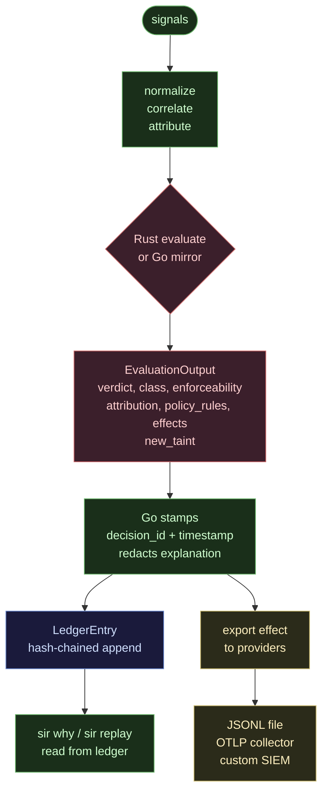
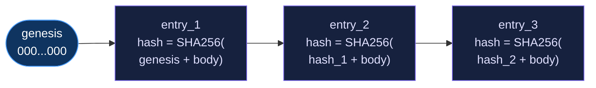

# Observability

SIR records everything that matters. Every signal, decision, and effect goes into a tamper-evident, hash-chained ledger. Evidence is exportable to JSONL, OTLP, or any downstream system through an export provider. The Rust kernel defines the normalized policy verdict; Go orchestrates state, stamps IDs, may add session/preflight restrictions, and writes the record.

---

## How a decision becomes evidence

When the pipeline runs, Rust `evaluate()` and the parity-checked Go path produce a deterministic `EvaluationOutput`. Go then stamps a `decision_id` and timestamp, builds the `Decision`, redacts the explanation, and appends a `LedgerEntry` to disk. Export providers receive the evidence as an effect request after that.



---

## The evidence ledger

The local ledger lives at `~/.sir/v2/ledger.jsonl`. It is append-only and hash-chained. Each entry includes the SHA-256 hash of the previous entry concatenated with the current entry body. Tampering with any entry breaks the chain from that point forward.



The ledger is seeded from a zero genesis hash. `OpenLedger` only seeds a fresh ledger when the file does not exist -- any other read failure returns an error and fails closed (non-negotiable #3).

**What is stored:** decision IDs, timestamps, modes, verdicts, enforceability, attribution, action types, sensitivity labels, policy rule names, planned effects, display paths.

**What is never stored:** raw secret values. Passive redaction runs over explanations before anything reaches disk.

**Passive redaction patterns (from `pkg/kernel/redact.go`):**

| Pattern | Example |
|---|---|
| AWS access keys | `AKIA[0-9A-Z]{16}` |
| GitHub PATs | `ghp_...` |
| GitHub Actions secrets | `ghs_...` |
| OpenAI-style keys | `sk-...` |
| Slack tokens | `xox[baprs]-...` |
| Bearer tokens | `Bearer <20+ chars>` |
| Shell password assignments | `password=...` |
| API key assignments | `api_key=...` |

---

## Ledger entry format

Each line in the ledger is a JSON object:

```json
{
  "entry_id": "e-2026-05-31T03:27:35Z-dec-a3b2c1d4",
  "case_id": "cred-read-then-egress",
  "decision": {
    "decision_id": "dec-a3b2c1d4e5f6",
    "timestamp": "2026-05-31T03:27:35Z",
    "mode": "contained",
    "verdict": "deny",
    "decision_class": "deny_now",
    "enforceability": "enforces",
    "attribution": "high",
    "action_type": "file_read",
    "sensitivity": "credential",
    "policy_rules": ["deny-agent-credential-read"],
    "effects": [{"type": "block", "required": true, "fail_closed": true}],
    "explanation": "SIR DENIED this because:\n  Policy rule 'deny-agent-credential-read' matched.\n  Target: ~/.aws/credentials (sensitivity: credential)\n  Enforceability: enforces (provider-backed mode can enforce or contain)"
  },
  "prev_hash": "d5e6f7a8...",
  "hash": "a3f2b1c4..."
}
```

The `explanation` field is human-readable and may contain display paths, so it is stripped from export payloads. Only structured fields travel to external systems.

---

## View recent decisions

```bash
# Explain the last decision
sir why --last

# Explain a specific decision by ID or case name
sir why --id cred-read-then-egress

# Replay decisions from the ledger
sir replay

# Show current mode and last decision at a glance
sir status
```

---

## Export commands

```bash
# Export the full ledger as JSONL to stdout
sir export

# Export the last 10 decisions
sir export --last 10

# Export to a file
sir export --out /tmp/sir-evidence.jsonl
```

Each exported record is a flat JSON object. The `explanation` field is omitted. Structured fields only:

```json
{
  "entry_id": "e-2026-05-31T03:27:35Z-dec-a3b2c1",
  "case_id": "cred-read-then-egress",
  "decision_id": "dec-a3b2c1d4e5f6",
  "timestamp": "2026-05-31T03:27:35Z",
  "mode": "contained",
  "verdict": "deny",
  "decision_class": "deny_now",
  "enforceability": "enforces",
  "attribution": "high",
  "action_type": "file_read",
  "sensitivity": "credential",
  "policy_rules": ["deny-agent-credential-read"],
  "hash": "a3f2b1c4...",
  "prev_hash": "d5e6f7a8..."
}
```

---

## JSONL export provider

`sir-jsonl-exporter` writes redacted decisions to a JSONL file. It applies its own redaction pass on top of the ledger's -- belt and suspenders.

```bash
# Validate the provider manifest
sir provider validate examples/providers/jsonl-exporter/provider.yaml

# Test it against a synthetic effect request
sir provider test examples/providers/jsonl-exporter/provider.yaml
```

The provider accepts `export` effect requests:

```json
{
  "schema_version": "sir.effect_request.v0",
  "effect_id": "eff_export_001",
  "type": "export",
  "required": false,
  "fail_closed": false,
  "target": {
    "payload": { "decision_id": "...", "verdict": "deny" },
    "output_path": "~/.sir/v2/export.jsonl"
  }
}
```

The `output_path` is expanded with `os.path.expanduser`. Writes are appended. The provider uses `KIND_EXPORT` from the Python SDK and returns `effect_applied` on success or `effect_failed` on write error.

---

## OTLP export provider

`sir-otlp-exporter` sends decisions as OpenTelemetry traces. It uses only Python stdlib `urllib` -- no `opentelemetry-sdk` dependency required, which keeps it compatible with the Go stdlib-only policy on the core side (the OTLP transport runs in the Python subprocess).

```bash
# Point to your collector (Jaeger, Tempo, Grafana, etc.)
OTLP_ENDPOINT=http://localhost:4318 sir provider test examples/providers/otlp-exporter/provider.yaml
```

Without `OTLP_ENDPOINT`, the provider writes OTLP-shaped JSON to stderr for local debugging. Set the env var to route to a real collector.

Spans are posted to `$OTLP_ENDPOINT/v1/traces`. The trace ID and span ID both come from `decision_id`.

Span attributes:

| Attribute | Values |
|---|---|
| `sir.verdict` | allow, ask, deny |
| `sir.mode` | observe, advise, hook_gate, os_observed, mediated, contained, managed |
| `sir.enforceability` | enforces, detects, blind |
| `sir.attribution` | high, medium, low, unknown |
| `sir.action_type` | file_read, shell_exec, network_egress, etc. |
| `sir.sensitivity` | credential, external_network, high, medium, low |

Span status: `2` (error) for deny, `1` (ok) for allow or ask.

---

## Custom export providers

To send evidence to your own SIEM, webhook, or database, write an export provider using the Python SDK. The SDK is a single file with zero dependencies -- vendor it alongside your provider or install from `sdk/python/`.

```python
#!/usr/bin/env python3
import json
import urllib.request
import sir_sdk

WEBHOOK_URL = "https://your-siem.example.com/api/ingest"

def caps():
    return sir_sdk.capabilities(
        "my-siem-exporter",
        sir_sdk.KIND_EXPORT,
        {"export": True, "format": "webhook"},
    )

def handle_effect(req):
    effect_id = req.get("effect_id", "")
    if req.get("type") != sir_sdk.EFFECT_EXPORT:
        return sir_sdk.effect_not_supported(effect_id, "export only")

    payload = req.get("target", {}).get("payload", {})
    body = json.dumps(payload).encode()

    try:
        r = urllib.request.Request(
            WEBHOOK_URL,
            data=body,
            headers={"Content-Type": "application/json"},
            method="POST",
        )
        urllib.request.urlopen(r, timeout=5)
        return sir_sdk.effect_applied(effect_id, "sent to SIEM")
    except Exception as e:
        return sir_sdk.effect_failed(effect_id, str(e))

sir_sdk.run_effect_provider(caps, handle_effect)
```

Scaffold a new provider with `sir provider scaffold --kind export`. Validate it before registering with `sir provider validate provider.yaml`.

---

## Harness parity reports

`sir harness run` tests the fixture cases and writes a structured report to `harness/fixtures/report.json`. The `--engine` flag controls which implementation is under test:

```bash
# Run against the Go kernel only
sir harness run --engine go

# Run against the Rust sir-core binary only
sir harness run --engine rust

# Run both and compare -- this is the parity check
sir harness run --engine both
```

`--engine both` runs each fixture against both implementations and flags any disagreement on the six parity fields: `verdict`, `decision_class`, `enforceability`, `attribution`, `policy_rules`, `effects`. A clean run prints `N/N parity` (currently `37/37`). The fixture suite includes policy-composition cases (an OPA verdict changing the final decision through both kernels), the developer-workflow floor, and a real-containment case — so parity covers the production decision path, not a simplified subset.

The report format:

```json
{
  "results": [
    {
      "case_id": "cred-read-then-egress",
      "mode": "contained",
      "score": "enforces",
      "reason": "provider-backed mode can enforce or contain"
    },
    {
      "case_id": "span-strip",
      "mode": "hook_gate",
      "score": "detects",
      "reason": "hook/span unreliable; fallback observed"
    },
    {
      "case_id": "detached-child",
      "mode": "mediated",
      "score": "detects",
      "reason": "mediated span severed; runtime signal caught residue"
    }
  ],
  "mode_summary": [
    {
      "mode": "hook_gate",
      "enforces": 4,
      "detects": 4,
      "blind": 0
    },
    {
      "mode": "contained",
      "enforces": 1,
      "detects": 0,
      "blind": 0
    },
    {
      "mode": "advise",
      "enforces": 0,
      "detects": 2,
      "blind": 0
    }
  ]
}
```

The mode summary is the primary tool for understanding your actual coverage. It shows how many fixture cases each protection mode can enforce outright, detect after the fact, or is blind to entirely.

A representative slice of the fixture cases:

| Case | What it tests |
|---|---|
| `claude-hook-bash-egress` | Cooperative pre-exec hook blocks network egress |
| `cred-read-then-egress` | Cross-action taint: credential read followed by network egress |
| `cross-action-cred-egress-different-session` | Taint does not leak across sessions |
| `cross-action-cred-egress-same-session` | Taint propagates within a session |
| `detached-child` | Detached subprocess evades hook gate |
| `hook-missing-os-signal` | Hook absent, OS signal still catches the action |
| `low-confidence-grant` | Low-attribution credential access escalates to ask |
| `mcp-shell-side-effect` | MCP tool invocation with shell side-effect |
| `post-hoc-signal` | Runtime signal arrives after execution (os_observed) |
| `prompt-flood` | Prompt injection attempt observed in advise mode |
| `required-effect-unavailable` | Required effect missing, fail_closed=true denies |
| `shared-shell` | Shared shell session, attribution is low |
| `shell-wrapper-cred-read` | Shell wrapper signals a credential read pre-exec |
| `span-forge` | Forged span bypasses mediated mode |
| `span-strip` | Stripped span degrades hook_gate to detects |
| `opa-ask-agent-push-clean` | An OPA verdict escalates the final decision through both kernels |
| `opa-deny-human-commit-clean` | Developer-workflow floor suppresses an advisory deny on a clean commit |
| `devcontainer-real-containment` | A provider that demonstrably contains scores `enforces` |

---

## Capture tier: reality vs. the model

The fixture cases above are the *model* — what SIR claims it can enforce or detect. The **capture tier** checks that claim against a *real run*. Each case may carry a sibling `capture.json` produced from an actual reproduction; the capture tier scores it the same way and fails CI if the captured (real) result is weaker than the fixture (claimed) result.

```bash
# Score every capture.json against its fixture; fails on a regression
sir harness run --tier capture harness/fixtures/cases    # make harness-capture
```

`sir harness capture-generate` produces the capture files from **real process reproductions** — each evasion is reproduced with harmless commands and its flags are derived from genuine observation, not hand-authored:

```bash
sir harness capture-generate            # dry run — print what each real reproduction observed
sir harness capture-generate --write    # regenerate capture.json files   (make harness-capture-generate)
```

- **span-strip** sets `SIR_SPAN_ID` in the parent and runs a child with it unset; the child genuinely observes an empty span.
- **detached-child** spawns a `setsid` child and confirms its process-group id really differs from the parent's.
- **prompt-flood** performs N rapid invocations with real wall-clock timestamps.
- **hook-missing** runs in a bare `env -i` shell with no hook and confirms zero signals reached the kernel.

For effect providers, `sir provider verify-containment --write-capture <dir>` writes a capture from a real contained run (e.g. the devcontainer provider blocking egress inside `--network=none`). The captured artifact records a `_capture_evidence` block so the score is backed by an observed run, not a claim.

---

## Provider health in doctor

`sir doctor` includes a provider health section that shows which providers are registered and what capabilities they advertise:

```text
v2 provider health

  sir-shell-wrapper          healthy   reliability=[declared_intent] timing=[pre_exec]
  sir-claude-code-hook       healthy   reliability=[declared_intent] timing=[pre_exec]
  sir-macos-seatbelt         healthy   contain=true  block=false  platform=darwin
  sir-devcontainer           healthy   contain=true  docker=true
  noop-effect-provider       healthy   contain=false  record=true
```

This section is best-effort. It is skipped in `sir doctor --json` to keep the CI probe hermetic. If a provider fails its health check, `sir doctor` will tell you which one and why.

Check a provider directly:

```bash
sir provider health examples/providers/jsonl-exporter/provider.yaml
```

---

## doctor --json v2 fields

`sir doctor --json` outputs a machine-readable health report that includes v2 Rust kernel status. This is useful for CI pipelines and automated monitoring.

```bash
sir doctor --json
```

```json
{
  "healthy": true,
  "installed": true,
  "deny_all": false,
  "ledger_valid": true,
  "binary_ok": true,
  "v2": {
    "sir_core_eval_present": true,
    "sir_core_eval_callable": true,
    "active_engine": "go",
    "provider_count": 11
  }
}
```

**v2 fields:**

| Field | Type | Description |
|---|---|---|
| `sir_core_eval_present` | bool | Whether `sir-core-eval` binary was found (checks repo build output and install path) |
| `sir_core_eval_callable` | bool | Whether a probe evaluation succeeded -- presence is not callability |
| `active_engine` | string | Current engine: `go`, `rust`, or `both` (from `SIR_ENGINE` env or default `go`) |
| `provider_count` | int | Number of registered providers found in `examples/providers/` |

**Use in CI:**

```bash
# Fail CI if Rust kernel is absent or broken
sir doctor --json | python3 -c "
import json, sys
data = json.load(sys.stdin)
v2 = data.get('v2', {})
if not v2.get('sir_core_eval_present'):
    print('sir-core-eval not found -- run: cargo build -p sir-core')
    sys.exit(1)
if not v2.get('sir_core_eval_callable'):
    print('sir-core-eval not callable')
    sys.exit(1)
print('Rust kernel: ok')
"
```

**Note on `--json` and provider health:** The provider health section is excluded from `--json` output because it spawns provider subprocesses. The `v2` block is always present and safe for CI consumption.

---

## Mode telemetry in status

`sir status` shows your current protection mode and the last decision at a glance:

```text
Mode: hook_gate
Guarantee: cooperative hooks only; blind to detached children

Last decision: deny (2026-05-31T03:27:35Z) -- case: cred-read-then-egress
```

The guarantee text comes from the mode's enforceability characteristics. It tells you exactly what SIR can and cannot stop in your current configuration. Here is what each mode reports:

| Mode | Guarantee text |
|---|---|
| `observe` | records only |
| `advise` | explains only |
| `hook_gate` | cooperative hooks only |
| `os_observed` | post-hoc detection |
| `mediated` | pre-exec when span intact |
| `contained` | provider-backed enforcement |
| `managed` | signed policy + provider health |

If you want stronger guarantees, `sir status` is where you will see the gap. Use `sir why --last` to understand the most recent decision in detail.

---

## Cross-action taint and evidence

SIR tracks taint across separate evaluations within a session. When an action with `sensitivity=credential` is allowed or observed, the kernel records `credential_access` taint. A subsequent network egress request in the same session carries that taint as `prior_taint` in the `EvaluationInput`, which the policy engine uses to escalate the verdict.

This cross-action correlation shows up in the ledger. Both entries will be present, and the second entry's `policy_rules` will include the rule that triggered on prior taint (such as `deny-cross-action-cred-egress`). `sir why --id <decision_id>` will show you the full chain.

The `cred-read-then-egress` and `cross-action-cred-egress-same-session` fixture cases exercise this path. Run `sir harness run --engine both` to verify parity between the Rust and Go implementations for these cases.
