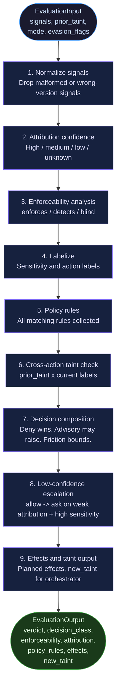
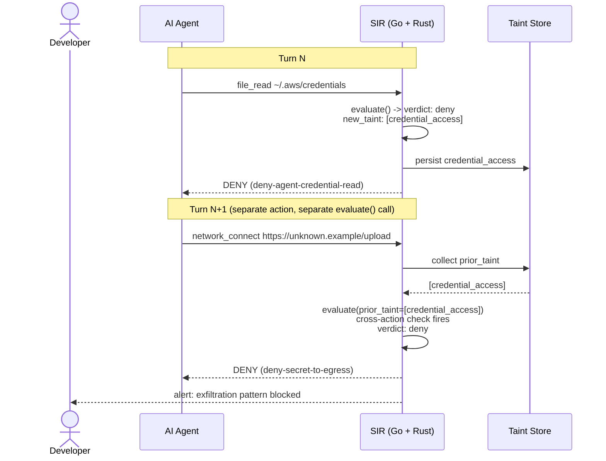
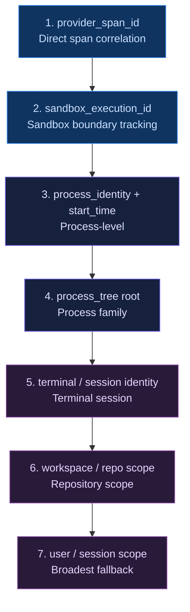

# Policy Reference

Policy is how SIR decides what to do with an attributed action. Rules are deterministic: they pattern-match against labeled actions and produce verdicts. The Rust kernel (`sir-core`) runs every evaluation. Go orchestrates the stateful parts before and after.

---

## Where policy runs

Every policy evaluation passes through `sir-core`, the pure Rust decision kernel. The entry point is:

```
evaluate(EvaluationInput) -> EvaluationOutput
```

The kernel has no filesystem access, no network access, no global state, and no external dependencies. It reads everything it needs from the `EvaluationInput` struct: signals, evasion flags, `prior_taint` from previous actions in the same session, and `provider_capabilities` from the Go orchestrator.

The Go layer (`pkg/kernel`) mirrors the same `Evaluate()` function for parity verification. The harness (`sir harness run --engine both`) proves that both engines agree on all 37 fixture cases.

---

## The evaluation pipeline

A policy evaluation does not jump straight from "action received" to "verdict issued." It moves through a defined sequence of stages. Understanding the stages helps you reason about why a specific verdict was produced.



---

## How the decision composer works

All matching rules are collected. The composer applies these rules in order:

1. Hard deny always wins over ask or allow.
2. Required effect unavailable with `fail_closed=true` upgrades the enforceability class to `enforces` and produces a deny.
3. Low attribution confidence on high-sensitivity targets escalates allow to ask (`low-confidence-escalation` rule).
4. Advisory engines can raise risk but cannot lower a deterministic verdict.
5. Friction bounding: three ask prompts in ten minutes escalates the next one to deny.

---

## Built-in policy rules

### deny-agent-credential-read

**When:** An AI coding agent (`actor_kind: ai_coding_agent`) attempts to read a file with `sensitivity: credential`.

**Verdict:** deny

**Effects:** block (required, fail_closed), record (required)

**Why this exists:** AI agents should not have direct access to credential files. They can receive credentials through safer mechanisms like environment variables injected at launch time. Direct reads are almost always a sign something has gone wrong.

---

### deny-secret-to-egress

**When:** The current action involves external network egress AND either:
- The same action also carries `credential_access` (same-action match), or
- `prior_taint` from a previous evaluation in this session contains `credential_access` (cross-action match).

**Verdict:** deny

**Effects:** block (required, fail_closed), record (required)

**Why this exists:** The classic exfiltration pattern is: read a secret, then send it somewhere. The cross-action check catches this even when the credential read and the egress attempt happen in separate agent turns. See the [cross-action taint section](#cross-action-taint) for the full story.

---

### ask-external-egress

**When:** Any action involves `sensitivity: external_network`.

**Verdict:** ask

**Effects:** prompt (best-effort), record (required)

**Why this exists:** Outbound network connections are a frequent exfiltration vector. Asking before each new external host gives developers visibility without being overly aggressive about blocking legitimate work.

---

### ask-dangerous-shell

**When:** A normalized shell command matches the `dangerous_shell` classifier. The classifier is intentionally narrow: it asks on high-blast-radius destructive operations, not ordinary project cleanup.

Covered patterns include:

- Recursive deletes of root, the current tree, home-directory roots, or Windows drive roots: `rm -rf /`, `rm -rf ./*`, `rm -rf $HOME/*`, `Remove-Item -Recurse C:\`, `rd /s C:\`, `del /s C:\*`.
- Disk, partition, and filesystem destruction: `mkfs*`, `mke2fs`, `newfs`, `wipefs`, `blkdiscard`, `dd ... of=/dev/sdX`, `tee /dev/sdX`, `cp image.raw /dev/nvme0n1`, `shred /dev/nvme0n1`, `sgdisk --zap-all`, `parted ... mklabel`, `cryptsetup luksFormat`, `diskpart`, `format C:`, `format-volume`, `clear-disk`, `initialize-disk`, `remove-partition`.
- macOS disk erase flows: `diskutil eraseDisk`, `diskutil eraseVolume`, `diskutil partitionDisk`, `diskutil secureErase`, `diskutil apfs deleteContainer`, `asr restore --erase`.
- Permission and ownership changes with broad scope: `chmod -R 777 .`, `chmod -R a+w /path`, `chown -R user:group /`, `icacls C:\ /grant Everyone:F /T`, `takeown /F C:\ /R`.
- Repository-wide destructive resets: `git clean -fdx`, `git clean -ffdx`, `git reset --hard`, `git checkout -- .`, `git restore .`.
- Resource-destruction patterns: fork bombs such as `:(){ :|:& };:`, `kill -9 -1`, and Windows free-space wipe via `cipher /w:C:\`.

The classifier recurses through common wrappers before matching, including `sudo`, `sh -c`, `bash -c`, `zsh -c`, `dash -c`, `ksh -c`, `powershell -Command`, `pwsh -c`, and `cmd /c`.

Explicitly not covered: common cleanup and inspection commands such as `rm -rf node_modules`, `rm -rf build target dist`, `find build -delete`, `git clean -fd`, `diskutil list`, `del /q build\file.txt`, and disk reads like `cp /dev/sda backup.img`.

**Verdict:** ask

**Effects:** prompt (best-effort), record (required)

**Why this exists:** These commands can irreversibly destroy files, disks, permissions, repository state, or running processes. An agent running them without developer awareness is a meaningful risk regardless of the intended purpose.

---

### ask-new-mcp-server

**When:** Action type is `mcp_trust` or the `new_mcp_server` label is present.

**Verdict:** ask

**Effects:** prompt (best-effort), record (required)

**Why this exists:** New MCP servers are a supply chain risk. A malicious or compromised MCP server can exfiltrate data or execute arbitrary code inside the agent's trust boundary. Getting explicit approval before trusting a new server is the right default.

---

### ask-cicd-edit

**When:** A file write targets a CI/CD path: `.github/workflows`, `.gitlab-ci`, `Jenkinsfile`, `.circleci`, `Makefile`, `.travis.yml`.

**Verdict:** ask

**Effects:** prompt (best-effort), record (required)

**Why this exists:** CI/CD configuration controls what runs in production. An agent editing it without explicit developer approval is a meaningful supply chain risk, even when the agent's intent is benign.

---

### ask-git-hook-tamper

**When:** A file write targets a git hook — any path under `.git/hooks/` (`pre-commit`, `pre-push`, `post-checkout`, …).

**Verdict:** ask — *for everyone, agent and human alike.*

**Effects:** prompt (best-effort), record (required)

**Why this exists:** A planted `.git/hooks/pre-commit` executes on the next commit, so a git hook is an execution-on-commit vector a prompt-injected agent can abuse. It is the same shape as `ask-cicd-edit`.

**Why ask, not deny** (the design choice, stated plainly so it can be vetoed): the closest existing floor — SIR-config tamper — is itself *ask + restore*, not pure deny, and non-negotiable #9 requires posture writes to always ask. Legitimate hook frameworks (husky, pre-commit, lefthook) and humans install hooks routinely; a one-time approval keeps that working while still surfacing an agent's attempt. A pure agent-scoped deny would block normal hook installation — the exact friction SIR exists to avoid.

**How it actually enforces:** in the shipping engine this is the **posture-file mechanism** — `.git/hooks/*` is in the lease `PostureFiles`, so a write classifies as posture and the oracle asks (`pkg/lease`, `pkg/hooks/classify`, `mister-core`). The `ask-git-hook-tamper` rule above is the v2-kernel mirror that keeps the Go/Rust parity suite aligned on intent. **Deliberate limitation:** the `PostureFiles` entry is a glob, which is never sentinel-hashed, so git hooks get the pre-exec write ask but **no** post-hoc tamper→deny-all coverage. That is intentional — hashing individual hook files would deny-all the session on every husky reinstall.

---

### deny-sir-config-tamper

**When:** An action targets a SIR configuration path: `.claude/settings`, `sir.yaml`, `.sir/`, `sir-posture`.

**Verdict:** deny

**Effects:** block (required, fail_closed), record (required)

**Why this exists:** A compromised or prompt-injected agent might try to disable SIR before exfiltrating data. This rule ensures SIR cannot be silenced through a file write. Non-negotiable: Go must never widen a Rust deny.

---

## Production self-protection floors (Go gate layer)

Some floors live in neither the v2 kernel nor the posture/lease layer but in the Go gate chain in `pkg/hooks/evaluate.go` — Go-only restrictions that act on runtime facts the Rust oracle cannot see (a resolved `~/.sir/` path; a parsed git command line). Go may *add* a restriction this way; it never widens a Rust deny.

- **SIR state tamper → deny.** An agent write whose target resolves into SIR's own state dir (`~/.sir/`, the ledger/session/posture) or the `sir.yaml` / `sir-posture` config patterns is a control-plane tamper — a prompt-injected agent trying to disable the guard before acting. Hard deny, marked `Floor` so observe mode cannot downgrade it (`sirStateTamper`). This is the production parity for the v2 kernel's `deny-sir-config-tamper`, which previously had no shipping-path equivalent. Symlinks are resolved before matching (#6), and it covers Write / Edit / **apply_patch** (so it catches the PreToolUse-bypass vector the file-hash path cannot). SIR's own writes are internal Go calls that never pass through agent intent classification, so this never blocks SIR itself. Deny — not the posture ask used for `.claude/settings.json` — because an agent has *no* legitimate reason to write SIR's own state; the asymmetry is principled.
- **Credential-helper / hooks-path config rewrite → ask.** `git config [--global|--local|--add|--replace-all] credential.helper|core.hooksPath <value>` and inline `git -c credential.helper=…|core.hooksPath=… <cmd>` are the *config/shell* form of credential theft (a malicious helper leaks credentials on every git op) and hook redirection. Detected by `gitConfigSensitiveAsk` and gated **ask, not deny** — husky v5+ and lefthook legitimately run `git config core.hooksPath …` on install, so a deny would break the most common hook frameworks (consistent with the `.git/hooks/*` file floor). Read forms (`--get`/`--list`) are excluded; it self-guards on verb risk so it never preempts a stricter gate (e.g. `git -c …=… push`).

**Accepted residuals** (inherent limits, not a TODO list): the Bash form of a `.sir/` write (`echo > ~/.sir/x`, `rm -rf ~/.sir`); a direct write to `.git/config`'s `[credential]`/`[core]` sections (which stays non-posture so routine `git config` is quiet); and heavy shell obfuscation or env-var indirection of the git config command. These are the cost of keeping ordinary git and editing workflows silent.

The credential **store** `.git-credentials` is separately a `SensitivePath`, so *reading* it already taints the session.

A fixture cannot prove a floor that does not exist, and a harness fixture proves only the v2 kernel — production floors that live in the posture/lease or Go gate layer are proven by Go tests on the real evaluation path (e.g. `TestSirStateTamper`, `TestGitConfigSensitiveAsk`, `TestLocalEvaluate_GitHookWrite_Asks`, `TestIsPostureFile`), not by the parity suite. The harness suite proves every v2-kernel floor (see `agent-modify-sir-config`, `agent-modify-git-hooks`, `human-modify-git-hooks`, `agent-push-after-cred-read-denies`, `agent-commit-secret-denies`).

---

## Sensitivity labels

Sensitivity labels are applied to action targets based on what the target matches:

| Label | Applied when |
|---|---|
| `credential` | Target matches `.env`, `credentials`, `.aws/`, `.ssh/`, `.pem`, `.key`, `id_rsa`, `id_ed25519` |
| `external_network` | Target is an external URL, IP, or hostname |
| `low` | No elevated pattern detected |

---

## Action labels

Action labels are applied based on the correlated signals and target content:

| Label | Applied when |
|---|---|
| `credential_access` | Sensitivity is `credential` |
| `external_egress` | Sensitivity is `external_network` |
| `shell_execution` | Action type contains `shell_exec` |
| `file_mutation` | Action type contains `file_write` |
| `ai_agent_actor` | ActorClaim kind is `ai_coding_agent` |
| `dangerous_shell` | Command display matches a dangerous shell pattern |
| `cicd_edit` | File path matches a CI/CD pattern |
| `sir_config_tamper` | File path matches a SIR config path |

---

## Cross-action taint

Taint is how SIR tracks dangerous context across multiple agent turns in the same session. The key scenario is credential exfiltration: the agent reads a secret in turn N, then sends it somewhere in turn N+1. Without cross-action tracking, each turn looks innocent on its own.

The Rust kernel and Go orchestrator handle this explicitly. When a credential read completes, `new_taint: ["credential_access"]` is returned in `EvaluationOutput`. The Go orchestrator merges that into the session taint store. On the next call to `evaluate()`, the orchestrator populates `prior_taint` with whatever taint has accumulated. The kernel checks it before running any other rule.



The two harness fixture cases that prove this behavior:

| Case | `prior_taint` | Expected verdict | Rule fired |
|---|---|---|---|
| `cross-action-cred-egress-same-session` | `["credential_access"]` | deny | `deny-secret-to-egress` |
| `cross-action-cred-egress-different-session` | `[]` | ask | `ask-external-egress` |

The second case shows the other side: in a fresh session or a different session with no credential read, the same egress attempt gets `ask`, not `deny`. The rule only fires when the taint is actually present.

---

## Taint scope and priority

Taint is scoped by the strongest available session identifier. Weak attribution widens the taint scope rather than narrowing it. Taint is never erased within a session.



When attribution is weak, the taint scope widens to include more candidate sessions. This is intentional: evasion techniques that strip spans or detach child processes should produce stricter outcomes, not more permissive ones.

---

## Grants

A grant allows a specific action that would otherwise be blocked or prompted.

```bash
# Allow an action once, expiring in 15 minutes (default TTL)
sir allow ~/.aws/credentials

# Allow with a custom TTL
sir allow target-host --ttl 30m
```

**Constraints:**
- One-time use by default
- Maximum TTL: one hour
- Persistent, repo-wide, and global grants are not allowed
- Every grant is written to the ledger

Broad grants train developers to approve without thinking. Narrow, expiring grants maintain friction that is appropriate to the risk. The CORRELATION spec requires that low-confidence grants be narrow and short-lived.

---

## Friction bounding

SIR tracks how often it issues `ask` verdicts per session scope. The default policy:

- Window: 10 minutes
- Threshold: 3 ask prompts
- Escalation: deny

If the threshold is exceeded, the next ask in the same session scope is upgraded to deny. This stops agents from spamming approval gates and expecting the developer to eventually click yes. A tool that generates twelve prompts in a row will hit the threshold and be blocked before the developer has to decide whether to keep saying yes.

The friction state is managed by the Go orchestrator, not the Rust kernel. It is stateful by design. The kernel returns a verdict; the orchestrator applies friction before acting on it.

---

## Advisory engines

Advisory providers and model-based risk scores can influence verdicts, but they are bounded:

1. An advisory signal can escalate `allow` to `ask`.
2. An advisory signal cannot change `deny` to anything else.
3. An advisory signal cannot change `ask` to `allow`.

This is the "advisory engines may raise risk but may not lower deterministic risk" rule. The rationale is that deterministic rules encode hard policy boundaries. An LLM-based signal, however well-calibrated, should not be able to override a hard deny. It can add caution; it cannot remove it.

Advisory providers (registered `advisory_provider` kind) are invoked on every evaluation. The orchestrator takes the highest `risk_level` across all of them and composes it: `high`/`critical` escalates `allow → ask`; `medium` records only; `low` changes nothing. A `deny` stays a `deny`. The bound is enforced both in the Go translation (`collectAdvisoryVerdicts` in `pkg/hooks/policy_providers.go`) and in the Rust composer (`compose_policy_verdicts` in `mister-core/src/policy.rs`), which never lets an advisory verdict widen a deny.

**Developer-workflow floor.** Before advisory composition runs, the Rust composer checks whether the action is a clean-session developer workflow — `read_ref`, `stage_write`, `run_tests`, `commit`, `list_files`, `search_code`, `net_local` with no credential taint. If so, no advisory verdict can escalate it. This guarantees normal coding stays quiet regardless of what policy or advisory providers return. The floor lifts the moment the session carries credential taint, so the was-secret push rules still fire.

**Configurable policy lives in providers, not the core.** The was-secret push re-prompt (ask on `push_origin`/`push_remote` after the session held credentials) is no longer hardcoded in the Rust oracle — it is an advisory rule in the `sir-policy-pack` provider, tunable per-project: `sir provider configure sir-policy-pack --set was-secret-push-origin=allow`. The live-credential floors (secret session + external egress = deny) remain hardcoded in Rust and are never configurable.

**Did an advisory verdict actually matter?** When an advisory verdict escalates `allow → ask`, the ledger entry records the pre-composition `base_verdict` (`allow`) alongside the final `ask`. `sir why` uses it to annotate each provider verdict — `→ used (escalated allow→ask)` for the one that moved the needle, `→ no effect` for the rest, and `→ no effect (cannot lower a native deny)` when the final verdict was a native deny. The base verdict is recomputed by re-running the same decision engine with the verdicts removed (the authoritative source — never a cross-engine guess), only in the otherwise-ambiguous `ask` case, so the hot path stays single-shot. To model the composition for a hypothetical action without consulting the ledger, use `sir policy explain`.

---

## Composition order

When SIR composes a final decision, inputs are layered by authority — highest first. The Rust core (`compose_policy_verdicts`) does the composing; effect providers apply the result.

1. **Native SIR safety floors** — always authoritative (secret-session + external egress, SIR/git-hook/credential-helper tamper, tripwire). Hardcoded in Rust, non-bypassable. *(current)*
2. **Signed managed policy** — enterprise, authoritative input above local policy. *(future)*
3. **Local policy provider** — advisory verdict from your chosen engine. *(current — exactly one active policy provider; see [Composition and exclusivity](providers.md#composition-and-exclusivity) for the MVP limitation)*
4. **Advisory providers** — risk scoring; raise risk, never lower it. *(current)*
5. **Developer-workflow floor** — protects clean-session coding actions from advisory escalation. *(current)*

This list is the **authority ordering**, not the execution order: the developer-workflow floor is checked *before* advisory composition runs (see [Advisory engines](#advisory-engines) above), but it sits below the floors and policy input in authority because it only suppresses advisory escalation — it never widens or lowers anything.

The bound that holds across every layer: an advisory verdict (from a `policy_provider` or an `advisory_provider`) can escalate `allow → ask` only. It can never change `ask → allow` and it can never override a native `deny`. Deny always wins. The single-active-policy-provider model — picked with `sir provider use` and swapped with `sir provider swap` — is the current MVP; multi-provider policy composition is roadmap. See [Composition and exclusivity](providers.md#composition-and-exclusivity) in the Provider Guide.

---

## Debugging policy

Two commands let you inspect a single decision without running a full `sir guard` cycle.

**`sir policy test`** sends one request to a policy provider and prints its verdict — for debugging a policy pack, OPA bridge, or Cedar bridge in isolation:

```bash
sir policy test --provider examples/providers/policy-pack/provider.yaml \
  --action push_origin --taint credential_access --actor ai_coding_agent
# Policy request:
#   action: push_origin
# Provider verdict:
#   sir-policy-pack: ask
#     rules: was-secret-push-origin
# Final Rust decision:
#   verdict: ask

sir policy test opa-bridge --fixture examples/providers/opa-bridge/fixtures/was-secret-push.json
# If OPA is unavailable, SIR prints an unavailable/no-verdict provider result
# and still shows the native final decision.
```

**`sir policy explain`** runs the real kernel composition and shows each layer — native decision, developer-workflow floor, advisory escalation, and the final verdict — so you can see exactly *why* a verdict was honored or suppressed:

```bash
sir policy explain --action vcs_commit --verdict opa=deny
# 1. native decision: allow
# 2. developer-workflow floor protects this action: true
# 3. advisory verdict: opa says deny → suppressed by the developer-workflow floor
# final: allow

sir policy explain --action vcs_push --verdict opa=ask
# 3. advisory verdict: opa says ask → escalated allow → ask
# final: ask

sir policy explain --action vcs_commit --actor human_developer --provider opa-bridge
# Runs the active provider, prints its recommendation, then prints the composed final decision.
```

---

## Low-confidence escalation

When the attribution confidence for an action is `low` or `unknown` and the target sensitivity is `credential`, `high`, or `critical`:

- `allow` becomes `ask`
- `ask` stays `ask`
- `deny` stays `deny`

The policy rule ID recorded in the decision is `low-confidence-escalation`.

Weak attribution should not be rewarded with permissive outcomes. If SIR cannot establish who is touching a credential file with reasonable confidence, it asks before proceeding. Evasion techniques that strip spans or detach child processes produce low attribution. That should make outcomes stricter, not easier to pass through.

---

## Decision classes

The kernel resolves a decision class alongside the verdict. The class carries enforcement timing semantics:

| Class | Verdict | Meaning |
|---|---|---|
| `deny_now` | deny | Immediate block. No waiting. |
| `block_and_wait` | ask | Pre-exec gate. Action is held until the developer responds. Requires enforceability class `enforces`. |
| `record_post_hoc` | ask | SIR detected but cannot gate. Recorded after the fact. |
| `proceed_and_reconcile` | allow | Action proceeds. SIR records and may reconcile later. |

The distinction between `block_and_wait` and `record_post_hoc` depends on enforceability. In `hook_gate` mode with a cooperative pre-exec hook present, SIR can hold the action. Without that hook, it can only observe and record.
