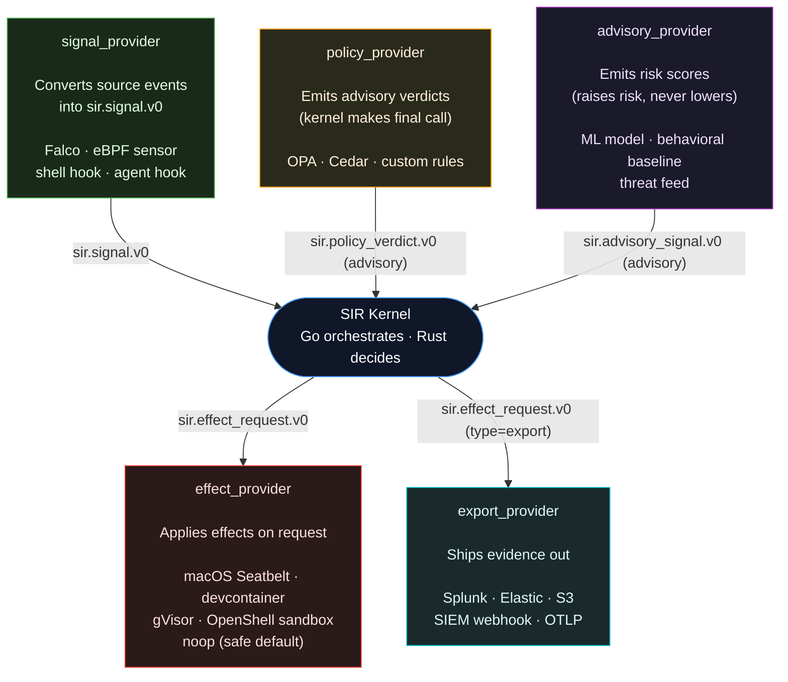
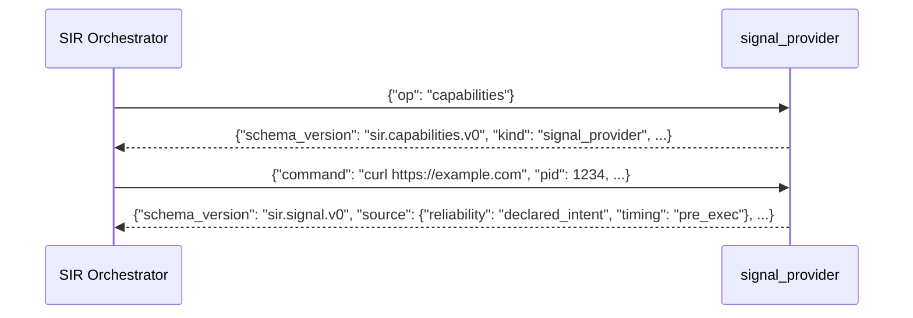
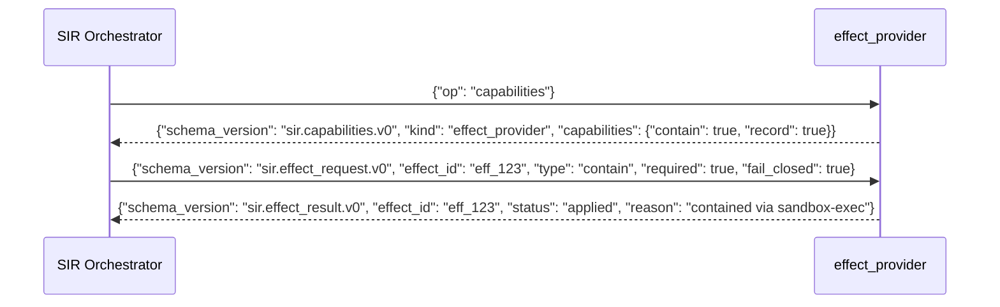
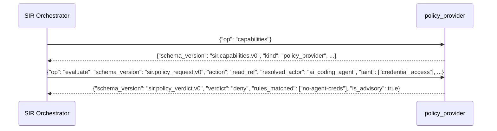
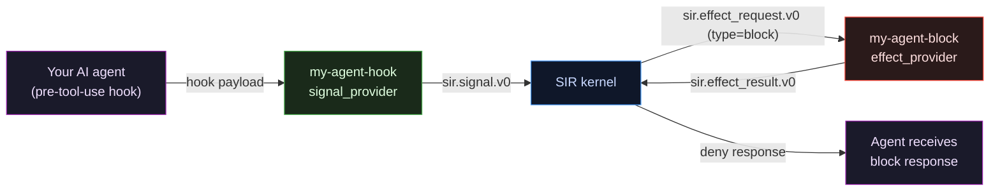
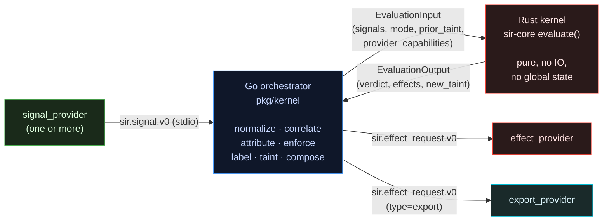

# Provider Guide

Providers are how SIR integrates with the rest of the world. A provider is a process that reads JSON on stdin and writes JSON on stdout. The language, runtime, and framework are yours to choose.

---

## Which provider do I need?

Start here. Find what you want to plug in and read across.

| I want to plug in... | Provider kind | Examples |
|---|---|---|
| Falco, eBPF sensor, auditd, OS telemetry | **signal_provider** | Falco rule → signal bridge |
| Shell pre-exec hook, Claude Code hook | **signal_provider** | `sir-shell-wrapper`, `sir-claude-code-hook` |
| Any AI coding agent or LLM harness | **signal_provider** + **effect_provider** | See [Wiring an AI agent](#wiring-an-ai-coding-agent) |
| macOS Seatbelt, seccomp, gVisor, OpenShell sandbox | **effect_provider** | `sir-macos-seatbelt`, `sir-devcontainer` |
| OPA, Cedar, custom policy rules | **policy_provider** | `sir-policy-pack` |
| ML risk model, anomaly detector, threat feed | **advisory_provider** | `sir-advisory-baseline` |
| Splunk, Elastic, SIEM webhook, S3, OTLP | **export_provider** | `sir-jsonl-exporter`, `sir-otlp-exporter` |
| Prometheus, security dashboard | **export_provider** | write your own |

**OPA vs sandbox — the question that comes up most:**
- **OPA** says allow/deny/ask. It evaluates policies. Wire it as a `policy_provider`.
- **A sandbox** (Seatbelt, seccomp, gVisor, OpenShell) *applies* the effect. Wire it as an `effect_provider`.

You can and often should run both: OPA recommends through policy advice, SIR composes the final decision, and your sandbox enforces the resulting effect.

---

## How all providers fit together



**The flow in plain terms:**

1. **Signal providers** are sensors. They watch for actions and translate them into a normalized signal.
2. **Policy and advisory providers** give the kernel extra input. Policy providers emit verdicts (allow/ask/deny); advisory providers emit risk scores. Both are advisory — the kernel makes the final call.
3. The **kernel** (Go orchestrates, Rust decides) evaluates signals, applies policy rules, and produces a verdict.
4. **Effect providers** carry out whatever the kernel decides: block, contain, record, prompt.
5. **Export providers** receive evidence bundles and ship them out.

---

## Signal provider

**What it does:** translates source-native events into `sir.signal.v0`. This is the sensor layer — any event source that SIR needs to see belongs here.

**When to use it:**
- You have a runtime sensor (Falco, eBPF, auditd) that emits events you want SIR to act on
- You have a pre-exec shell hook (bash `PROMPT_COMMAND`, zsh precmd)
- You are wiring a new AI agent's hook payloads into SIR
- You are building a file watcher, network tap, or other event source

**Input:** any JSON object (the raw source event — your format, not SIR's)

**Output:** `sir.signal.v0`

**What reliability to declare:**

| Signal source | Reliability to use |
|---|---|
| Pre-exec hook (agent told us before running) | `declared_intent` |
| SIR launched / proxied the process | `mediated_action` |
| eBPF / Falco / auditd saw it happen | `observed_runtime` |
| Sandbox boundary confirmed it | `enforced_boundary` |
| Heuristic, model output | `advisory_signal` |

Do not claim `declared_intent` if you are receiving post-hoc OS events. Reliability feeds directly into whether SIR can gate or only detect.



**Python example — shell wrapper:**

```python
#!/usr/bin/env python3
import hashlib
import sir_sdk

PROVIDER_NAME = "my-shell-wrapper"
PROVIDER_VERSION = "0.1.0"


def _classify(command: str) -> str:
    cred_patterns = (".env", "credentials", ".aws/", ".ssh/", ".pem", ".key")
    net_patterns = ("curl ", "wget ", " ssh ", " scp ", "nc ", "socat ")
    cmd = command.lower()
    if any(p in cmd for p in cred_patterns):
        return "credential"
    if any(p in cmd for p in net_patterns):
        return "external_network"
    return "low"


def caps():
    return sir_sdk.capabilities(
        PROVIDER_NAME,
        sir_sdk.KIND_SIGNAL,
        {
            "signal_reliability": [sir_sdk.RELIABILITY_DECLARED_INTENT],
            "timing": [sir_sdk.TIMING_PRE_EXEC],
        },
    )


def emit(event: dict):
    command = event.get("command", "")
    if not command:
        return None

    raw_id = f"{command}:{event.get('pid', 0)}"
    signal_id = "shell-" + hashlib.sha256(raw_id.encode()).hexdigest()[:12]

    return sir_sdk.make_signal(
        signal_id=signal_id,
        signal_time=event.get("signal_time", "1970-01-01T00:00:00Z"),
        source_kind="shell_wrapper",
        reliability=sir_sdk.RELIABILITY_DECLARED_INTENT,
        timing=sir_sdk.TIMING_PRE_EXEC,
        action_claim={
            "type": "shell_exec",
            "target": {
                "display": command,
                "sensitivity": _classify(command),
            },
        },
        provider_name=PROVIDER_NAME,
        provider_version=PROVIDER_VERSION,
    )


sir_sdk.run_signal_provider(caps, emit)
```

**Fixture format** (a native source event — your format, not a signal):

```json
{
  "command": "curl https://example.com/upload",
  "pid": 9001,
  "session_id": "sess_test_001",
  "signal_time": "2026-01-01T00:00:00Z"
}
```

Return `None` from `emit` to silently drop an event.

**Example manifest:**

```yaml
schema_version: sir.provider.v0
name: my-shell-wrapper
kind: signal_provider
version: 0.1.0
protocol: stdio-json
entrypoint: ./provider.py
platforms: [macos, linux]
capabilities:
  signal_reliability: [declared_intent]
  timing: [pre_exec]
fixtures:
  - fixtures/shell-event.json
```

---

## Effect provider

**What it does:** applies effects that the kernel requests. Effects include `record`, `nudge`, `contain`, `block`, `prompt`, and `export`.

**When to use it:**
- You are wiring a sandbox: macOS Seatbelt, seccomp, gVisor, OpenShell, devcontainer
- You need to terminate or isolate a process
- You want to implement a custom blocking mechanism (iptables rule, cgroup freeze)
- You need a safe no-op default while you build out enforcement

**Input:** `sir.effect_request.v0`

**Output:** `sir.effect_result.v0`



**Required vs best-effort effects.** Each effect request carries two flags:

- `required: true` — the kernel considers this effect necessary for the decision to hold
- `fail_closed: true` — if you return `unavailable` on a required effect, SIR upgrades the decision to `deny`

If `required` is false, returning `unavailable` is fine.

**`unavailable` is a valid, honest response.** Do not claim `applied` for something you did not actually apply. SIR records your response as evidence, and a false `applied` corrupts the audit trail.

| Status | Meaning |
|---|---|
| `applied` | The effect was applied successfully |
| `unavailable` | You cannot apply it in this environment |
| `failed` | You tried and failed |
| `not_supported` | You do not support this effect type at all |

**Effects the kernel can request:**

| Effect type | What it means |
|---|---|
| `record` | Write evidence to the ledger |
| `nudge` | Show the developer an advisory message |
| `redact` | Remove sensitive data from output |
| `prompt` | Ask the developer for approval |
| `block` | Prevent the action from completing |
| `contain` | Run the action inside a sandbox boundary |
| `kill_process` | Terminate the offending process |
| `request_exception` | Ask for a policy exception |
| `export` | Send evidence to an external system (see export_provider) |

### Enforcement honesty: declared vs. demonstrated

Declaring `contain: true` does not make SIR trust you to enforce. The kernel only scores an action `enforces` when the effect is **demonstrated**, not merely declared — closing the false-`enforces` soundness gap.

Two signals make this concrete:

1. **Manifest `enforcement` field** — an effect provider that declares `contain`/`block` should state whether its enforcement is real:

   ```yaml
   enforcement: simulated   # capability plumbing / stub — never scores enforces
   # or
   enforcement: real        # demonstrably contains — scores enforces, but only with proof
   ```

2. **`sir provider verify-containment`** — proves an `enforcement: real` claim by actually running a contained action and confirming the boundary held:

   ```bash
   sir provider verify-containment examples/providers/devcontainer/provider.yaml
   # VERIFIED: sir-devcontainer demonstrably contains (enforcement:real is justified)
   ```

   The reference `devcontainer` provider does this for real: on a `contain` effect it runs the action inside a hardened `docker run --network=none --read-only --memory --pids-limit --cap-drop=ALL` jail. A network-egress command inside `--network=none` genuinely cannot reach the network — verify-containment confirms it (`network_blocked=true`).

   A **second, Docker-independent** real enforcer ships alongside it: `examples/providers/macos-sandbox` runs the action under macOS Seatbelt (`sandbox-exec -p '(version 1)(allow default)(deny network*)'`). A network egress inside that profile genuinely cannot resolve or connect — `sir provider verify-containment` confirms it the same way. It backs **`mediated` mode** (SIR launches/proxies the process under the profile — the mediation premise) the way the devcontainer backs `contained`, so SIR's real enforcement is not a single point. Its capture proof lives in `harness/fixtures/cases/mediated-sandbox-real/capture.json`, generated from a real sandboxed run; `mediated-declared-only-detects` is the paired soundness proof that a declared-only pre-exec signal (no real runner) degrades to `detects`.

A provider that declares `enforcement: real` without capture proof **fails CI** (the enforcement-honesty gate in `.github/workflows/ci.yml`). A `simulated` provider is excluded from `enforces` and surfaced honestly in `sir provider status` and `sir provider list`. See [enforceability](#how-signals-reach-the-decision-kernel).

### Action-scoped capability

A full-containment provider like the devcontainer contains *everything* (no network, read-only filesystem), so it enforces every action. But a narrower sandbox might enforce only some action types — a network jail blocks egress but does nothing about a file write. Declaring `enforcement: real` for such a provider would over-claim `enforces` on actions it cannot actually contain.

`enforced_actions` (optional, item 8) scopes the claim. A provider lists the action types its real enforcement covers:

```yaml
schema_version: sir.provider.v0
name: sir-netjail
kind: effect_provider
capabilities:
  block: true
  record: true
enforcement: real
enforced_actions: [network_connect, network_fetch, dns_lookup]   # network only
```

The kernel then classifies `enforces` only for a covered action and degrades to `detects` for any other (the sandbox still *observes* the uncovered action inside the jail — it just cannot prevent it). Omitting `enforced_actions` (or leaving it empty) means "enforces everything," the backward-compatible default that every existing provider keeps. An `unknown` action type is never covered by a non-empty list, so it also degrades to `detects` — a partial enforcer can never over-claim.

This is a forward-looking soundness mechanism: **no shipping provider partially-enforces yet** (the devcontainer contains everything). The behavior is proven by the harness fixtures `action-scoped-enforces-covered` (covered → enforces) and `action-scoped-detects-uncovered` (uncovered → detects), and by `pkg/kernel` / `sir-core` unit tests in both engines.

**Python example — macOS Seatbelt:**

```python
#!/usr/bin/env python3
import shutil
import sys
import sir_sdk

PROVIDER_NAME = "my-seatbelt-provider"
PROVIDER_VERSION = "0.1.0"


def _available() -> bool:
    return sys.platform == "darwin" and shutil.which("sandbox-exec") is not None


def caps():
    available = _available()
    return sir_sdk.capabilities(
        PROVIDER_NAME,
        sir_sdk.KIND_EFFECT,
        {
            "contain": available,
            "block": False,
            "record": True,
            "platform": sys.platform,
        },
    )


def handle_effect(req):
    effect_id = req.get("effect_id", "")
    effect_type = req.get("type", "")

    if effect_type == sir_sdk.EFFECT_RECORD:
        return sir_sdk.effect_applied(effect_id, "recorded")

    if effect_type == sir_sdk.EFFECT_CONTAIN:
        if not _available():
            return sir_sdk.effect_unavailable(
                effect_id,
                f"sandbox-exec not available on {sys.platform}",
            )
        # apply containment here
        return sir_sdk.effect_applied(effect_id, "contained via sandbox-exec")

    return sir_sdk.effect_not_supported(effect_id, f"unsupported: {effect_type}")


sir_sdk.run_effect_provider(caps, handle_effect)
```

**Fixture format** (an effect request to test against):

```json
{
  "schema_version": "sir.effect_request.v0",
  "effect_id": "eff_test_001",
  "type": "contain",
  "required": false,
  "fail_closed": false,
  "target": {"kind": "process", "pid": 1234}
}
```

**Example manifest:**

```yaml
schema_version: sir.provider.v0
name: my-seatbelt-provider
kind: effect_provider
version: 0.1.0
protocol: stdio-json
entrypoint: ./provider.py
platforms: [macos]
capabilities:
  contain: true
  block: false
  record: true
fixtures:
  - fixtures/contain-request.json
```

---

## Policy provider

**What it does:** evaluates an action and emits a verdict. By default it is **advisory** (the kernel makes the final call). An operator may opt a policy provider into **authoritative** mode, where its verdict *is* the decision — see below.

**When to use it:**
- You want OPA to evaluate your organization's Rego policies against SIR actions
- You are enforcing Cedar-based policy from a central policy store
- You have compliance rules (SOC 2, FedRAMP) that need to contribute to decisions
- You want to add domain-specific rules without modifying the SIR core

**Critical rule (advisory mode): policy providers can recommend `deny`, they cannot guarantee it.** The kernel may override an *advisory* verdict based on enforceability, attribution confidence, or other rules. Do not build systems that depend on an advisory verdict being the last word.

### Authoritative mode (PDP delegation)

An operator can mark the active policy provider **authoritative**. Its verdict then **replaces** the native `core.Evaluate` decision — including *granting* actions the native engine would gate. This is how OPA/Cedar/Rego becomes the decision point ("policy is the whole truth"), not just an advisory voice. It is an explicit operator act; a provider can never self-promote on the wire.

```sh
sir provider use opa                              # enable it as the active policy provider
sir provider authoritative opa --on-failure deny  # promote (prints what it means, asks to confirm)
sir provider status opa                           # verify: Authority: AUTHORITATIVE
sir provider advisory opa                          # demote back to advisory (the default)
```

`--on-failure` selects the fail-closed verdict when the provider can't decide: `ask` (default) or `deny`. Only an **enabled** `policy_provider` can be authoritative. Add `--yes` to skip the confirmation in scripts.

Scope and safety:
- **Fail closed.** If an authoritative provider is unreachable, times out, returns empty/malformed output, or its registry is corrupt, SIR does **not** silently fall back to native-allow — it holds the action (`ask`, or `deny` in managed mode). Silence is never a grant.
- **Non-delegable floors.** Authoritative mode delegates the core decision, not everything. Seven integrity/tamper floors still fire regardless: sir-state-tamper, posture-file writes, secret-exfil egress, DNS-tunnel, tainted-MCP/injection, delegation-after-injection, opaque-shell. These keep PDP from being a self-amplification or exfiltration bypass.
- **Run the provider WARM.** Because the verdict is on the live decision path and a timeout fails closed, an authoritative provider should run as a **localhost sidecar/daemon** (e.g. `opa run --server`), not a cold process spawned per call. SIR allows a larger (capped) budget for authoritative calls, but a cold Python/OPA spawn per tool call will add friction — the warm process keeps it sub-millisecond.

See [docs/research/pdp-provider-delegation.md](research/pdp-provider-delegation.md) for the full model.

**Two safety floors the kernel enforces regardless of your verdict:**
- **Native safety floors** — secret-session + external egress, SIR tamper, tripwire — always deny, no matter what a policy provider returns. Advisory verdicts cannot widen them and cannot override them.
- **Developer-workflow floor** — on a clean session (no credential taint), the canonical coding verbs (`read_ref`, `stage_write`, `run_tests`, `commit`, `list_files`, `search_code`, `net_local`) cannot be escalated by any advisory verdict. A policy pack that accidentally asks on every `git commit` is suppressed. The floor lifts the moment the session holds credential taint, so the was-secret push rules still fire. (`push_origin`/`push_remote` is deliberately *not* floored — it stays escalatable even on a clean session.)

### Composition and exclusivity

**One active policy provider is the current MVP.** You pick your policy engine with `sir provider use <name>` and swap engines atomically with `sir provider swap <old> <new>`. The registry enforces exclusivity for the `policy_provider` kind (see [Exclusive vs. shared kinds](#provider-lifecycle-install-enable-swap)): enabling or using a new policy provider deactivates the old one, so you never run two policy engines at once.

> **Known MVP limitation:** Running *multiple* policy providers simultaneously — and composing their verdicts together — is not yet supported. Today it is exactly one active policy provider at a time. This is a deliberate MVP simplification, not the final architecture; the multi-provider composition model below is the roadmap.

**Intended long-term composition order (roadmap).** This is the authority ordering — highest authority first — that SIR is designed to grow into. It describes *how verdicts will be layered*, not the order in which they execute. It is **not** current behavior except where tagged `current`:

1. **Native SIR safety floors** — always authoritative. Secret-session + external egress, SIR/git-hook/credential-helper tamper, tripwire. Hardcoded in Rust, non-bypassable. *(current)*
2. **Signed managed policy** — enterprise-distributed, authoritative input above local policy. *(future)*
3. **Local policy provider** — advisory verdict from your chosen engine (OPA, Cedar, policy-pack). *(current — single provider; multi-provider composition is the MVP limitation above)*
4. **Advisory providers** — risk scoring that can raise risk, never lower it. *(current)*
5. **Developer-workflow floor** — protects clean-session coding actions from advisory escalation. *(current)*

The Rust core then composes the final decision, and effect providers apply it. Throughout, advisory verdicts (from policy and advisory providers alike) can only escalate `allow → ask`; they can never widen or lower a native deny. See [Composition order](policy.md#composition-order) in the Policy Reference for the verdict-bounding rules.

**Input:** `sir.policy_request.v0` — a fully-populated request. Every field is set by the orchestrator, so you never have to handle empty strings.

| Field | Example | Meaning |
|---|---|---|
| `action` | `"push_origin"` | The verb being evaluated |
| `target` | `"origin"`, `"~/.aws/credentials"` | File path, remote, URL, command |
| `resolved_actor` | `"ai_coding_agent"` | `ai_coding_agent` \| `human_developer` \| `unknown` |
| `attribution_confidence` | `"medium"` | `high` \| `medium` \| `low` \| `unknown` |
| `taint` | `["credential_access"]` | Prior-session taint labels |
| `enforceability` | `"enforces"` | `enforces` \| `detects` \| `blind` |
| `mode` | `"guard"` | Active operating mode |

Full schema: [`schemas/sir.policy_request.v0.schema.json`](../schemas/sir.policy_request.v0.schema.json).

**Output:** `sir.policy_verdict.v0` ([`schemas/sir.policy_verdict.v0.schema.json`](../schemas/sir.policy_verdict.v0.schema.json)). `is_advisory` must be `true` — the kernel rejects any verdict with `is_advisory: false`.



**Python example — rule-based policy pack** (use `run_policy_provider` and the `policy_verdict()` builder):

```python
#!/usr/bin/env python3
import sir_sdk

PROVIDER = "my-policy-pack"

RULES = [
    {
        "id": "deny-agent-credential-read",
        "match": lambda r: r.get("resolved_actor") == "ai_coding_agent"
            and r.get("action") == "read_ref"
            and "credential_access" in r.get("taint", []),
        "verdict": sir_sdk.VERDICT_DENY,
        "reason": "AI agents cannot read credential files directly",
    },
    {
        "id": "was-secret-push-origin",
        "match": lambda r: "credential_access" in r.get("taint", [])
            and r.get("action") == "push_origin",
        "verdict": sir_sdk.VERDICT_ASK,
        "reason": "Session previously held credentials; re-approve push",
    },
]


def caps():
    return sir_sdk.capabilities(PROVIDER, sir_sdk.KIND_POLICY, {
        "verdict_types": ["allow", "ask", "deny"],
        "is_advisory": True,
    })


def evaluate(request: dict):
    matched, verdict, reason = [], sir_sdk.VERDICT_ALLOW, ""
    for rule in RULES:
        if rule["match"](request):
            matched.append(rule["id"])
            if rule["verdict"] == sir_sdk.VERDICT_DENY:
                verdict, reason = sir_sdk.VERDICT_DENY, rule["reason"]
                break
            if verdict != sir_sdk.VERDICT_DENY and rule["verdict"] == sir_sdk.VERDICT_ASK:
                verdict, reason = sir_sdk.VERDICT_ASK, rule["reason"]
    return sir_sdk.policy_verdict(PROVIDER, verdict, rules_matched=matched, reason=reason)


sir_sdk.run_policy_provider(caps, evaluate)
```

`run_policy_provider` handles the capabilities handshake, the `evaluate` dispatch, and JSON I/O. `policy_verdict()` sets `schema_version` and forces `is_advisory: true` for you.

**OPA and Cedar are fully wired** — working reference bridges ship in the repo:

- [`examples/providers/opa-bridge/`](../examples/providers/opa-bridge/) — calls `opa eval` (or a cedar-agent HTTP API) with the full `sir.policy_request.v0` as `input`. Includes a ready-to-edit `policy.rego` showing every request field and the was-secret/credential rules.
- [`examples/providers/cedar-bridge/`](../examples/providers/cedar-bridge/) — maps `resolved_actor → SIR::Actor`, `action → SIR::Action`, `target → SIR::Target`, and the rest into Cedar context. Ships `policies/sir-policy.cedar`.

Install either with one command:

```bash
sir provider install ./examples/providers/opa-bridge/provider.yaml
sir provider use opa-bridge          # make it the active policy engine
```

Edit `policy.rego` (or your Cedar policy) and the bridge re-reads it on every evaluation — no restart.

**Graceful degradation.** If the engine binary (`opa`, `cedar`) is not installed, the bridge emits no verdict and reports the provider as unavailable; SIR **fails open** — the native floors still apply and `sir policy test` still prints the composed final decision. A quiet provider with empty stdout and no stderr is the SDK's documented "no verdict" signal (`evaluate` returns `None`); an empty verdict with provider stderr is recorded as fail-open provider evidence. The fully self-contained engines — `simple-yaml-policy`, `json-policy-pack`, `sir-policy-pack` — need no external binary and work out of the box.

---

## Advisory provider

**What it does:** emits heuristic risk scores. It adds additional signal without making decisions.

**When to use it:**
- You have a behavioral model or ML classifier that can assess risk
- You have a threat intelligence feed (known bad IPs, malicious package names)
- You want to add anomaly detection (unusual egress pattern for this agent)
- You have a baseline you want to compare current behavior against

**Two invariants:**
1. Advisory signals can raise risk. They cannot lower it. A `low` advisory does not override a `deny` rule. The orchestrator translates the highest risk across all advisory providers into the policy composition: `high`/`critical` → escalate `allow → ask`; `medium` → record only; `low` → nothing. A deny stays a deny.
2. `is_advisory: true` is always set in the response. The kernel rejects advisory signals that omit it.

**Input:** `sir.advisory_request.v0` — same shape as the policy request (`action`, `target`, `resolved_actor`, `attribution_confidence`, `taint`, `enforceability`, `mode`). Schema: [`schemas/sir.advisory_request.v0.schema.json`](../schemas/sir.advisory_request.v0.schema.json).

**Output:** `sir.advisory_signal.v0` ([`schemas/sir.advisory_signal.v0.schema.json`](../schemas/sir.advisory_signal.v0.schema.json)). `risk_level` is one of `low` / `medium` / `high` / `critical`.

**Python example — heuristic baseline** (use `run_advisory_provider` and the `advisory_signal()` builder):

```python
#!/usr/bin/env python3
import re
import sir_sdk

PROVIDER = "my-advisory"

HIGH_RISK = [
    (re.compile(r'curl.+https?://(?!localhost)', re.I), "outbound curl to external host"),
    (re.compile(r'\bsudo\b'), "sudo escalation"),
    (re.compile(r'rm\s+-rf', re.I), "recursive delete"),
]
MEDIUM_RISK = [
    (re.compile(r'wget|nc\b|ncat\b', re.I), "network tool"),
    (re.compile(r'\.env|credentials|\.pem|\.key', re.I), "sensitive file reference"),
]


def _assess(request: dict):
    target = request.get("target", "")  # command, path, or URL
    for pattern, reason in HIGH_RISK:
        if pattern.search(target):
            return sir_sdk.RISK_HIGH, reason
    for pattern, reason in MEDIUM_RISK:
        if pattern.search(target):
            return sir_sdk.RISK_MEDIUM, reason
    return sir_sdk.RISK_LOW, "no elevated risk pattern detected"


def caps():
    return sir_sdk.capabilities(PROVIDER, sir_sdk.KIND_ADVISORY, {
        "risk_levels": ["low", "medium", "high", "critical"],
        "is_advisory": True,
    })


def assess(request: dict):
    level, reason = _assess(request)
    return sir_sdk.advisory_signal(PROVIDER, level, reason=reason)


sir_sdk.run_advisory_provider(caps, assess)
```

`run_advisory_provider` handles the capabilities handshake and the `assess` dispatch. `advisory_signal()` sets `schema_version` and forces `is_advisory: true`. Working reference: [`examples/providers/advisory-baseline/`](../examples/providers/advisory-baseline/).

**Example manifest:**

```yaml
schema_version: sir.provider.v0
name: my-advisory
kind: advisory_provider
version: 0.1.0
protocol: stdio-json
entrypoint: ./provider.py
platforms: [macos, linux]
capabilities:
  risk_levels: [low, medium, high, critical]
  is_advisory: true
fixtures:
  - fixtures/high-risk-event.json
```

---

## Export provider

**What it does:** receives evidence from SIR and ships it to an external system. The kernel sends an `effect_request.v0` with `type: export`.

**When to use it:**
- You want to send decisions to Splunk, Elastic, or a SIEM
- You need OTLP-format telemetry for a Prometheus / Grafana stack
- You are writing audit evidence to S3 or a compliance archive
- You want webhook delivery of decisions to an incident management system

**Redaction requirement:** the ledger and telemetry never store raw secret values. If you write an export provider, redact accordingly before persisting. File path display strings and sensitivity labels are safe to export; raw credential values are not.

**Input:** `sir.effect_request.v0` with `type: export`

**Output:** `sir.effect_result.v0`

**Python example — JSONL exporter:**

```python
#!/usr/bin/env python3
import json
import os
import sys
import sir_sdk

PROVIDER_NAME = "my-exporter"
PROVIDER_VERSION = "0.1.0"


def caps():
    return sir_sdk.capabilities(
        PROVIDER_NAME,
        sir_sdk.KIND_EXPORT,
        {
            "export": True,
            "format": "jsonl",
            "redacted_by_default": True,
        },
    )


def handle_effect(req):
    effect_id = req.get("effect_id", "")

    if req.get("type") != sir_sdk.EFFECT_EXPORT:
        return sir_sdk.effect_not_supported(effect_id, "only export is supported")

    target = req.get("target") or {}
    payload = target.get("payload", {})
    output_path = target.get("output_path", "sir-export.jsonl")

    try:
        os.makedirs(os.path.dirname(output_path) or ".", exist_ok=True)
        with open(output_path, "a") as f:
            f.write(json.dumps(payload) + "\n")
        return sir_sdk.effect_applied(effect_id, f"exported to {output_path}")
    except OSError as e:
        print(f"[exporter] write error: {e}", file=sys.stderr)
        return sir_sdk.effect_failed(effect_id, str(e))


sir_sdk.run_effect_provider(caps, handle_effect)
```

**SIEM webhook example:**

```python
#!/usr/bin/env python3
import json
import os
import urllib.request
import sir_sdk

PROVIDER_NAME = "siem-webhook"
PROVIDER_VERSION = "0.1.0"
WEBHOOK_URL = os.environ.get("SIEM_WEBHOOK_URL", "")


def caps():
    return sir_sdk.capabilities(
        PROVIDER_NAME,
        sir_sdk.KIND_EXPORT,
        {"export": True, "format": "webhook", "redacted_by_default": True},
    )


def handle_effect(req):
    effect_id = req.get("effect_id", "")
    if req.get("type") != sir_sdk.EFFECT_EXPORT:
        return sir_sdk.effect_not_supported(effect_id, "only export is supported")

    if not WEBHOOK_URL:
        return sir_sdk.effect_unavailable(effect_id, "SIEM_WEBHOOK_URL not set")

    payload = (req.get("target") or {}).get("payload", {})
    body = json.dumps(payload).encode()
    request = urllib.request.Request(
        WEBHOOK_URL,
        data=body,
        headers={"Content-Type": "application/json"},
        method="POST",
    )
    try:
        urllib.request.urlopen(request, timeout=5)
        return sir_sdk.effect_applied(effect_id, "delivered to SIEM webhook")
    except Exception as e:
        return sir_sdk.effect_failed(effect_id, str(e))


sir_sdk.run_effect_provider(caps, handle_effect)
```

**Example manifest:**

```yaml
schema_version: sir.provider.v0
name: my-exporter
kind: export_provider
version: 0.1.0
protocol: stdio-json
entrypoint: ./provider.py
platforms: [macos, linux]
capabilities:
  export: true
  format: jsonl
  redacted_by_default: true
fixtures:
  - fixtures/export-request.json
```

---

## Wiring an AI coding agent

AI coding agents (Claude Code, Cursor, Gemini CLI, Codex, Aider, or a custom LLM harness) integrate with SIR using the same two-provider pattern that ships with the built-in adapters.

**You need two providers:**

| Provider | Role |
|---|---|
| **signal_provider** | Receives the agent's hook payloads, translates them to `sir.signal.v0` |
| **effect_provider** | Receives SIR's block/contain decisions, formats the deny response the agent expects |

This is the same split the built-in `sir-claude-code-hook` (signal) and `sir-devcontainer` (effect) providers use.



**Signal provider — translating agent hook payloads:**

```python
#!/usr/bin/env python3
import hashlib
import sir_sdk

PROVIDER_NAME = "my-agent-hook"
PROVIDER_VERSION = "0.1.0"

# Map your agent's tool names to SIR action types
TOOL_TO_ACTION = {
    "bash":          "shell_exec",
    "execute_code":  "shell_exec",
    "read_file":     "file_read",
    "write_file":    "file_write",
    "http_request":  "network_connect",
    "fetch":         "network_connect",
}


def _sensitivity(payload: dict) -> str:
    target = str(payload.get("tool_input", {}) or payload)
    cred_patterns = [".env", "credentials", ".aws/", ".ssh/", ".pem", ".key", "token"]
    net_patterns = ["http://", "https://", "curl ", "wget "]
    if any(p in target.lower() for p in cred_patterns):
        return "credential"
    if any(p in target.lower() for p in net_patterns):
        return "external_network"
    return "low"


def caps():
    return sir_sdk.capabilities(
        PROVIDER_NAME,
        sir_sdk.KIND_SIGNAL,
        {
            "signal_reliability": [sir_sdk.RELIABILITY_DECLARED_INTENT],
            "timing": [sir_sdk.TIMING_PRE_EXEC],
        },
    )


def emit(event: dict):
    tool_name = event.get("tool_name", "")
    if not tool_name:
        return None  # not a tool-use event; drop it

    action_type = TOOL_TO_ACTION.get(tool_name.lower(), "unknown_tool")
    sensitivity = _sensitivity(event)
    raw_id = f"{tool_name}:{event.get('session_id', '')}:{event.get('turn_id', '')}"
    signal_id = "hook-" + hashlib.sha256(raw_id.encode()).hexdigest()[:12]

    return sir_sdk.make_signal(
        signal_id=signal_id,
        signal_time=event.get("signal_time", "1970-01-01T00:00:00Z"),
        source_kind="agent_hook",
        reliability=sir_sdk.RELIABILITY_DECLARED_INTENT,
        timing=sir_sdk.TIMING_PRE_EXEC,
        action_claim={
            "type": action_type,
            "target": {
                "display": str(event.get("tool_input", tool_name)),
                "sensitivity": sensitivity,
            },
        },
        actor_claim={
            "kind": "ai_coding_agent",
            "name": event.get("agent_name", "unknown"),
        },
        session={
            "session_id": event.get("session_id", ""),
            "turn_id": event.get("turn_id", ""),
            "span_id": event.get("span_id", ""),
        },
        provider_name=PROVIDER_NAME,
        provider_version=PROVIDER_VERSION,
    )


sir_sdk.run_signal_provider(caps, emit)
```

**Effect provider — formatting the deny response your agent expects:**

```python
#!/usr/bin/env python3
import json
import sir_sdk

PROVIDER_NAME = "my-agent-block"
PROVIDER_VERSION = "0.1.0"


def caps():
    return sir_sdk.capabilities(
        PROVIDER_NAME,
        sir_sdk.KIND_EFFECT,
        {
            "block": True,
            "record": True,
            "contain": False,
        },
    )


def handle_effect(req):
    effect_id = req.get("effect_id", "")
    effect_type = req.get("type", "")

    if effect_type == sir_sdk.EFFECT_RECORD:
        return sir_sdk.effect_applied(effect_id, "recorded")

    if effect_type == sir_sdk.EFFECT_BLOCK:
        # Format whatever response your agent framework expects for a block.
        # The "decision" field in target carries the SIR verdict and explanation.
        decision = (req.get("target") or {}).get("decision", {})
        print(
            json.dumps({
                "type": "block",
                "decision": decision.get("verdict", "deny"),
                "reason": decision.get("explanation", "blocked by SIR policy"),
            }),
            flush=True,
        )
        return sir_sdk.effect_applied(effect_id, "block response sent to agent")

    return sir_sdk.effect_not_supported(effect_id, f"unsupported: {effect_type}")


sir_sdk.run_effect_provider(caps, handle_effect)
```

**Fixtures for your signal provider** (your agent's hook payload format):

```json
{
  "tool_name": "Bash",
  "tool_input": {"command": "curl https://external.example/upload"},
  "session_id": "sess_test_001",
  "turn_id": "turn_001",
  "span_id": "span_001",
  "agent_name": "my-agent",
  "signal_time": "2026-01-01T00:00:00Z"
}
```

**Scaffold both providers:**

```bash
sir provider scaffold --name my-agent-hook  --kind signal_provider --lang python
sir provider scaffold --name my-agent-block --kind effect_provider  --lang python
```

**Built-in reference:** `examples/providers/claude-code-hook/` (signal_provider for Claude Code) and `examples/providers/noop-effect/` (safe starting effect provider).

---

## Integration recipes

These are complete provider sets for common integration scenarios.

### Falco + SIR

Falco generates runtime security events via eBPF or audit rules. Because Falco sees events post-hoc (after they happen), use `observed_runtime` + `post_exec`. This is honest, and tells the kernel that it can detect but not gate these events.

```
Falco rule output
  → signal_provider (observed_runtime, post_exec)
  → SIR kernel
  → export_provider → SIEM / Elastic
```

Providers needed:
1. **signal_provider** — reads Falco JSON output, maps rule names to SIR sensitivity labels
2. **export_provider** — ships decisions to your SIEM or alerting stack

Falco's event format includes `output_fields` with `proc.cmdline`, `fd.name`, `user.name`. Your signal provider maps these to `action_claim`:
- `proc.cmdline` → `target.display`
- `fd.name` containing `.pem`/`.key` → `sensitivity: credential`
- `fd.sip` (socket IP, non-localhost) → `sensitivity: external_network`

Because Falco uses `observed_runtime`, SIR classifies these actions as `detects` rather than `enforces`. You get audit trail and alerting, not pre-exec gating. Pair with a pre-exec shell hook signal_provider if you also want gating.

### OPA + SIR

OPA is a policy engine. Wire it as a policy_provider. A working bridge ships in [`examples/providers/opa-bridge/`](../examples/providers/opa-bridge/) — no code to write, just edit the Rego.

```
SIR kernel
  → policy_provider (opa-bridge) — sends full sir.policy_request.v0 as OPA `input`
  → opa eval → { verdict, rules_matched, reason }
  → SIR kernel (OPA recommendation, composed under native floors)
```

```bash
sir provider install ./examples/providers/opa-bridge/provider.yaml
sir provider use opa-bridge
$EDITOR ./examples/providers/opa-bridge/policy.rego   # re-read on every eval
```

Your Rego policy accesses every request field: `input.action`, `input.target`, `input.resolved_actor`, `input.taint`, `input.attribution_confidence`, `input.enforceability`, `input.mode`. It returns `{verdict, rules_matched, reason}` as a recommendation; SIR may allow, ask, deny, or record after composing that recommendation with native floors, the developer-workflow floor, attribution, taint, mode, and enforceability. Cedar works the same way — see [`examples/providers/cedar-bridge/`](../examples/providers/cedar-bridge/).

If you also want enforcement, add an **effect_provider** that implements `block` or `contain` for the final SIR decision. OPA recommends; SIR composes; your sandbox enforces the resulting effect.

### Sandbox integration (macOS Seatbelt, seccomp, gVisor, OpenShell)

Sandbox providers are effect_providers. They receive `contain` effect requests and apply the sandbox boundary.

```
Any signal_provider
  → SIR kernel
  → effect_provider (your sandbox)
  → container/seatbelt/gVisor applies boundary
```

Providers needed:
1. **signal_provider** — any source (shell hook, agent hook, or existing provider)
2. **effect_provider** — your sandbox; handles `contain` and returns `unavailable` on unsupported platforms

If you are integrating a sandbox technology like NVIDIA OpenShell, write an effect_provider that:
- Responds `contain: true` in capabilities
- On `type: contain`, launches the process inside your confinement API
- Returns `unavailable` if your sandbox is not installed or not supported on this platform

See `examples/providers/macos-seatbelt/` for a complete reference implementation. The pattern is identical regardless of the underlying sandbox technology.

### New AI agent harness

Covered in full in [Wiring an AI coding agent](#wiring-an-ai-coding-agent). The short version:
1. **signal_provider** — translates your agent's hook format to `sir.signal.v0`, sets `actor_claim.kind: "ai_coding_agent"`
2. **effect_provider** — translates SIR's `block` effect to your agent's native deny format

Your agent sets up a pre-tool-use hook that pipes to your signal_provider. SIR gates tool calls, and when blocking, sends an effect request to your effect_provider which formats the deny response your agent expects.

---

## Create a provider

Scaffold a new provider:

```bash
sir provider scaffold --name my-provider --kind signal_provider --lang python
```

The full flag set:

```
--name  <name>    required; becomes the provider directory name
--kind  <kind>    one of: signal_provider, effect_provider, policy_provider,
                  advisory_provider, export_provider (default: signal_provider)
--lang  python|go  implementation language (default: python)
--dir   <dir>     output directory (default: examples/providers)
```

This creates:

```
examples/providers/my-provider/
  provider.yaml         manifest
  provider.py           implementation stub
  fixtures/
    example.json        example fixture for testing
```

Then implement the stub, add real fixtures, and validate:

```bash
sir provider validate examples/providers/my-provider/provider.yaml
sir provider test examples/providers/my-provider/provider.yaml
```

The scaffold-validate-test workflow:


---

## Write the manifest

Every provider needs a `provider.yaml` at its root:

```yaml
schema_version: sir.provider.v0
name: my-provider
kind: signal_provider
version: 0.1.0
protocol: stdio-json
entrypoint: ./provider.py
platforms: [macos, linux]
capabilities:
  signal_reliability: [declared_intent]
  timing: [pre_exec]
fixtures:
  - fixtures/shell-event.json
  - fixtures/credential-read.json
```

The `capabilities` block is what SIR checks against. If you declare `signal_reliability: [declared_intent]` but your provider emits a signal with `reliability: observed_runtime`, `sir provider test` will reject it. Declare what you deliver.

---

## Provider conformance

Every provider must pass two checks before it is considered ready.

**Validate** confirms the manifest is well-formed:
- valid YAML
- known kind
- executable entrypoint
- protocol is `stdio-json`
- all listed fixture files exist
- capabilities block present

**Test** confirms the provider behaves correctly. `sir provider test` runs a full round-trip per fixture, dispatched on the fixture's `schema_version`:
- starts without errors and responds to `{"op": "capabilities"}` with `sir.capabilities.v0`
- **signal** (`sir.signal.v0` fixtures): emits `sir.signal.v0` with `reliability` and `timing` within the declared set
- **effect** (`sir.effect_request.v0` fixtures): responds with `sir.effect_result.v0` and a valid status enum
- **policy** (`sir.policy_request.v0` fixtures): responds with `sir.policy_verdict.v0`, a valid verdict enum, and `is_advisory: true`
- **advisory** (`sir.advisory_request.v0` fixtures): responds with `sir.advisory_signal.v0`, a valid `risk_level` enum, and `is_advisory: true`

```bash
# validate the manifest
sir provider validate examples/providers/my-provider/provider.yaml

# run fixture round-trips
sir provider test examples/providers/my-provider/provider.yaml

# check all providers at once
sir provider health examples/providers

# prove an effect provider that claims enforcement:real actually contains
sir provider verify-containment examples/providers/devcontainer/provider.yaml
```

---

## Provider lifecycle (install, enable, swap)

Validating and testing a provider proves it works. Installing it registers it so SIR actually consults it on every evaluation. The registry lives at `~/.sir/providers.json`.

```bash
sir provider install <manifest.yaml>     # register + validate + health-check
sir provider list [--kind <kind>]        # show registered providers
sir provider enable <name>               # enable a registered provider
sir provider disable <name>              # disable without removing
sir provider use <name>                  # make active (exclusive kinds)
sir provider swap <old> <new>            # atomically swap the active provider
sir provider configure <name> --set k=v  # set provider-specific config
sir provider uninstall <name>            # remove from registry (files kept)
sir provider status [<name>]             # live health check
```

**Exclusive vs. shared kinds.** At most one **policy** engine and one **effect** sandbox can be active at a time — `enable`, `use`, and `swap` enforce this so you never have two sandboxes fighting over the same action. **Signal**, **advisory**, and **export** providers are non-exclusive: enable as many as you want; they all contribute.

```bash
# swap your sandbox without downtime
sir provider install ./examples/providers/devcontainer/provider.yaml
sir provider swap sir-macos-seatbelt sir-devcontainer

# tune a policy provider's behaviour without editing it
sir provider configure sir-policy-pack --set was-secret-push-origin=allow
```

`sir install --with-provider <manifest.yaml>` registers a provider as part of the main install, so a fresh machine comes up with your policy engine and exporters already wired.

Health output:

```text
provider                   kind             status     capabilities
sir-shell-wrapper          signal_provider  healthy    reliability=[declared_intent] timing=[pre_exec]
sir-macos-seatbelt         effect_provider  healthy    contain=true  block=false  platform=darwin
sir-devcontainer           effect_provider  healthy    contain=true  docker=true
noop-effect                effect_provider  healthy    contain=false  block=false  record=true
```

---

## Existing providers

These reference providers live in `examples/providers/`.

| Provider | Kind | What it does |
|---|---|---|
| `toy-signal` | signal | Minimal fixture-driven example; good starting point |
| `shell-wrapper` | signal | Converts shell preexec events to signals; classifies credential and network sensitivity |
| `claude-code-hook` | signal | Converts Claude Code PreToolUse hook payloads to signals |
| `noop-effect` | effect | Handles `record` and `nudge`; returns `unavailable` for containment; useful as a safe default |
| `sandbox-provider-stub` | effect | Stub for sandbox integration testing |
| `macos-seatbelt` | effect | Probes for `sandbox-exec` on macOS; contains process launches; returns `unavailable` on other platforms |
| `devcontainer` | effect | Docker devcontainer containment; requires Docker |
| `openshell` | effect | OpenShell sandbox containment |
| `test-block-effect` | effect | Handles `block` and `record`; used in harness parity tests |
| `policy-pack` | policy | Built-in policy rules: credential reads, was-secret push, external egress. Tunable via `sir provider configure` |
| `opa-bridge` | policy | **OPA bridge** — evaluates Rego policy via `opa eval`; ships an editable `policy.rego` |
| `cedar-bridge` | policy | **Cedar bridge** — maps actions to Cedar principal/action/resource; ships a `.cedar` policy |
| `simple-yaml-policy` | policy | Zero-dependency rules in a sibling `rules.yaml` (hand-parsed, no pyyaml); edit-without-code starting point |
| `json-policy-pack` | policy | Zero-dependency rules in a sibling `rules.json`; JSON `match`-object rule format |
| `advisory-baseline` | advisory | Heuristic risk scoring for common command patterns |
| `jsonl-exporter` | export | Redacted JSONL evidence export; safe to use as an audit trail |
| `otlp-exporter` | export | OpenTelemetry JSON export; reads endpoint from `OTLP_ENDPOINT` env var |

---

## How signals reach the decision kernel

The path from a raw event to a decision:



**Go orchestrates.** The Go layer collects signals, runs the pipeline (normalize, correlate, attribute, enforce, label, taint, policy, compose), stamps decision ID and timestamp, and owns ledger writes.

**Rust decides.** `sir-core` exposes a single pure function: `evaluate(EvaluationInput) -> EvaluationOutput`. No IO, no filesystem access, no global state.

**Provider capabilities shape enforcement.** A signal provider that declares `declared_intent` + `pre_exec` enables gating. One that declares `observed_runtime` + `post_exec` only enables detection. An effect provider that declares `contain: true` lets the kernel use `contained` mode. Enforceability classification is capability-gated — `contained` and `managed` modes produce an `enforces` class only when an active provider declares `block` or `contain` capability, or when an `enforced_boundary` signal is present. Mode alone does not imply enforcement.

> **Demonstrated capability is required for `enforces`.** A declared `block`/`contain` capability alone is not enough: the kernel scores `enforces` only when the provider's enforcement is demonstrated (`enforcement: real` backed by capture proof, or an `enforced_boundary` signal). A declared-only or `simulated` provider classifies at most `detects`. This closes the prior false-`enforces` gap where a stub that merely declared a capability would make the kernel claim it enforces. See `pkg/kernel/attribution_golden_test.go::TestEnforceabilitySoundnessGap_DemonstratedCapability` and `sir provider verify-containment`.

**Cross-action taint.** The `prior_taint` field carries credential access labels from earlier evaluations in the same session. If an agent read a credential file in a previous turn, and now tries to make an outbound network connection, the kernel sees both actions and fires `deny-secret-to-egress` — even though neither action alone would trigger a deny.

---

## Enforcement provider roadmap

The `test-block-effect` provider in `examples/providers/test-block-effect/` is **capability plumbing, not real OS enforcement.** It proves the control-plane wiring (signal → kernel → capability detection → `enforces` classification) works end-to-end. No OS process is blocked.

The first *real* enforcement providers, in priority order:

1. **`devcontainer`** (in `examples/providers/devcontainer/`) — Docker devcontainer isolation. Easiest cross-platform developer story. Requires Docker. Container boundary enforces at the OS level; the kernel's `enforces` verdict has teeth.
2. **`macos-seatbelt`** (in `examples/providers/macos-seatbelt/`) — macOS `sandbox-exec` profile enforcement. Requires macOS. Containment at the kernel sandbox level.
3. **Linux Sandlock / seccomp** — Linux kernel-level containment via seccomp/Landlock. The companion to macOS Seatbelt for bare-metal Linux enforcement.

When using `test-block-effect` in demos, state explicitly: **"This proves capability plumbing only; not real OS enforcement."** Do not present it as the destination — it is scaffolding for the providers above.
