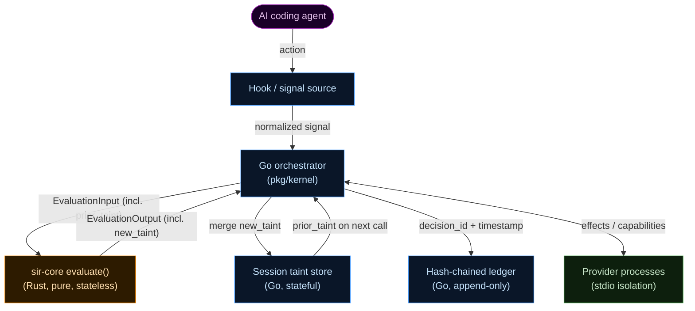
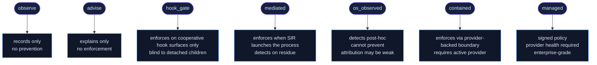

# Security Model

SIR makes specific, narrow security claims. This page states exactly what those claims are, where the trust boundary sits, what SIR does not protect against, and how to verify everything independently.

---

## The threat model

SIR addresses one specific threat: an AI coding agent taking actions on a developer's machine that the developer did not intend or did not understand.

In practice this means:

- Reading credential files and sending them to external hosts
- Modifying CI/CD configuration without review
- Installing malicious packages
- Trusting injected MCP servers without verification
- Disabling security controls, including SIR itself
- Running irreversible shell commands

SIR is not designed for:

- Network-level threat prevention (use a firewall)
- Malware already present before SIR was installed
- Compromised providers (a malicious provider is outside the threat model)
- Physical access attacks
- Enterprise fleet security at scale (this may come later)

---

## Trust anchor: the Rust decision kernel

The security model starts with a small, auditable Rust crate: `sir-core`.

`sir-core` exports a single function:

```rust
pub fn evaluate(input: EvaluationInput) -> EvaluationOutput
```

This function is:

- Pure: no filesystem access, no network access, no shell execution
- Stateless: no hidden global state; all context arrives in `EvaluationInput`
- Auditable: zero external crate dependencies (JSON parsing is handled by the internal first-party `mister-shared` crate), zero unsafe code

The Go orchestration layer in `pkg/kernel` implements the same logic as `Evaluate(in EvaluationInput) EvaluationOutput`. Both implementations must agree on the six parity fields: `verdict`, `decision_class`, `enforceability`, `attribution`, `policy_rules`, and `effects`. The harness verifies this agreement across all fixture cases.



Key division of responsibility:

| Responsibility | Owner |
|---|---|
| Policy decision (pure) | Rust `sir-core` |
| `decision_id` and timestamp | Go orchestrator |
| Session taint store | Go orchestrator |
| Ledger writes | Go orchestrator |
| Friction counters | Go orchestrator |
| Provider supervision | Go orchestrator |

The orchestrator threads `prior_taint` from the taint store into each `EvaluationInput`, and merges `new_taint` from each `EvaluationOutput` back out. The Rust kernel reads no global state and writes nothing.

---

## Decision pipeline

Every action passes through this pipeline before a verdict is issued:


- **signals**: raw inputs from hook providers, OS sensors, and agent declarations
- **normalize**: strip duplicates, resolve signal sources
- **correlate**: match cross-action taint, session context, and span IDs
- **attribute**: score confidence based on signal reliability and timing
- **enforceability**: determine whether the active mode can enforce or only detect
- **labels / taint**: classify the action and mark what taint it produces
- **policy**: apply rules including `deny-secret-to-egress`, `ask-external-egress`, and friction bounds
- **decision**: emit verdict (`allow` / `ask` / `deny`) and decision class
- **effects**: plan block, prompt, record, or nudge effects
- **evidence**: redact and ledger the decision

---

## Non-negotiables

These rules cannot be overridden by configuration, policy, or runtime state:

**1. Go stays standard library only.** No third-party dependencies in core packages. Exceptions require explicit review. This keeps the attack surface minimal and the supply chain auditable.

**2. `sir-core` and `mister-shared` stay zero-dependency and zero-unsafe.** The Rust decision kernel (`sir-core`) has no external crate dependencies and no unsafe code. The shared protocol types (`mister-shared`) follow the same rules.

**3. Corrupted state fails closed.** If SIR cannot read its state files and the error is not `os.IsNotExist`, it fails closed. Only a missing file can seed fresh defaults.

**4. Go verb strings stay aligned with Rust verb parsing.** The kernel and the policy oracle must speak the same language.

**5. Session mutation stays lock-safe and atomic on disk.** No partial writes.

**6. Path-sensitive checks resolve symlinks before classification.** Symlink attacks are a common bypass attempt.

**7. The ledger and telemetry never store raw secrets.** Only display paths, sensitivity labels, and decision metadata. Passive redaction runs before anything reaches disk.

**8. Hook handlers return well-formed deny JSON on internal errors.** An error in the handler fails closed, not open.

**9. Posture-file writes always ask.** SIR cannot silently modify its own configuration.

**10. Public guarantees need tests or contract checks.** If a behavior is documented as a guarantee, there is a test that exercises it.

---

## Mode honesty

SIR never says "protected" without specifying which mode is active and what that mode can enforce. Run `sir status` to see the current mode and its guarantee. Run `sir doctor` to see provider health alongside mode information.



`detects` is a valid and honest outcome. The goal is accuracy about what each mode can and cannot do, not a pass/fail grade.

---

## Attribution and confidence

SIR tracks attribution confidence separately from the decision verdict. Confidence is derived from signal reliability:

| Reliability | Confidence |
|---|---|
| `enforced_boundary` | high |
| `mediated_action` or `declared_intent` | medium |
| `observed_runtime` | low |
| no qualifying signal | unknown |

When attribution confidence is low:

- `allow` on high-sensitivity targets becomes `ask`
- The escalation rule is recorded as `low-confidence-escalation`
- Evidence notes the weak attribution

The invariant: weak attribution on high-sensitivity targets must fail stricter, not more permissive. Evasion techniques that strip span IDs or detach child processes increase scrutiny, not reduce it.

---

## Taint and grants

### Cross-action taint

Taint is session-scoped and additive. `EvaluationInput` carries a `prior_taint` field populated by the Go orchestrator from the session taint store. When `sir-core` returns `new_taint` in `EvaluationOutput`, the orchestrator merges it back.

The practical effect: once a credential file is read in a session, the session carries `credential_access` taint. Any subsequent egress attempt in that session triggers `deny-secret-to-egress`, even if the credential read itself was approved and even if the egress action arrives in a separate `evaluate()` call.

The two cross-action harness cases demonstrate this precisely:

- `cross-action-cred-egress-same-session`: `prior_taint: ["credential_access"]` is present, egress is denied
- `cross-action-cred-egress-different-session`: `prior_taint: []`, egress triggers `ask-external-egress` but not the stronger deny rule

Taint is never erased within a session. Weak attribution widens the taint scope rather than narrowing it.

### Grants

Grants are narrow and time-limited. The design prevents an agent from training developer approval through repeated asks:

- Maximum TTL: one hour
- Persistent grants: not allowed
- Repo-wide grants: not allowed
- Global grants: not allowed
- Every grant is ledgered

**Friction bounding** escalates repeated `ask` prompts to `deny` after three prompts within ten minutes. This blocks prompt-flooding attacks.

---

## Evasion harness

The harness is the primary verification tool. It runs known evasion techniques through the decision kernel and shows where each protection mode is blind.

```bash
sir harness run --engine both harness/fixtures/cases
```

The `--engine both` flag runs each case through both the Go implementation and the Rust `sir-core-eval` binary, then compares the six parity fields. All 15 cases are expected to agree.

Current evasion cases:

| Case | What it tests |
|---|---|
| `span-strip` | Agent strips its span ID to evade correlation |
| `span-forge` | Agent forges a span ID to impersonate another session |
| `detached-child` | Agent spawns a detached child to bypass hooks |
| `hook-missing-os-signal` | Hook is absent; only OS sensor is available |
| `mcp-shell-side-effect` | MCP tool causes a shell side effect not covered by hooks |
| `shared-shell` | Two agents share a shell, breaking attribution |
| `cred-read-then-egress` | Credential read followed by external egress |
| `cross-action-cred-egress-same-session` | Egress with prior credential taint in the same session |
| `cross-action-cred-egress-different-session` | Egress with no prior credential taint |
| `required-effect-unavailable` | Required sandbox provider is absent |
| `prompt-flood` | Repeated asks trying to train approval |
| `low-confidence-grant` | Grant issued under weak attribution |
| `post-hoc-signal` | OS signal arrives after the action completes |
| `claude-hook-bash-egress` | Claude hook fires for an egress attempt |
| `shell-wrapper-cred-read` | Shell wrapper detects credential read |

Each case is scored `enforces`, `detects`, or `blind`. The distinction matters: `detects` is valid and honest in `os_observed` mode. `blind` means both engines cannot act on that case in the current mode, which is the honest answer.

---

## Evidence integrity

The ledger is hash-chained. Each entry's hash covers the previous entry's hash plus the entry body using SHA-256. The genesis hash is all-zeros. Modifying any entry breaks every subsequent hash. Run `sir doctor` to verify the chain.

No raw secret values are stored. Passive redaction runs before anything reaches disk and replaces known patterns with `[REDACTED]`:

| Pattern | Example match |
|---|---|
| AWS access key | `AKIA...` |
| GitHub PAT | `ghp_...` |
| GitHub Actions secret | `ghs_...` |
| OpenAI-style key | `sk-...` |
| Slack token | `xox[baprs]-...` |
| Bearer token | `Bearer <token>` |
| Shell password assignment | `password=...` |
| API key assignment | `api_key=...` |

The Rust kernel produces verdicts. The Go orchestrator stamps `decision_id` and `timestamp`, then writes to the ledger. Rust has no IO and writes nothing.

---

## Supply chain

| Component | Dependencies | Notes |
|---|---|---|
| `sir-core` (Rust) | Zero external crates | JSON via first-party `mister-shared` |
| `mister-shared` (Rust) | Zero external crates | Shared protocol types |
| Go core (`pkg/`, `cmd/`) | Zero third-party | Standard library only |
| Python SDK (`sdk/python/sir_sdk.py`) | Zero | Single file |
| Provider processes | Untrusted external code | stdio isolation only |

Provider processes run in subprocess isolation. They communicate over a narrow JSON-over-stdio interface, cannot call back into the SIR kernel, cannot read SIR state, and can only respond to the messages SIR sends them.

---

## Reference commands

| Command | What it does |
|---|---|
| `sir on` / `sir off` | Enable or pause SIR enforcement |
| `sir status` | Show current mode, last decision, and provider health |
| `sir why` | Explain the last decision from the kernel ledger |
| `sir replay` | Process fixture cases through the kernel and write ledger entries |
| `sir allow` | Issue a narrow, time-limited grant |
| `sir doctor` | Verify ledger chain integrity and provider health |
| `sir export` | Export the ledger for external review |
| `sir provider validate` | Validate a provider manifest |
| `sir provider test` | Run a provider through a test sequence |
| `sir provider health` | Check provider health |
| `sir provider scaffold` | Generate a provider manifest scaffold |
| `sir harness run [--engine go\|rust\|both]` | Run evasion fixture cases through the decision kernel |
| `sir kernel replay` | Process cases through the v2 kernel, write ledger |
| `sir kernel why [--id <id>]` | Explain the last or a specific kernel decision |
| `sir kernel status` | Show mode, last decision, and provider health |

---

## Reporting security issues

Please report security vulnerabilities through [GitHub Security Advisories](https://github.com/somoore/sir/security/advisories), not through public issues.

See [SECURITY.md](../SECURITY.md) for the full disclosure policy.
